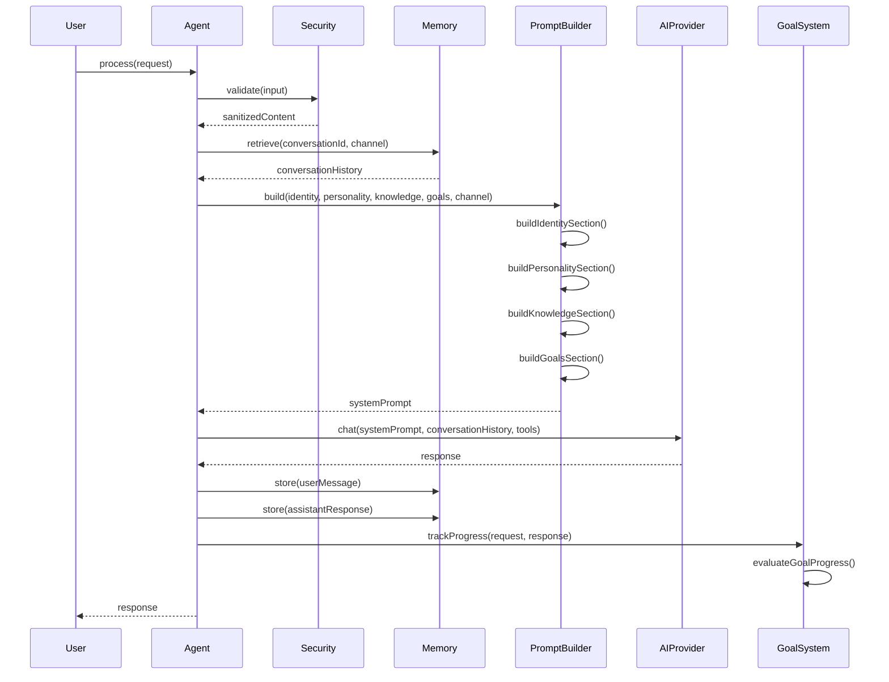
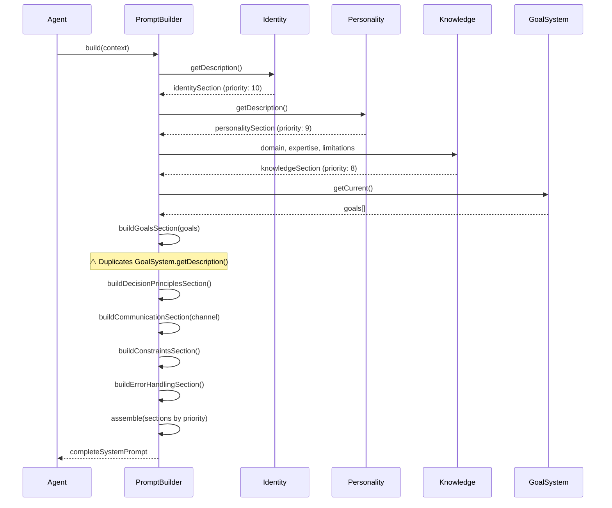
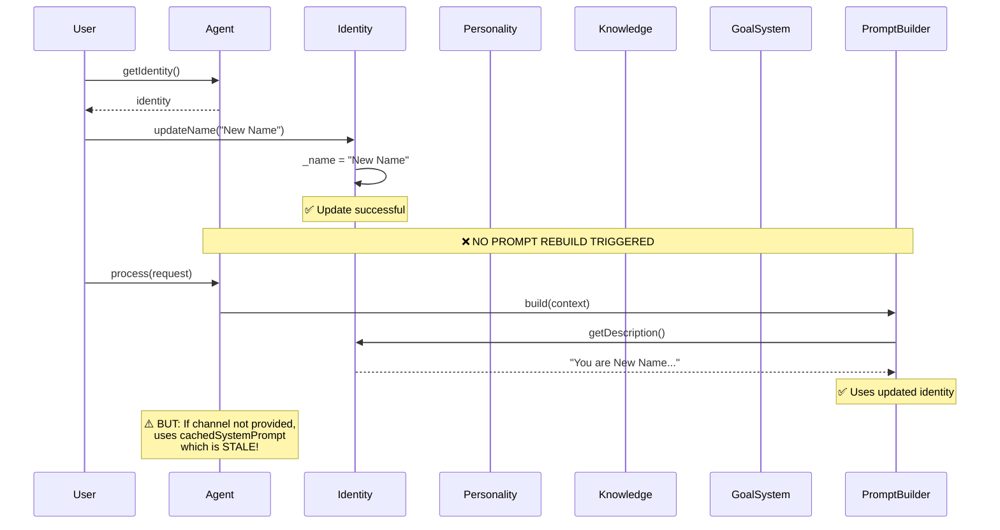
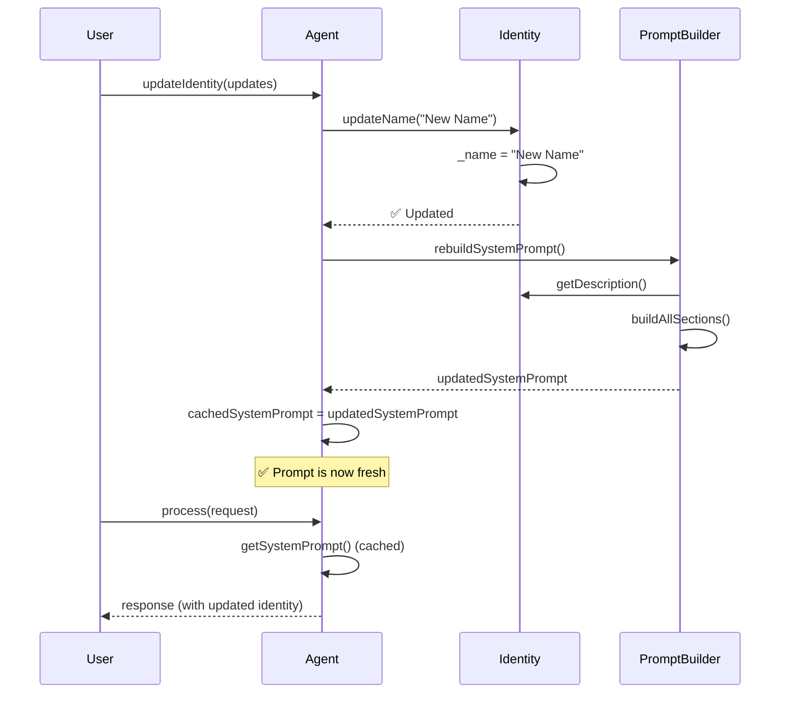
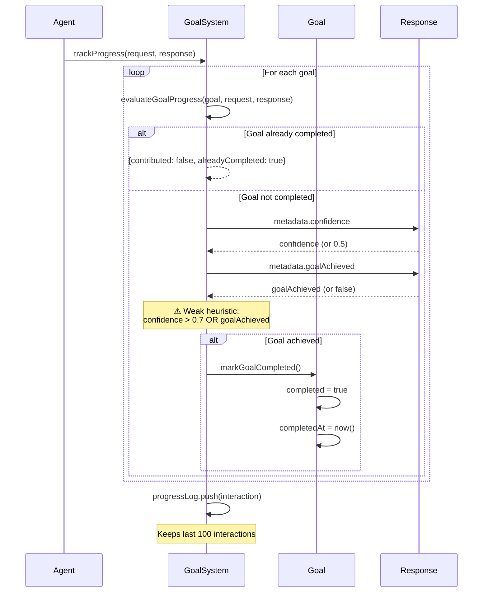
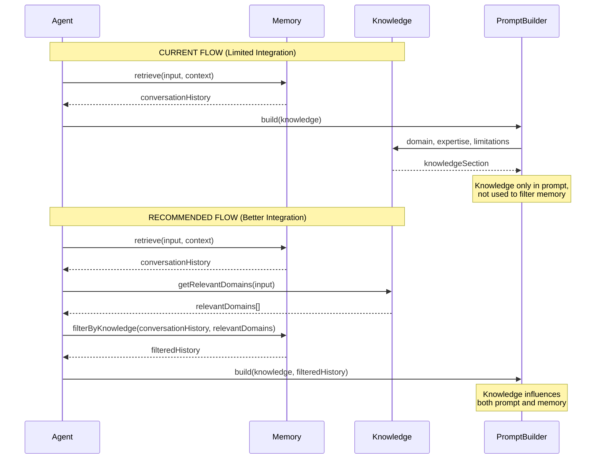
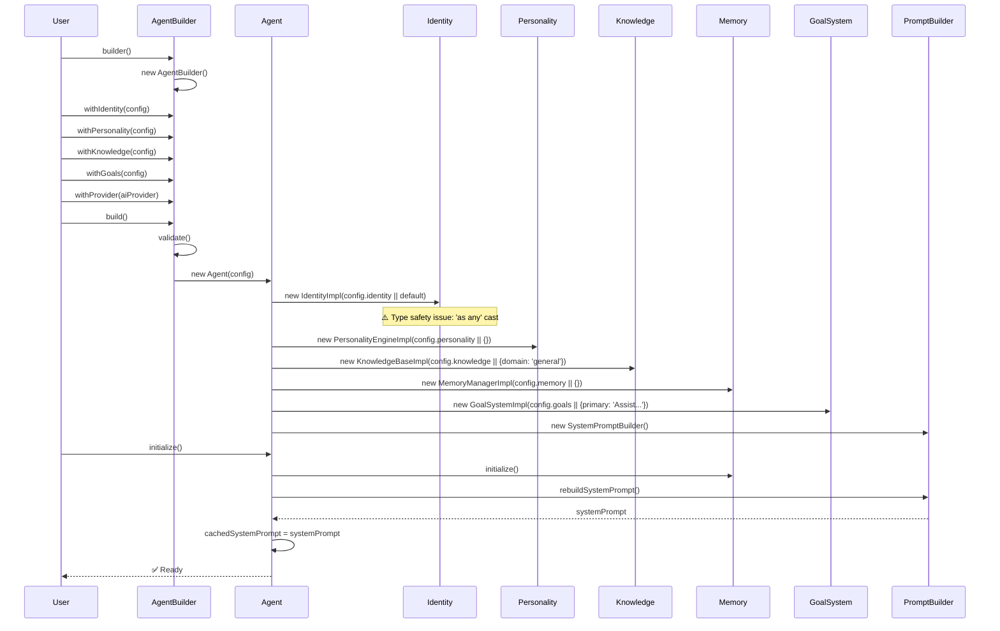

# Agent Architecture Audit Report
## Knowledge, GoalSystem, Personality, and Identity Flow Analysis

**Date:** 2024-12-19  
**Scope:** `/agent` folder - Core pillar components and their integration flows

---

## Executive Summary

This audit examines the architectural flows for the four core agent pillars:
1. **Knowledge** (KnowledgeBase)
2. **GoalSystem** (GoalSystem)
3. **Personality** (PersonalityEngine)
4. **Identity** (Identity)

**Overall Assessment:** The architecture is well-structured with clear separation of concerns. However, several flow inconsistencies and potential improvements were identified.

---

## 1. IDENTITY Flow Analysis

### 1.1 Initialization Flow
**Location:** `Agent.ts:71-77`

```71:77:services/AI-receptionist/src/agent/core/Agent.ts
    // Initialize identity (use default if custom system prompt is provided without identity)
    this.identity = new IdentityImpl(config.identity || {
      name: 'Custom Agent',
      role: 'AI Assistant',
      authorityLevel: 'standard'
    } as any);
```

**Issues Found:**
- ⚠️ **Type Safety Issue:** Uses `as any` cast, bypassing TypeScript validation
- ⚠️ **Default Value Mismatch:** Default `authorityLevel: 'standard'` but type expects `'low' | 'medium' | 'high'`
- ✅ **Fallback Logic:** Correctly provides defaults when custom system prompt bypasses identity

### 1.2 Usage Flow
**Location:** `Agent.ts:200-208`, `SystemPromptBuilder.ts:81-123`

**Flow:**
1. Identity is passed to `SystemPromptBuilder.build()` during each request
2. `buildIdentitySection()` creates the identity section of the system prompt
3. Identity is included in the prompt with priority 10 (highest)

**Issues Found:**
- ✅ **Correct Priority:** Identity has highest priority (10) in prompt building
- ✅ **Complete Integration:** All identity fields are properly included in prompt
- ⚠️ **Missing Dynamic Updates:** System prompt is rebuilt per-request if channel changes, but identity updates don't trigger prompt rebuild

### 1.3 Update Flow
**Location:** `Identity.ts:131-250`

**Available Updates:**
- `updateName()`, `updateRole()`, `updateTitle()`, `updateBackstory()`
- `updateDepartment()`, `updateReportsTo()`
- `setAuthorityLevel()`, `addEscalationRule()`, `removeEscalationRule()`
- `setYearsOfExperience()`, `addSpecialization()`, `removeSpecialization()`
- `addCertification()`, `removeCertification()`

**Issues Found:**
- ⚠️ **No Prompt Rebuild Trigger:** Updating identity doesn't automatically rebuild system prompt
- ⚠️ **No Validation on Updates:** Some updates (e.g., `updateBackstory()`) accept empty strings without validation
- ✅ **Getter Methods:** All fields have readonly getters, maintaining encapsulation

### 1.4 Integration with Other Pillars
- ✅ **Personality:** No direct coupling (good)
- ✅ **Knowledge:** No direct coupling (good)
- ⚠️ **Goals:** Identity authority level should influence goal constraints, but no explicit connection exists

---

## 2. PERSONALITY Flow Analysis

### 2.1 Initialization Flow
**Location:** `Agent.ts:79-80`

```79:80:services/AI-receptionist/src/agent/core/Agent.ts
    // Initialize personality
    this.personality = new PersonalityEngineImpl(config.personality || {});
```

**Issues Found:**
- ✅ **Safe Defaults:** Empty config uses sensible defaults in `PersonalityEngineImpl`
- ✅ **Flexible Input:** Accepts both string arrays and `PersonalityTrait[]` objects

### 2.2 Usage Flow
**Location:** `Agent.ts:200-208`, `SystemPromptBuilder.ts:129-163`, `Agent.ts:489`

**Flow:**
1. Personality is passed to `SystemPromptBuilder.build()` during each request
2. `buildPersonalitySection()` creates personality section (priority 9)
3. Used in error handling: `getErrorMessage()` provides channel-specific error messages

**Issues Found:**
- ✅ **Channel-Specific Behavior:** Error messages adapt to channel (call, SMS, email, text)
- ✅ **Formality Adaptation:** Error messages adapt to formality level
- ✅ **Complete Integration:** All personality traits and behaviors included in prompt
- ⚠️ **No Dynamic Adaptation:** Personality traits don't adapt based on conversation context (despite having `adaptabilityRules`)

### 2.3 Update Flow
**Location:** `PersonalityEngine.ts:257-311`

**Available Updates:**
- `addTrait()`, `removeTrait()`, `updateTrait()`
- `updateCommunicationStyle()`, `setFormalityLevel()`

**Issues Found:**
- ⚠️ **No Prompt Rebuild Trigger:** Personality updates don't trigger system prompt rebuild
- ✅ **Validation:** Formality level is clamped between 1-10
- ⚠️ **Trait Duplication:** `addTrait()` checks for duplicates, but case-insensitive comparison might miss variations

### 2.4 Integration with Other Pillars
- ✅ **Identity:** No direct coupling (good)
- ✅ **Knowledge:** No direct coupling (good)
- ⚠️ **Goals:** Personality decision style should influence goal prioritization, but no explicit connection

---

## 3. KNOWLEDGE Flow Analysis

### 3.1 Initialization Flow
**Location:** `Agent.ts:82-83`

```82:83:services/AI-receptionist/src/agent/core/Agent.ts
    // Initialize knowledge base
    this.knowledge = new KnowledgeBaseImpl(config.knowledge || { domain: 'general' });
```

**Issues Found:**
- ✅ **Required Field:** Domain is required and validated in `KnowledgeBaseImpl`
- ✅ **Safe Default:** Falls back to `'general'` domain if not provided
- ⚠️ **Default Limitations:** Default limitations are generic and may not match domain

### 3.2 Usage Flow
**Location:** `Agent.ts:200-208`, `SystemPromptBuilder.ts:168-216`

**Flow:**
1. Knowledge is passed to `SystemPromptBuilder.build()` during each request
2. `buildKnowledgeSection()` creates knowledge section (priority 8)
3. Knowledge boundaries and limitations are included in prompt

**Issues Found:**
- ✅ **Complete Coverage:** Domain, expertise, languages, industries, limitations all included
- ✅ **Uncertainty Handling:** `uncertaintyThreshold` guides when to say "I don't know"
- ⚠️ **Static Knowledge:** Knowledge base doesn't learn or update from interactions
- ⚠️ **No Retrieval Integration:** Knowledge base doesn't integrate with memory retrieval for context-aware knowledge

### 3.3 Update Flow
**Location:** `KnowledgeBase.ts:81-200`

**Available Updates:**
- `updateDomain()`, `addExpertise()`, `removeExpertise()`
- `addLanguage()`, `removeLanguage()`
- `addIndustry()`, `removeIndustry()`
- `addKnownDomain()`, `removeKnownDomain()`
- `addLimitation()`, `removeLimitation()`
- `updateUncertaintyThreshold()`

**Issues Found:**
- ⚠️ **No Prompt Rebuild Trigger:** Knowledge updates don't trigger system prompt rebuild
- ✅ **Domain Consistency:** `updateDomain()` automatically adds domain to `knownDomains`
- ⚠️ **No Validation:** Adding expertise/industry doesn't validate against domain relevance

### 3.4 Integration with Other Pillars
- ⚠️ **Identity:** Knowledge specializations should align with identity specializations, but no validation
- ⚠️ **Personality:** Knowledge limitations should influence personality adaptability, but no connection
- ⚠️ **Goals:** Knowledge domain should inform goal constraints, but no explicit connection
- ⚠️ **Memory:** Knowledge should be used to filter/prioritize memory retrieval, but no integration

---

## 4. GOALSYSTEM Flow Analysis

### 4.1 Initialization Flow
**Location:** `Agent.ts:89-94`

```89:94:services/AI-receptionist/src/agent/core/Agent.ts
    // Initialize goals (ensure primary exists)
    const goalConfig = config.goals || { primary: 'Assist users effectively' };
    if (!goalConfig.primary || goalConfig.primary.trim().length === 0) {
      goalConfig.primary = 'Assist users effectively';
    }
    this.goals = new GoalSystemImpl(goalConfig);
```

**Issues Found:**
- ✅ **Required Primary Goal:** Primary goal is required and validated
- ✅ **Safe Default:** Falls back to generic default if not provided
- ⚠️ **Default Goal Quality:** Default goal "Assist users effectively" is too generic

### 4.2 Usage Flow
**Location:** `Agent.ts:200-208`, `Agent.ts:250-251`, `SystemPromptBuilder.ts:221-278`, `GoalSystem.ts:178-207`

**Flow:**
1. Goals are retrieved via `goals.getCurrent()` and passed to `SystemPromptBuilder.build()`
2. `buildGoalsSection()` creates goals section (priority 9)
3. After response: `goals.trackProgress()` evaluates progress toward goals
4. Goals can be marked as completed automatically if `goalAchieved` metadata is present

**Issues Found:**
- ✅ **Progress Tracking:** Goals are tracked after each interaction
- ⚠️ **Weak Evaluation Logic:** `evaluateGoalProgress()` uses simple heuristics (response length, confidence) rather than semantic analysis
- ⚠️ **Metadata Dependency:** Goal achievement relies on AI provider setting `goalAchieved` metadata, which may not happen
- ⚠️ **No Goal-Driven Behavior:** Goals are in the prompt but don't actively influence decision-making during conversation
- ⚠️ **Incomplete Goals in Prompt:** `buildGoalsSection()` in SystemPromptBuilder doesn't use `getDescription()` from GoalSystem, causing duplication

### 4.3 Update Flow
**Location:** `GoalSystem.ts:270-322`

**Available Updates:**
- `addGoal()`, `removeGoal()`, `updateGoal()`
- `markGoalCompleted()`, `markGoalIncomplete()`

**Issues Found:**
- ✅ **Validation:** Updates validate goal structure and prevent duplicates
- ⚠️ **No Prompt Rebuild Trigger:** Goal updates don't trigger system prompt rebuild
- ✅ **Completion Tracking:** Goals track completion status and timestamps

### 4.4 Integration with Other Pillars
- ⚠️ **Identity:** Authority level should constrain goal types, but no validation
- ⚠️ **Personality:** Decision style should influence goal prioritization, but no connection
- ⚠️ **Knowledge:** Knowledge domain should inform goal feasibility, but no validation
- ⚠️ **Memory:** Goal progress should be stored in memory, but only logged in progressLog

---

## 5. CROSS-PILLAR FLOW ISSUES

### 5.1 System Prompt Rebuild Flow
**Location:** `Agent.ts:404-446`

**Current Behavior:**
- System prompt is rebuilt during `initialize()`
- System prompt is rebuilt per-request if channel is provided
- System prompt is NOT rebuilt when pillars are updated

**Issues:**
- ⚠️ **Stale Prompts:** Updates to Identity, Personality, Knowledge, or Goals don't trigger prompt rebuild
- ⚠️ **No Update Method:** No public method to trigger prompt rebuild after pillar updates
- ⚠️ **Cached Prompt:** `cachedSystemPrompt` may become stale after updates

**Recommendation:**
- Add `rebuildSystemPrompt()` call after pillar updates, or
- Add `updateIdentity()`, `updatePersonality()`, etc. methods that trigger rebuild

### 5.2 Prompt Building Duplication
**Location:** `SystemPromptBuilder.ts:221-278` vs `GoalSystem.ts:337-399`

**Issue:**
- `SystemPromptBuilder.buildGoalsSection()` manually builds goals description
- `GoalSystem.getDescription()` also builds goals description
- Two sources of truth for goals formatting

**Recommendation:**
- Use `GoalSystem.getDescription()` in `SystemPromptBuilder.buildGoalsSection()`

### 5.3 Missing Cross-Pillar Validation
**Issues:**
- Identity authority level doesn't validate against goal constraints
- Knowledge domain doesn't validate against identity specializations
- Personality decision style doesn't influence goal prioritization
- Knowledge limitations don't inform personality adaptability

**Recommendation:**
- Add validation layer that checks cross-pillar consistency
- Or add explicit connections (e.g., `identity.getAuthorityLevel()` influences `goals.getConstraints()`)

### 5.4 Goal Evaluation Weakness
**Location:** `GoalSystem.ts:212-242`

**Current Logic:**
```typescript
const responseLength = response.content.length;
const hasMetadata = !!response.metadata;
const confidence = response.metadata?.confidence || 0.5;
const goalAchieved = response.metadata?.goalAchieved === true;
```

**Issues:**
- ⚠️ **No Semantic Analysis:** Doesn't analyze if response content actually relates to goal
- ⚠️ **Weak Heuristics:** Response length and confidence are poor indicators of goal progress
- ⚠️ **Metadata Dependency:** Relies on AI provider to set goal achievement metadata

**Recommendation:**
- Add semantic analysis of response content against goal description
- Use embeddings to measure goal-relevance
- Or integrate with AI provider to evaluate goal progress

---

## 6. POSITIVE FINDINGS

### 6.1 Clean Separation of Concerns
- ✅ Each pillar is self-contained with clear responsibilities
- ✅ No tight coupling between pillars
- ✅ Clear interfaces defined in `types.ts`

### 6.2 Comprehensive Update Methods
- ✅ All pillars have update methods for runtime modification
- ✅ Updates maintain data integrity (validation, duplicates, etc.)

### 6.3 Proper Integration in System Prompts
- ✅ All pillars are properly integrated into system prompt building
- ✅ Priority ordering is logical (Identity > Personality/Goals > Knowledge)
- ✅ Channel-specific adaptations are handled

### 6.4 Error Handling
- ✅ Personality provides channel-specific error messages
- ✅ Graceful degradation in error scenarios

---

## 7. RECOMMENDATIONS

### High Priority
1. **Fix Type Safety:** Remove `as any` cast in Identity initialization, fix authority level default
2. **Add Prompt Rebuild Trigger:** Call `rebuildSystemPrompt()` after pillar updates
3. **Fix Goal Description Duplication:** Use `GoalSystem.getDescription()` in SystemPromptBuilder
4. **Improve Goal Evaluation:** Add semantic analysis or better heuristics for goal progress

### Medium Priority
5. **Add Cross-Pillar Validation:** Validate consistency between pillars (e.g., knowledge domain vs identity specializations)
6. **Add Update Methods to Agent:** Expose `updateIdentity()`, `updatePersonality()`, etc. that trigger prompt rebuild
7. **Integrate Knowledge with Memory:** Use knowledge base to filter/prioritize memory retrieval

### Low Priority
8. **Add Goal-Driven Behavior:** Make goals actively influence decision-making, not just be in prompt
9. **Add Dynamic Personality Adaptation:** Implement `adaptabilityRules` to actually adapt personality based on context
10. **Add Knowledge Learning:** Allow knowledge base to learn from interactions (with validation)

---

## 8. CONCLUSION

The agent architecture demonstrates **good separation of concerns** and **clear interfaces**. The flows are generally logical and well-structured. However, several **integration gaps** and **update flow issues** were identified:

- **Main Issue:** Updates to pillars don't trigger system prompt rebuilds, leading to stale prompts
- **Secondary Issue:** Weak goal evaluation logic and missing cross-pillar validation
- **Minor Issues:** Type safety, duplication, and missing dynamic behaviors

**Overall Grade: B+** (Good architecture with room for improvement in integration and update flows)

---

## Appendix: Flow Diagrams

### 1. Request Processing Flow



### 2. System Prompt Building Flow



### 3. Current Pillar Update Flow (Problematic)



### 4. Recommended Pillar Update Flow



### 5. Goal Tracking Flow



### 6. Knowledge Integration Flow (Current vs Recommended)



### 7. Agent Initialization Flow



