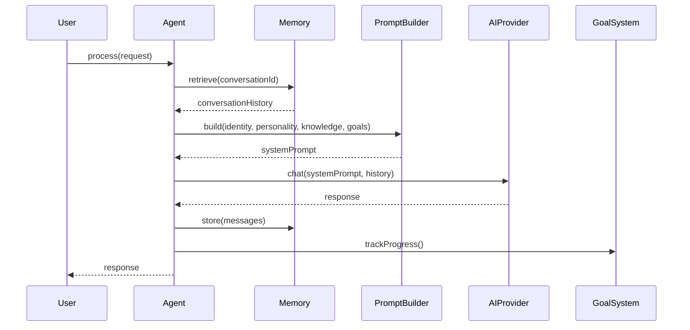
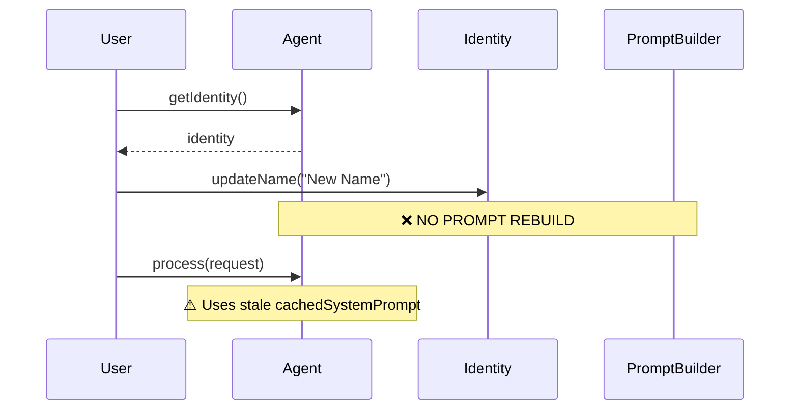
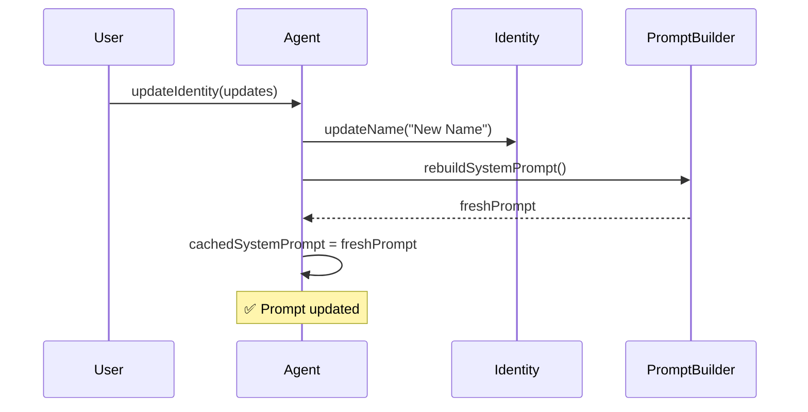

# Agent Architecture Audit - Executive Summary

## Critical Issues Found

### 1. ⚠️ **System Prompt Staleness After Pillar Updates**
**Severity:** High  
**Location:** All pillar update methods

**Problem:**
- When Identity, Personality, Knowledge, or Goals are updated via their update methods, the system prompt is NOT rebuilt
- The cached system prompt becomes stale
- Updates only take effect after agent reinitialization

**Impact:**
- Runtime updates to agent configuration don't work as expected
- Users updating agent personality/knowledge won't see changes until restart

**Fix:**
- Call `agent.rebuildSystemPrompt()` after pillar updates
- Or add wrapper methods like `agent.updateIdentity()` that trigger rebuild

---

### 2. ⚠️ **Goal Description Duplication**
**Severity:** Medium  
**Location:** `SystemPromptBuilder.buildGoalsSection()` vs `GoalSystem.getDescription()`

**Problem:**
- Two separate implementations of goals formatting
- `SystemPromptBuilder` manually builds goals section
- `GoalSystem.getDescription()` also builds goals description
- Changes to goal formatting need to be made in two places

**Impact:**
- Maintenance burden
- Risk of inconsistency

**Fix:**
- Use `GoalSystem.getDescription()` in `SystemPromptBuilder.buildGoalsSection()`

---

### 3. ⚠️ **Weak Goal Evaluation Logic**
**Severity:** Medium  
**Location:** `GoalSystem.evaluateGoalProgress()`

**Problem:**
- Goal progress evaluation uses simple heuristics:
  - Response length
  - Confidence score
  - Metadata flag
- No semantic analysis of whether response actually relates to goal
- Relies on AI provider to set `goalAchieved` metadata (may not happen)

**Impact:**
- Goal completion may be missed or incorrectly detected
- Progress tracking is inaccurate

**Fix:**
- Add semantic analysis using embeddings
- Or integrate with AI provider to evaluate goal relevance

---

### 4. ⚠️ **Type Safety Issue in Identity Initialization**
**Severity:** Low  
**Location:** `Agent.ts:73`

**Problem:**
```typescript
this.identity = new IdentityImpl(config.identity || {
  name: 'Custom Agent',
  role: 'AI Assistant',
  authorityLevel: 'standard'  // ❌ Should be 'low' | 'medium' | 'high'
} as any);  // ❌ Bypasses type checking
```

**Impact:**
- Type safety bypassed
- Invalid default value for authorityLevel

**Fix:**
- Change default to `'medium'`
- Remove `as any` cast

---

### 5. ⚠️ **Missing Cross-Pillar Validation**
**Severity:** Low  
**Location:** All pillars

**Problem:**
- No validation that pillars are consistent with each other:
  - Identity authority level vs Goal constraints
  - Knowledge domain vs Identity specializations
  - Personality decision style vs Goal prioritization

**Impact:**
- Potential for inconsistent agent behavior
- No early detection of configuration errors

**Fix:**
- Add validation layer or explicit cross-pillar connections

---

## Positive Findings ✅

1. **Clean Architecture:** Excellent separation of concerns, no tight coupling
2. **Comprehensive Updates:** All pillars have update methods with proper validation
3. **Proper Integration:** All pillars correctly integrated into system prompts
4. **Channel Adaptation:** Personality adapts error messages to channel
5. **Priority Ordering:** Logical priority in system prompt (Identity > Personality/Goals > Knowledge)

---

## Quick Wins (Easy Fixes)

1. **Fix Identity Type Safety** (5 min)
   - Change `authorityLevel: 'standard'` → `'medium'`
   - Remove `as any` cast

2. **Use GoalSystem.getDescription()** (10 min)
   - Replace manual goal building in SystemPromptBuilder

3. **Add Prompt Rebuild After Updates** (30 min)
   - Add `rebuildSystemPrompt()` calls or wrapper methods

---

## Recommended Next Steps

1. **Immediate:** Fix type safety and goal description duplication
2. **Short-term:** Add prompt rebuild triggers for pillar updates
3. **Medium-term:** Improve goal evaluation with semantic analysis
4. **Long-term:** Add cross-pillar validation layer

---

## Files Requiring Changes

- `services/AI-receptionist/src/agent/core/Agent.ts` - Fix initialization, add update wrappers
- `services/AI-receptionist/src/agent/prompt/SystemPromptBuilder.ts` - Use GoalSystem.getDescription()
- `services/AI-receptionist/src/agent/goals/GoalSystem.ts` - Improve evaluation logic (optional)

---

**Overall Assessment:** Architecture is solid with good separation of concerns. Main issues are around update flows and prompt rebuilding. Fixes are straightforward and low-risk.

---

## Flow Diagrams

### Request Processing Flow



### Pillar Update Flow (Current Problem)



### Recommended Fix



