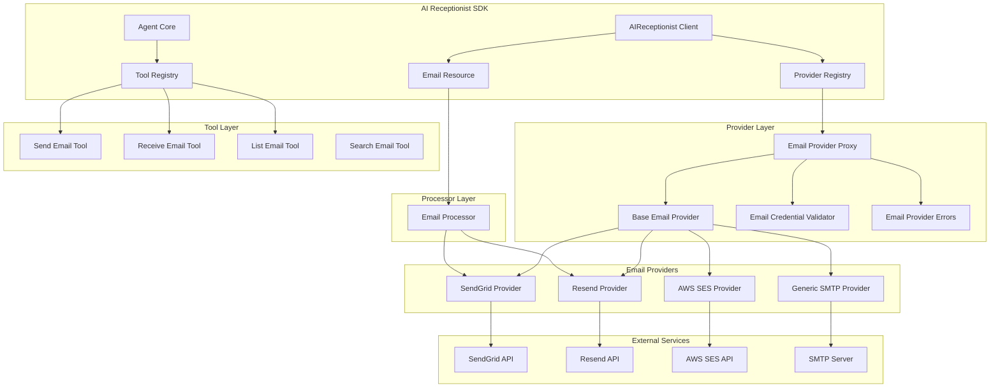
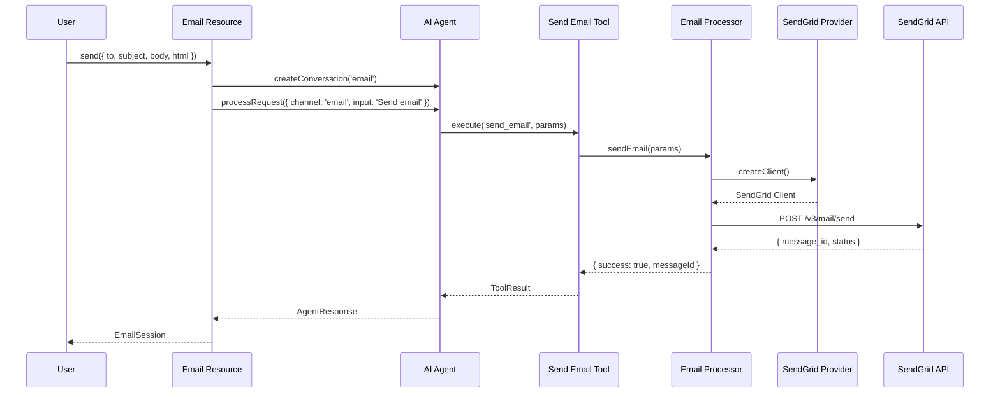

# Email Resource Implementation Plan

**Created:** October 23, 2025
**Status:** Planning Phase
**Author:** AI Receptionist Development Team

---

## Executive Summary

This document provides a comprehensive implementation plan for building out the Email Resource functionality in the AI Receptionist SDK. The plan follows the existing architecture patterns established in the codebase and adheres to the CLAUDE.md SDK development guidelines.

The email system will integrate seamlessly with the existing **Provider → Processor → Tool → Resource** architecture, enabling the AI agent to send, receive, and manage emails across multiple channels.

---

## Table of Contents

1. [Current State Analysis](#current-state-analysis)
2. [Architecture Overview](#architecture-overview)
3. [Required Components](#required-components)
4. [Detailed Implementation Plan](#detailed-implementation-plan)
5. [Configuration & Types](#configuration--types)
6. [Testing Strategy](#testing-strategy)
7. [Documentation Requirements](#documentation-requirements)
8. [Migration Path](#migration-path)
9. [Timeline & Milestones](#timeline--milestones)

---

## Current State Analysis

### What Exists Today

1. **Email Resource** (`src/resources/email.resource.ts`)
   - Basic skeleton with mock implementation
   - `send()`, `get()`, `list()` methods stubbed out
   - Returns mock `EmailSession` objects
   - No actual email sending capability

2. **Messaging Processor** (`src/processors/messaging.processor.ts`)
   - Has `sendEmail()` method that returns mock data
   - TODO comment: "Integrate with SendGrid or other email provider"
   - Currently only implements SMS via Twilio

3. **Send Email Tool** (`src/tools/standard/messaging-tools.ts`)
   - `buildSendEmailTool()` exists but uses mock messaging processor
   - Supports email parameters: `to`, `subject`, `body`, `html`
   - No actual email sending

4. **Types** (`src/types/index.ts`)
   - `SendEmailOptions` interface defined
   - `EmailSession` interface defined
   - `SendGridConfig` interface defined but unused

### What's Missing

1. **Email Provider** - No SMTP/SendGrid provider implementation
2. **Email Processor** - Messaging processor needs email-specific logic
3. **Email Validation** - No credential validator for email providers
4. **Email Tools** - Receive, list, and manage email tools
5. **Email Configuration** - Provider registration in client.ts
6. **Email Service Layer** - High-level business logic (optional)

---

## Architecture Overview

Following the established **Provider Architecture** pattern from [providers.md](./providers.md):



### Data Flow Example



---

## Required Components

### 1. Email Providers

#### **Primary Provider: Resend** (Recommended)
- **Why:** Modern developer experience, best pricing at scale, superior TypeScript support
- **Features:** Simple API, React email templates, webhooks, excellent deliverability
- **SDK:** `resend` (official TypeScript SDK)
- **Pricing:** Free tier (100/day), $20/mo for 50k emails, $80/mo for 1M emails
- **Used by:** Vercel, Supabase, Cal.com, Linear

#### **Alternative Provider: SendGrid** (Enterprise-Grade)
- **Why:** Industry standard, battle-tested, extensive enterprise features
- **Features:** Advanced analytics, marketing campaigns, A/B testing, dedicated IPs
- **SDK:** `@sendgrid/mail` (official SDK)
- **Pricing:** Free tier (100/day), $20/mo for 50k emails, $250/mo for 1M emails
- **Used by:** Uber, Airbnb, Spotify

#### **Alternative Provider: Generic SMTP** (Maximum Flexibility)
- **Why:** Works with any SMTP server (Gmail, Outlook, custom servers), zero vendor lock-in
- **Features:** Universal compatibility, self-hosted options
- **SDK:** `nodemailer` (most popular Node.js email SDK)
- **Pricing:** FREE (Gmail/Outlook limits apply) or self-hosted costs

### 2. File Structure

```
src/
├── providers/
│   ├── email/
│   │   ├── resend.provider.ts            # Resend implementation (PRIMARY)
│   │   ├── sendgrid.provider.ts          # SendGrid implementation
│   │   ├── smtp.provider.ts              # Generic SMTP implementation
│   │   ├── email-provider.interface.ts   # Common email provider interface
│   │   └── email-router.ts               # Multi-provider routing logic
│   ├── validation/
│   │   ├── resend-validator.ts           # Resend credential validator
│   │   ├── sendgrid-validator.ts         # SendGrid credential validator
│   │   ├── smtp-validator.ts             # SMTP credential validator
│   └── index.ts                          # Export email providers
│
├── processors/
│   └── email.processor.ts                # Email processor (supports multi-provider)
│
├── tools/
│   └── standard/
│       └── email-tools.ts                # Email tools (send, receive, list, search)
│
├── resources/
│   └── email.resource.ts                 # Email resource (UPDATE)
│
├── config/
│   └── email-config.ts                   # Email configuration utilities (NEW)
│
├── types/
│   └── index.ts                          # Add email types (UPDATE)
│
└── client.ts                             # Register email provider (UPDATE)
```

### 3. Dependencies to Add

```json
{
  "dependencies": {
    "resend": "^4.0.0",                   // Resend (PRIMARY)
    "@sendgrid/mail": "^8.1.0",           // SendGrid (alternative)
    "nodemailer": "^6.9.0"                // SMTP (alternative)
  },
  "devDependencies": {
    "@types/nodemailer": "^6.4.0"         // SMTP types
  }
}
```

**Note:** All email providers are **optional dependencies** and only loaded when configured (lazy loading).

---

## Detailed Implementation Plan

### Phase 1: Provider Layer

#### Step 1.1: Create Email Provider Interface

**File:** `src/providers/email/email-provider.interface.ts`

```typescript
/**
 * Common interface for all email providers
 */
export interface IEmailProvider extends IProvider {
  /**
   * Send an email
   */
  sendEmail(params: EmailParams): Promise<EmailResult>;

  /**
   * Send bulk emails
   */
  sendBulkEmails?(params: BulkEmailParams): Promise<BulkEmailResult>;

  /**
   * Get email delivery status
   */
  getDeliveryStatus?(messageId: string): Promise<DeliveryStatus>;

  /**
   * Validate email address
   */
  validateEmail?(email: string): Promise<boolean>;
}

export interface EmailParams {
  to: string | string[];
  from?: string;           // Override default from address
  replyTo?: string;
  subject: string;
  text?: string;           // Plain text
  html?: string;           // HTML content
  attachments?: Attachment[];
  headers?: Record<string, string>;
  templateId?: string;     // For template-based emails
  templateData?: Record<string, any>;
  tags?: string[];         // For analytics/filtering
}

export interface Attachment {
  filename: string;
  content?: string | Buffer;
  path?: string;
  contentType?: string;
  encoding?: string;
}

export interface EmailResult {
  success: boolean;
  messageId?: string;
  error?: string;
  statusCode?: number;
}

export interface DeliveryStatus {
  messageId: string;
  status: 'queued' | 'sent' | 'delivered' | 'failed' | 'bounced' | 'spam';
  deliveredAt?: Date;
  error?: string;
}
```

#### Step 1.2: Create Email Router (Multi-Provider Support)

**File:** `src/providers/email/email-router.ts`

```typescript
/**
 * Email Router
 * Routes emails to appropriate provider based on configuration
 * Supports multiple providers simultaneously with fallback logic
 */
import type { IEmailProvider, EmailParams, EmailResult } from './email-provider.interface';
import { logger } from '../../utils/logger';

export interface EmailProviderEntry {
  provider: IEmailProvider;
  priority: number;
  tags?: string[];
  domains?: string[];  // Route specific domains to specific providers
}

export class EmailRouter {
  private providers: Map<string, EmailProviderEntry> = new Map();
  private sortedProviders: EmailProviderEntry[] = [];

  /**
   * Register an email provider
   */
  register(name: string, entry: EmailProviderEntry): void {
    this.providers.set(name, entry);
    this.sortProviders();
    logger.info(`[EmailRouter] Registered provider '${name}' with priority ${entry.priority}`);
  }

  /**
   * Sort providers by priority (lowest number = highest priority)
   */
  private sortProviders(): void {
    this.sortedProviders = Array.from(this.providers.values())
      .sort((a, b) => a.priority - b.priority);
  }

  /**
   * Select provider based on email parameters
   */
  selectProvider(params: EmailParams, forcedProvider?: string): IEmailProvider | null {
    // If provider is forced, use it
    if (forcedProvider && this.providers.has(forcedProvider)) {
      logger.info(`[EmailRouter] Using forced provider: ${forcedProvider}`);
      return this.providers.get(forcedProvider)!.provider;
    }

    // Match by tags
    if (params.tags && params.tags.length > 0) {
      for (const entry of this.sortedProviders) {
        if (entry.tags && entry.tags.some(tag => params.tags!.includes(tag))) {
          logger.info(`[EmailRouter] Matched provider by tags: ${entry.provider.name}`);
          return entry.provider;
        }
      }
    }

    // Match by recipient domain
    if (typeof params.to === 'string') {
      const domain = params.to.split('@')[1];
      for (const entry of this.sortedProviders) {
        if (entry.domains && entry.domains.includes(domain)) {
          logger.info(`[EmailRouter] Matched provider by domain: ${entry.provider.name}`);
          return entry.provider;
        }
      }
    }

    // Use primary provider (highest priority)
    if (this.sortedProviders.length > 0) {
      const primary = this.sortedProviders[0];
      logger.info(`[EmailRouter] Using primary provider: ${primary.provider.name}`);
      return primary.provider;
    }

    logger.error('[EmailRouter] No providers available');
    return null;
  }

  /**
   * Send email with automatic provider selection and fallback
   */
  async sendEmail(params: EmailParams, forcedProvider?: string): Promise<EmailResult> {
    const provider = this.selectProvider(params, forcedProvider);

    if (!provider) {
      return {
        success: false,
        error: 'No email provider configured'
      };
    }

    try {
      const result = await provider.sendEmail(params);

      // If primary fails and we have fallbacks, try them
      if (!result.success && !forcedProvider && this.sortedProviders.length > 1) {
        logger.warn(`[EmailRouter] Primary provider failed, trying fallback`);

        for (let i = 1; i < this.sortedProviders.length; i++) {
          const fallback = this.sortedProviders[i].provider;
          logger.info(`[EmailRouter] Attempting fallback: ${fallback.name}`);

          const fallbackResult = await fallback.sendEmail(params);
          if (fallbackResult.success) {
            logger.info(`[EmailRouter] Fallback successful: ${fallback.name}`);
            return fallbackResult;
          }
        }
      }

      return result;
    } catch (error) {
      logger.error('[EmailRouter] Send failed:', error);
      return {
        success: false,
        error: error instanceof Error ? error.message : 'Unknown error'
      };
    }
  }

  /**
   * Get all registered providers
   */
  getProviders(): string[] {
    return Array.from(this.providers.keys());
  }

  /**
   * Check if a provider is registered
   */
  hasProvider(name: string): boolean {
    return this.providers.has(name);
  }
}
```

#### Step 1.3: Implement SendGrid Provider

**File:** `src/providers/email/sendgrid.provider.ts`

```typescript
/**
 * SendGrid Email Provider
 * ULTRA-PURE - just wraps SendGrid SDK, no business logic
 */
import { BaseProvider } from '../base.provider';
import type { SendGridConfig } from '../../types';
import type { IEmailProvider, EmailParams, EmailResult } from './email-provider.interface';
import { logger } from '../../utils/logger';

export class SendGridProvider extends BaseProvider implements IEmailProvider {
  readonly name = 'sendgrid';
  readonly type = 'email' as const;

  private sendgridSdk: any = null;

  constructor(private config: SendGridConfig) {
    super();
  }

  async initialize(): Promise<void> {
    logger.info('[SendGridProvider] Initializing (loading SDK)');

    try {
      // Lazy-load SendGrid SDK
      const sgMail = await import('@sendgrid/mail');
      this.sendgridSdk = sgMail.default;

      // Set API key
      this.sendgridSdk.setApiKey(this.config.apiKey);

      this.initialized = true;
      logger.info('[SendGridProvider] SDK loaded and configured');
    } catch (error) {
      logger.error('[SendGridProvider] Failed to load SDK:', error);
      throw error;
    }
  }

  /**
   * Send email via SendGrid
   */
  async sendEmail(params: EmailParams): Promise<EmailResult> {
    this.ensureInitialized();

    try {
      const msg = {
        to: params.to,
        from: params.from || this.config.fromEmail,
        replyTo: params.replyTo,
        subject: params.subject,
        text: params.text,
        html: params.html,
        attachments: params.attachments?.map(att => ({
          filename: att.filename,
          content: att.content,
          type: att.contentType,
          disposition: 'attachment'
        })),
        headers: params.headers,
        templateId: params.templateId,
        dynamicTemplateData: params.templateData,
        categories: params.tags
      };

      const response = await this.sendgridSdk.send(msg);
      const messageId = response[0]?.headers?.['x-message-id'];

      logger.info('[SendGridProvider] Email sent', { messageId, to: params.to });

      return {
        success: true,
        messageId,
        statusCode: response[0]?.statusCode
      };
    } catch (error: any) {
      logger.error('[SendGridProvider] Failed to send email:', error);

      return {
        success: false,
        error: error?.message || 'Unknown error',
        statusCode: error?.code
      };
    }
  }

  /**
   * Send bulk emails
   */
  async sendBulkEmails(params: { emails: EmailParams[] }): Promise<{ results: EmailResult[] }> {
    this.ensureInitialized();

    const messages = params.emails.map(email => ({
      to: email.to,
      from: email.from || this.config.fromEmail,
      subject: email.subject,
      text: email.text,
      html: email.html
    }));

    try {
      const response = await this.sendgridSdk.send(messages);

      return {
        results: response.map((r: any) => ({
          success: true,
          messageId: r?.headers?.['x-message-id'],
          statusCode: r?.statusCode
        }))
      };
    } catch (error: any) {
      logger.error('[SendGridProvider] Failed to send bulk emails:', error);

      return {
        results: [{
          success: false,
          error: error?.message || 'Unknown error'
        }]
      };
    }
  }

  /**
   * Get the raw SendGrid SDK
   */
  getSdk(): any {
    this.ensureInitialized();
    return this.sendgridSdk;
  }

  /**
   * Get config
   */
  getConfig(): SendGridConfig {
    return this.config;
  }

  async dispose(): Promise<void> {
    logger.info('[SendGridProvider] Disposing');
    this.sendgridSdk = null;
    this.initialized = false;
  }

  async healthCheck(): Promise<boolean> {
    return this.initialized && this.sendgridSdk !== null;
  }
}
```

#### Step 1.3: Implement Resend Provider (Alternative)

**File:** `src/providers/email/resend.provider.ts`

```typescript
/**
 * Resend Email Provider
 * Modern alternative to SendGrid with developer-friendly API
 */
import { BaseProvider } from '../base.provider';
import type { ResendConfig } from '../../types';
import type { IEmailProvider, EmailParams, EmailResult } from './email-provider.interface';
import { logger } from '../../utils/logger';

export class ResendProvider extends BaseProvider implements IEmailProvider {
  readonly name = 'resend';
  readonly type = 'email' as const;

  private resendClient: any = null;

  constructor(private config: ResendConfig) {
    super();
  }

  async initialize(): Promise<void> {
    logger.info('[ResendProvider] Initializing (loading SDK)');

    try {
      const { Resend } = await import('resend');
      this.resendClient = new Resend(this.config.apiKey);

      this.initialized = true;
      logger.info('[ResendProvider] SDK loaded');
    } catch (error) {
      logger.error('[ResendProvider] Failed to load SDK:', error);
      throw error;
    }
  }

  async sendEmail(params: EmailParams): Promise<EmailResult> {
    this.ensureInitialized();

    try {
      const response = await this.resendClient.emails.send({
        from: params.from || this.config.fromEmail,
        to: params.to,
        reply_to: params.replyTo,
        subject: params.subject,
        text: params.text,
        html: params.html,
        attachments: params.attachments,
        headers: params.headers,
        tags: params.tags?.map(tag => ({ name: tag, value: tag }))
      });

      logger.info('[ResendProvider] Email sent', { id: response.id, to: params.to });

      return {
        success: true,
        messageId: response.id
      };
    } catch (error: any) {
      logger.error('[ResendProvider] Failed to send email:', error);

      return {
        success: false,
        error: error?.message || 'Unknown error'
      };
    }
  }

  getClient(): any {
    this.ensureInitialized();
    return this.resendClient;
  }

  getConfig(): ResendConfig {
    return this.config;
  }

  async dispose(): Promise<void> {
    logger.info('[ResendProvider] Disposing');
    this.resendClient = null;
    this.initialized = false;
  }

  async healthCheck(): Promise<boolean> {
    return this.initialized && this.resendClient !== null;
  }
}
```

#### Step 1.4: Implement Generic SMTP Provider

**File:** `src/providers/email/smtp.provider.ts`

```typescript
/**
 * Generic SMTP Email Provider
 * Works with any SMTP server (Gmail, Outlook, custom servers)
 */
import { BaseProvider } from '../base.provider';
import type { SMTPConfig } from '../../types';
import type { IEmailProvider, EmailParams, EmailResult } from './email-provider.interface';
import { logger } from '../../utils/logger';

export class SMTPProvider extends BaseProvider implements IEmailProvider {
  readonly name = 'smtp';
  readonly type = 'email' as const;

  private transporter: any = null;

  constructor(private config: SMTPConfig) {
    super();
  }

  async initialize(): Promise<void> {
    logger.info('[SMTPProvider] Initializing (loading Nodemailer)');

    try {
      const nodemailer = await import('nodemailer');

      this.transporter = nodemailer.createTransport({
        host: this.config.host,
        port: this.config.port,
        secure: this.config.secure, // true for 465, false for other ports
        auth: {
          user: this.config.username,
          pass: this.config.password
        },
        ...this.config.options
      });

      // Verify connection
      await this.transporter.verify();

      this.initialized = true;
      logger.info('[SMTPProvider] Transporter created and verified');
    } catch (error) {
      logger.error('[SMTPProvider] Failed to initialize:', error);
      throw error;
    }
  }

  async sendEmail(params: EmailParams): Promise<EmailResult> {
    this.ensureInitialized();

    try {
      const info = await this.transporter.sendMail({
        from: params.from || this.config.fromEmail,
        to: params.to,
        replyTo: params.replyTo,
        subject: params.subject,
        text: params.text,
        html: params.html,
        attachments: params.attachments,
        headers: params.headers
      });

      logger.info('[SMTPProvider] Email sent', { messageId: info.messageId, to: params.to });

      return {
        success: true,
        messageId: info.messageId
      };
    } catch (error: any) {
      logger.error('[SMTPProvider] Failed to send email:', error);

      return {
        success: false,
        error: error?.message || 'Unknown error'
      };
    }
  }

  getTransporter(): any {
    this.ensureInitialized();
    return this.transporter;
  }

  getConfig(): SMTPConfig {
    return this.config;
  }

  async dispose(): Promise<void> {
    logger.info('[SMTPProvider] Disposing');

    if (this.transporter) {
      this.transporter.close();
    }

    this.transporter = null;
    this.initialized = false;
  }

  async healthCheck(): Promise<boolean> {
    if (!this.initialized || !this.transporter) {
      return false;
    }

    try {
      await this.transporter.verify();
      return true;
    } catch {
      return false;
    }
  }
}
```

#### Step 1.5: Create Email Validators

**File:** `src/providers/validation/sendgrid-validator.ts`

```typescript
/**
 * SendGrid Credential Validator
 * Validates SendGrid API key format and connection
 */
import type { ICredentialValidator, ValidationResult } from './credential-validator.interface';
import type { IProvider } from '../../types';
import type { SendGridConfig } from '../../types';

export class SendGridValidator implements ICredentialValidator {
  validateFormat(config: SendGridConfig): ValidationResult {
    // Check required fields
    if (!config.apiKey) {
      return {
        valid: false,
        error: 'Missing SendGrid API key',
        details: { provider: 'sendgrid' }
      };
    }

    if (!config.fromEmail) {
      return {
        valid: false,
        error: 'Missing from email address',
        details: { provider: 'sendgrid' }
      };
    }

    // Validate API key format (SendGrid keys start with 'SG.')
    if (!config.apiKey.startsWith('SG.')) {
      return {
        valid: false,
        error: 'Invalid SendGrid API key format (should start with "SG.")',
        details: { provider: 'sendgrid' }
      };
    }

    // Validate email format
    const emailRegex = /^[^\s@]+@[^\s@]+\.[^\s@]+$/;
    if (!emailRegex.test(config.fromEmail)) {
      return {
        valid: false,
        error: 'Invalid from email address format',
        details: { fromEmail: config.fromEmail }
      };
    }

    return { valid: true };
  }

  async validateConnection(provider: IProvider): Promise<ValidationResult> {
    const healthy = await provider.healthCheck();
    return healthy
      ? { valid: true }
      : { valid: false, error: 'Failed to connect to SendGrid API' };
  }
}
```

**File:** `src/providers/validation/smtp-validator.ts`

```typescript
/**
 * SMTP Credential Validator
 * Validates SMTP server configuration
 */
import type { ICredentialValidator, ValidationResult } from './credential-validator.interface';
import type { IProvider } from '../../types';
import type { SMTPConfig } from '../../types';

export class SMTPValidator implements ICredentialValidator {
  validateFormat(config: SMTPConfig): ValidationResult {
    // Check required fields
    if (!config.host) {
      return {
        valid: false,
        error: 'Missing SMTP host',
        details: { provider: 'smtp' }
      };
    }

    if (!config.port) {
      return {
        valid: false,
        error: 'Missing SMTP port',
        details: { provider: 'smtp' }
      };
    }

    if (!config.username || !config.password) {
      return {
        valid: false,
        error: 'Missing SMTP credentials (username/password)',
        details: {
          hasUsername: !!config.username,
          hasPassword: !!config.password
        }
      };
    }

    if (!config.fromEmail) {
      return {
        valid: false,
        error: 'Missing from email address',
        details: { provider: 'smtp' }
      };
    }

    // Validate port range
    if (config.port < 1 || config.port > 65535) {
      return {
        valid: false,
        error: 'Invalid SMTP port (must be 1-65535)',
        details: { port: config.port }
      };
    }

    // Validate email format
    const emailRegex = /^[^\s@]+@[^\s@]+\.[^\s@]+$/;
    if (!emailRegex.test(config.fromEmail)) {
      return {
        valid: false,
        error: 'Invalid from email address format',
        details: { fromEmail: config.fromEmail }
      };
    }

    return { valid: true };
  }

  async validateConnection(provider: IProvider): Promise<ValidationResult> {
    const healthy = await provider.healthCheck();
    return healthy
      ? { valid: true }
      : { valid: false, error: 'Failed to connect to SMTP server' };
  }
}
```

### Phase 2: Processor Layer

#### Step 2.1: Create Email Processor

**File:** `src/processors/email.processor.ts`

```typescript
/**
 * Email Processor
 * Thin administrative wrapper for email operations.
 * Supports multiple email providers with automatic routing and fallback.
 * No AI consultation - just provider operations for services.
 */
import type { EmailRouter } from '../providers/email/email-router';
import type { EmailParams } from '../providers/email/email-provider.interface';
import { logger } from '../utils/logger';

export interface SendEmailParams {
  to: string | string[];
  subject: string;
  body: string;
  html?: string;
  from?: string;
  replyTo?: string;
  attachments?: Array<{
    filename: string;
    content?: string | Buffer;
    path?: string;
  }>;
  templateId?: string;
  templateData?: Record<string, any>;
  tags?: string[];
  provider?: string;  // Force specific provider
}

export interface EmailProcessorResult {
  success: boolean;
  messageId?: string;
  content?: string;
  error?: string;
  provider?: string;  // Which provider was used
}

/**
 * EmailProcessor
 * Administrative helper for email operations via email router
 * Supports multiple providers with automatic routing and fallback
 */
export class EmailProcessor {
  readonly name = 'email';
  readonly type = 'email' as const;

  constructor(private emailRouter: EmailRouter) {}

  /**
   * Send email (administrative operation)
   * Automatically routes to appropriate provider based on configuration
   */
  async sendEmail(params: SendEmailParams): Promise<EmailProcessorResult> {
    logger.info('[EmailProcessor] Sending email', {
      to: params.to,
      subject: params.subject,
      forcedProvider: params.provider
    });

    try {
      const emailParams: EmailParams = {
        to: params.to,
        subject: params.subject,
        text: params.body,
        html: params.html,
        from: params.from,
        replyTo: params.replyTo,
        attachments: params.attachments,
        templateId: params.templateId,
        templateData: params.templateData,
        tags: params.tags
      };

      const result = await this.emailRouter.sendEmail(emailParams, params.provider);

      if (!result.success) {
        logger.error('[EmailProcessor] Failed to send email:', result.error);
        return {
          success: false,
          error: result.error
        };
      }

      logger.info('[EmailProcessor] Email sent', { messageId: result.messageId });

      return {
        success: true,
        messageId: result.messageId,
        content: params.body
      };
    } catch (error) {
      logger.error('[EmailProcessor] Failed to send email:', error);
      return {
        success: false,
        error: error instanceof Error ? error.message : 'Unknown error'
      };
    }
  }

  /**
   * Send bulk emails (administrative operation)
   */
  async sendBulkEmails(emails: SendEmailParams[]): Promise<EmailProcessorResult[]> {
    logger.info('[EmailProcessor] Sending bulk emails', { count: emails.length });

    const results: EmailProcessorResult[] = [];

    for (const email of emails) {
      const result = await this.sendEmail(email);
      results.push(result);
    }

    const successCount = results.filter(r => r.success).length;
    logger.info('[EmailProcessor] Bulk emails sent', {
      total: emails.length,
      success: successCount,
      failed: emails.length - successCount
    });

    return results;
  }

  /**
   * Validate email address format (administrative operation)
   */
  isValidEmail(email: string): boolean {
    return /^[^\s@]+@[^\s@]+\.[^\s@]+$/.test(email);
  }

  /**
   * Get available providers
   */
  getAvailableProviders(): string[] {
    return this.emailRouter.getProviders();
  }

  /**
   * Check if a specific provider is available
   */
  hasProvider(name: string): boolean {
    return this.emailRouter.hasProvider(name);
  }
}
```

### Phase 3: Tool Layer

#### Step 3.1: Create Email Tools

**File:** `src/tools/standard/email-tools.ts`

```typescript
/**
 * Email Tools (Standard)
 * Tools for email operations - uses EmailProcessor
 */
import { ToolBuilder } from '../builder';
import { ToolRegistry } from '../registry';
import { logger } from '../../utils/logger';
import type { ITool } from '../../types';
import type { EmailProcessor } from '../../processors/email.processor';

export interface EmailToolsConfig {
  emailProcessor?: EmailProcessor;
}

/**
 * Tool: Send Email
 */
export function buildSendEmailTool(config?: EmailToolsConfig): ITool {
  return new ToolBuilder()
    .withName('send_email')
    .withDescription('Send an email message')
    .withParameters({
      type: 'object',
      properties: {
        to: {
          type: 'string',
          description: 'Email address or comma-separated addresses'
        },
        subject: {
          type: 'string',
          description: 'Email subject line'
        },
        body: {
          type: 'string',
          description: 'Email body (plain text)'
        },
        html: {
          type: 'string',
          description: 'Email body (HTML format)'
        },
        attachments: {
          type: 'array',
          description: 'File attachments',
          items: {
            type: 'object',
            properties: {
              filename: { type: 'string' },
              content: { type: 'string' },
              path: { type: 'string' }
            }
          }
        }
      },
      required: ['to', 'subject', 'body']
    })
    .onCall(async (params, ctx) => {
      // Voice-optimized response
      logger.info('[SendEmailTool] Sending email via voice channel');

      if (!config?.emailProcessor) {
        return {
          success: false,
          error: 'Email processor not configured',
          response: {
            speak: 'I apologize, but email functionality is not configured.'
          }
        };
      }

      const result = await config.emailProcessor.sendEmail({
        to: params.to,
        subject: params.subject,
        body: params.body,
        html: params.html,
        attachments: params.attachments
      });

      if (!result.success) {
        return {
          success: false,
          error: result.error,
          response: {
            speak: 'I apologize, but I was unable to send the email. Please try again or contact support.'
          }
        };
      }

      return {
        success: true,
        data: { messageId: result.messageId },
        response: {
          speak: `I've sent your email to ${params.to}. You should receive a confirmation shortly.`
        }
      };
    })
    .onSMS(async (params, ctx) => {
      // SMS-optimized response
      logger.info('[SendEmailTool] Sending email via SMS channel');

      if (!config?.emailProcessor) {
        return {
          success: false,
          error: 'Email processor not configured',
          response: {
            message: 'Email not configured'
          }
        };
      }

      const result = await config.emailProcessor.sendEmail({
        to: params.to,
        subject: params.subject,
        body: params.body,
        html: params.html
      });

      if (!result.success) {
        return {
          success: false,
          error: result.error,
          response: {
            message: 'Failed to send email. Try again.'
          }
        };
      }

      return {
        success: true,
        data: { messageId: result.messageId },
        response: {
          message: `✓ Email sent to ${params.to}`
        }
      };
    })
    .onEmail(async (params, ctx) => {
      // Email-optimized response (email to email)
      logger.info('[SendEmailTool] Sending email via email channel');

      if (!config?.emailProcessor) {
        return {
          success: false,
          error: 'Email processor not configured',
          response: {
            text: 'Email functionality is not configured.',
            html: '<p>Email functionality is not configured.</p>'
          }
        };
      }

      const result = await config.emailProcessor.sendEmail({
        to: params.to,
        subject: params.subject,
        body: params.body,
        html: params.html,
        attachments: params.attachments
      });

      if (!result.success) {
        return {
          success: false,
          error: result.error,
          response: {
            text: 'Failed to send email. Please try again.',
            html: '<p>Failed to send email. Please try again.</p>'
          }
        };
      }

      return {
        success: true,
        data: { messageId: result.messageId },
        response: {
          text: `Email sent successfully to ${params.to}`,
          html: `
            <h3>Email Sent Successfully</h3>
            <p><strong>To:</strong> ${params.to}</p>
            <p><strong>Subject:</strong> ${params.subject}</p>
            <p><strong>Message ID:</strong> ${result.messageId}</p>
          `
        }
      };
    })
    .default(async (params, ctx) => {
      // Fallback handler
      logger.info('[SendEmailTool] Sending email via default channel');

      if (!config?.emailProcessor) {
        return {
          success: false,
          error: 'Email processor not configured',
          response: { text: 'Email functionality is not configured.' }
        };
      }

      const result = await config.emailProcessor.sendEmail({
        to: params.to,
        subject: params.subject,
        body: params.body,
        html: params.html
      });

      return {
        success: result.success,
        data: result.messageId ? { messageId: result.messageId } : undefined,
        error: result.error,
        response: {
          text: result.success
            ? `Email sent to ${params.to}`
            : 'Failed to send email'
        }
      };
    })
    .build();
}

/**
 * Register all email tools
 */
export async function setupEmailTools(
  registry: ToolRegistry,
  config?: EmailToolsConfig
): Promise<void> {
  registry.register(buildSendEmailTool(config));
  logger.info('[EmailTools] Registered email tools with processor');
}
```

### Phase 4: Resource Layer

#### Step 4.1: Update Email Resource

**File:** `src/resources/email.resource.ts`

```typescript
/**
 * Email Resource
 * User-facing API for email operations
 */
import type { SendEmailOptions, EmailSession } from '../types';
import type { Agent } from '../agent/core/Agent';
import type { ConversationService } from '../services/conversation.service';
import type { EmailProcessor } from '../processors/email.processor';
import { logger } from '../utils/logger';

export class EmailResource {
  constructor(
    private agent: Agent,
    private conversationService: ConversationService,
    private emailProcessor?: EmailProcessor
  ) {}

  /**
   * Send an email
   *
   * @example
   * ```typescript
   * const email = await client.email.send({
   *   to: 'user@example.com',
   *   subject: 'Welcome!',
   *   body: 'Thanks for reaching out...',
   *   html: '<h1>Welcome!</h1><p>Thanks for reaching out...</p>'
   * });
   * logger.info('Email sent:', email.id);
   * ```
   */
  async send(options: SendEmailOptions): Promise<EmailSession> {
    logger.info(`[EmailResource] Sending email to ${options.to}`);

    if (!this.emailProcessor) {
      throw new Error('Email processor not configured. Please configure an email provider.');
    }

    // Create conversation for email
    const conversationId = await this.conversationService.create({
      channel: 'email',
      metadata: {
        to: options.to,
        subject: options.subject,
        ...options.metadata
      }
    });

    try {
      // Send email via processor
      const result = await this.emailProcessor.sendEmail({
        to: options.to,
        subject: options.subject,
        body: options.body,
        html: options.html
      });

      if (!result.success) {
        throw new Error(result.error || 'Failed to send email');
      }

      // Store message in conversation
      await this.conversationService.addMessage(conversationId, {
        role: 'assistant',
        content: options.body,
        timestamp: new Date()
      });

      const emailSession: EmailSession = {
        id: result.messageId || `EMAIL_${Date.now()}`,
        conversationId,
        to: options.to,
        subject: options.subject,
        status: 'sent',
        sentAt: new Date()
      };

      logger.info('[EmailResource] Email sent successfully', {
        id: emailSession.id,
        conversationId
      });

      return emailSession;
    } catch (error) {
      logger.error('[EmailResource] Failed to send email:', error);

      // Update conversation status
      await this.conversationService.end(conversationId, 'failed');

      throw error;
    }
  }

  /**
   * Get email details by ID
   * TODO: Implement email retrieval
   */
  async get(emailId: string): Promise<EmailSession> {
    logger.info(`[EmailResource] Getting email ${emailId}`);

    // TODO: Implement email retrieval via provider
    // For now, throw not implemented
    throw new Error('Email retrieval not implemented yet. Coming soon!');
  }

  /**
   * List recent emails
   * TODO: Implement email listing
   */
  async list(options?: { limit?: number; conversationId?: string }): Promise<EmailSession[]> {
    logger.info('[EmailResource] Listing emails', options);

    // TODO: Implement email listing via conversation service
    // For now, throw not implemented
    throw new Error('Email listing not implemented yet. Coming soon!');
  }

  /**
   * Reply to an email
   * TODO: Implement email reply
   */
  async reply(emailId: string, options: { body: string; html?: string }): Promise<EmailSession> {
    logger.info(`[EmailResource] Replying to email ${emailId}`);

    // TODO: Implement email reply
    throw new Error('Email reply not implemented yet. Coming soon!');
  }
}
```

### Phase 5: Configuration & Types

#### Step 5.1: Update Type Definitions

**File:** `src/types/index.ts` (ADD these types)

```typescript
// ============================================================================
// Email Provider Types
// ============================================================================

export interface BaseEmailConfig {
  fromEmail: string;
  fromName?: string;
  replyTo?: string;
  priority?: number;         // Lower = higher priority (1 = primary, 2 = fallback, etc.)
  tags?: string[];          // Route emails with these tags to this provider
  domains?: string[];       // Route emails to these domains to this provider
}

export interface SendGridConfig extends BaseEmailConfig {
  apiKey: string;
}

export interface ResendConfig extends BaseEmailConfig {
  apiKey: string;
}

export interface SMTPConfig extends BaseEmailConfig {
  host: string;
  port: number;
  secure: boolean;
  username: string;
  password: string;
  options?: Record<string, any>;
}

// Email provider configuration (supports multiple providers)
export interface EmailProviderConfig {
  sendgrid?: SendGridConfig;
  resend?: ResendConfig;
  smtp?: SMTPConfig;
}

// Update ProviderConfig to include email providers
export interface ProviderConfig {
  communication?: {
    twilio?: TwilioConfig;
  };
  email?: EmailProviderConfig;
  calendar?: {
    google?: GoogleConfig;
  };
  custom?: IProvider[];
}

// Update SendEmailOptions to support provider selection
export interface SendEmailOptions {
  to: string;
  subject: string;
  body: string;
  html?: string;
  metadata?: Record<string, any>;
  provider?: string;        // Force specific provider (e.g., 'sendgrid', 'resend', 'smtp')
  tags?: string[];         // Tags for provider routing
  attachments?: Array<{
    filename: string;
    content?: string | Buffer;
    path?: string;
  }>;
}
```

#### Step 5.2: Update Client Registration

**File:** `src/client.ts` (UPDATE provider initialization)

```typescript
// In the initialize() method, add email provider registration:

// 8. Register Email provider ONLY if credentials configured (lazy loaded)
if (this.config.providers.email?.sendgrid) {
  this.providerRegistry.registerIfConfigured(
    'sendgrid',
    async () => {
      const { SendGridProvider } = await import('./providers/email/sendgrid.provider');
      return new SendGridProvider(this.config.providers.email!.sendgrid!);
    },
    new SendGridValidator(),
    this.config.providers.email.sendgrid
  );
} else if (this.config.providers.email?.resend) {
  this.providerRegistry.registerIfConfigured(
    'resend',
    async () => {
      const { ResendProvider } = await import('./providers/email/resend.provider');
      return new ResendProvider(this.config.providers.email!.resend!);
    },
    new ResendValidator(),
    this.config.providers.email.resend
  );
} else if (this.config.providers.email?.smtp) {
  this.providerRegistry.registerIfConfigured(
    'smtp',
    async () => {
      const { SMTPProvider } = await import('./providers/email/smtp.provider');
      return new SMTPProvider(this.config.providers.email!.smtp!);
    },
    new SMTPValidator(),
    this.config.providers.email.smtp
  );
}
```

#### Step 5.3: Update Processor Initialization

**File:** `src/processors/initialization.ts` (UPDATE)

```typescript
// Add email processor initialization
if (registry.has('sendgrid') || registry.has('resend') || registry.has('smtp')) {
  const emailProviderName = registry.has('sendgrid') ? 'sendgrid'
    : registry.has('resend') ? 'resend'
    : 'smtp';

  const emailProvider = await registry.get<IEmailProvider>(emailProviderName);
  const { EmailProcessor } = await import('./email.processor');
  emailProcessor = new EmailProcessor(emailProvider);

  logger.info(`[Processors] Email processor initialized with ${emailProviderName}`);
}
```

#### Step 5.4: Update Tool Initialization

**File:** `src/tools/initialization.ts` (UPDATE)

```typescript
// Add email tools registration
if (deps.emailProcessor) {
  const { setupEmailTools } = await import('./standard/email-tools');
  await setupEmailTools(registry, { emailProcessor: deps.emailProcessor });
  logger.info('[Tools] Email tools registered');
}
```

#### Step 5.5: Update Resource Initialization

**File:** `src/resources/initialization.ts` (UPDATE)

```typescript
// Update to include email processor
const email = new EmailResource(
  deps.agent,
  deps.conversationService,
  deps.emailProcessor
);
```

### Phase 6: Export Updates

#### Step 6.1: Update Provider Exports

**File:** `src/providers/index.ts` (ADD)

```typescript
// Email providers
export { SendGridProvider } from './email/sendgrid.provider';
export { ResendProvider } from './email/resend.provider';
export { SMTPProvider } from './email/smtp.provider';
export type { IEmailProvider } from './email/email-provider.interface';

// Email validators
export { SendGridValidator } from './validation/sendgrid-validator';
export { SMTPValidator } from './validation/smtp-validator';
```

#### Step 6.2: Update Main Index

**File:** `src/index.ts` (ADD)

```typescript
// Export email types
export type {
  SendGridConfig,
  ResendConfig,
  SMTPConfig
} from './types';

// Export email providers
export {
  SendGridProvider,
  ResendProvider,
  SMTPProvider
} from './providers';
```

---

## Configuration & Types

### Complete Type Definitions

All type definitions are added to `src/types/index.ts` as shown in Phase 5.

---

## Configuration Methods

The SDK supports **multiple ways to configure email providers** for maximum flexibility:

### Method 1: Direct Configuration (Recommended)

```typescript
import { AIReceptionist } from '@ai-receptionist/sdk';

const sdk = new AIReceptionist({
  agent: {
    identity: { name: 'Sarah', role: 'Support Agent' }
  },
  model: {
    provider: 'openai',
    apiKey: process.env.OPENAI_API_KEY!,
    model: 'gpt-4'
  },
  providers: {
    email: {
      resend: {
        apiKey: 're_xxxxxxxxxxxx',
        fromEmail: 'sarah@company.com',
        fromName: 'Sarah from Company'
      }
    }
  }
});
```

### Method 2: Environment Variables (12-Factor App)

```typescript
// .env file
RESEND_API_KEY=re_xxxxxxxxxxxx
EMAIL_FROM=sarah@company.com
EMAIL_FROM_NAME=Sarah from Company

// Code
const sdk = new AIReceptionist({
  agent: { identity: { name: 'Sarah', role: 'Support' } },
  model: { provider: 'openai', apiKey: process.env.OPENAI_API_KEY!, model: 'gpt-4' },
  providers: {
    email: {
      resend: {
        apiKey: process.env.RESEND_API_KEY!,
        fromEmail: process.env.EMAIL_FROM!,
        fromName: process.env.EMAIL_FROM_NAME
      }
    }
  }
});
```

### Method 3: Configuration File (Large Projects)

```typescript
// config/email.config.ts
import type { EmailProviderConfig } from '@ai-receptionist/sdk';

export const emailConfig: EmailProviderConfig = {
  resend: {
    apiKey: process.env.RESEND_API_KEY!,
    fromEmail: process.env.EMAIL_FROM!,
    fromName: process.env.EMAIL_FROM_NAME
  }
};

// client.ts
import { emailConfig } from './config/email.config';

const sdk = new AIReceptionist({
  // ... other config
  providers: {
    email: emailConfig
  }
});
```

### Method 4: Dynamic Configuration (Runtime)

```typescript
const sdk = new AIReceptionist({
  agent: { identity: { name: 'Sarah', role: 'Support' } },
  model: { provider: 'openai', apiKey: process.env.OPENAI_API_KEY!, model: 'gpt-4' }
});

await sdk.initialize();

// Add email provider dynamically
await sdk.addEmailProvider('resend', {
  apiKey: process.env.RESEND_API_KEY!,
  fromEmail: 'sarah@company.com'
});
```

---

## Multi-Provider Configuration

### Use Case: Different Providers for Different Email Types

```typescript
const sdk = new AIReceptionist({
  agent: { identity: { name: 'Sarah', role: 'Support' } },
  model: { provider: 'openai', apiKey: process.env.OPENAI_API_KEY!, model: 'gpt-4' },
  providers: {
    email: {
      // PRIMARY: Resend for transactional emails
      resend: {
        apiKey: process.env.RESEND_API_KEY!,
        fromEmail: 'notifications@company.com',
        fromName: 'Company Notifications',
        priority: 1  // Primary provider
      },
      // BACKUP: SendGrid as fallback
      sendgrid: {
        apiKey: process.env.SENDGRID_API_KEY!,
        fromEmail: 'notifications@company.com',
        fromName: 'Company Notifications',
        priority: 2  // Fallback provider
      },
      // INTERNAL: SMTP for internal emails
      smtp: {
        host: 'smtp.company.internal',
        port: 587,
        secure: false,
        username: process.env.SMTP_USER!,
        password: process.env.SMTP_PASS!,
        fromEmail: 'internal@company.com',
        priority: 3,  // Lower priority
        tags: ['internal']  // Only for internal emails
      }
    }
  }
});

await sdk.initialize();

// Send email (uses primary: Resend)
await sdk.email.send({
  to: 'customer@example.com',
  subject: 'Order Confirmation',
  body: 'Your order has been confirmed!'
});

// Send via specific provider
await sdk.email.send({
  to: 'customer@example.com',
  subject: 'Marketing Campaign',
  body: 'Check out our new products!',
  provider: 'sendgrid'  // Force SendGrid
});

// Send internal email (auto-routes to SMTP)
await sdk.email.send({
  to: 'team@company.internal',
  subject: 'Internal Report',
  body: 'Here is the weekly report',
  tags: ['internal']  // Routes to SMTP based on tags
});
```

---

## Single Provider Examples

### Example 1: Using Resend (Recommended)

```typescript
import { AIReceptionist } from '@ai-receptionist/sdk';

const sdk = new AIReceptionist({
  agent: {
    identity: {
      name: 'Sarah',
      role: 'Customer Success Manager'
    }
  },
  model: {
    provider: 'openai',
    apiKey: process.env.OPENAI_API_KEY!,
    model: 'gpt-4'
  },
  providers: {
    email: {
      resend: {
        apiKey: process.env.RESEND_API_KEY!,
        fromEmail: 'sarah@company.com',
        fromName: 'Sarah - Customer Success'
      }
    }
  }
});

await sdk.initialize();

// Send email
const email = await sdk.email.send({
  to: 'customer@example.com',
  subject: 'Welcome to Our Service!',
  body: 'Thank you for signing up...',
  html: '<h1>Welcome!</h1><p>Thank you for signing up...</p>'
});
```

### Example 2: Using SendGrid (Enterprise)

```typescript
const sdk = new AIReceptionist({
  // ... agent and model config
  providers: {
    email: {
      sendgrid: {
        apiKey: process.env.SENDGRID_API_KEY!,
        fromEmail: 'sarah@company.com',
        fromName: 'Sarah',
        replyTo: 'support@company.com'
      }
    }
  }
});
```

### Example 3: Using SMTP (Gmail, Outlook, Self-Hosted)

```typescript
const sdk = new AIReceptionist({
  // ... agent and model config
  providers: {
    email: {
      smtp: {
        host: 'smtp.gmail.com',
        port: 587,
        secure: false,
        username: process.env.GMAIL_USERNAME!,
        password: process.env.GMAIL_APP_PASSWORD!,
        fromEmail: 'sarah@company.com',
        fromName: 'Sarah'
      }
    }
  }
});
```

---

## Provider Routing Logic

The Email Router supports sophisticated routing based on multiple criteria:

### 1. Priority-Based Routing (Default)

```typescript
const sdk = new AIReceptionist({
  // ... config
  providers: {
    email: {
      sendgrid: {
        apiKey: process.env.SENDGRID_API_KEY!,
        fromEmail: 'noreply@company.com',
        priority: 1  // PRIMARY (lowest number = highest priority)
      },
      resend: {
        apiKey: process.env.RESEND_API_KEY!,
        fromEmail: 'noreply@company.com',
        priority: 2  // FALLBACK
      }
    }
  }
});

// Uses SendGrid (priority 1)
// If SendGrid fails, automatically falls back to Resend
await sdk.email.send({
  to: 'user@example.com',
  subject: 'Hello',
  body: 'World'
});
```

### 2. Tag-Based Routing

```typescript
const sdk = new AIReceptionist({
  // ... config
  providers: {
    email: {
      sendgrid: {
        apiKey: process.env.SENDGRID_API_KEY!,
        fromEmail: 'marketing@company.com',
        tags: ['marketing', 'newsletter'],  // Route marketing emails here
        priority: 1
      },
      resend: {
        apiKey: process.env.RESEND_API_KEY!,
        fromEmail: 'transactional@company.com',
        tags: ['transactional', 'notifications'],  // Route transactional emails here
        priority: 1
      },
      smtp: {
        host: 'smtp.company.internal',
        port: 587,
        secure: false,
        username: process.env.SMTP_USER!,
        password: process.env.SMTP_PASS!,
        fromEmail: 'internal@company.com',
        tags: ['internal'],  // Route internal emails here
        priority: 1
      }
    }
  }
});

// Goes to SendGrid (matched by 'marketing' tag)
await sdk.email.send({
  to: 'user@example.com',
  subject: 'New Product Launch',
  body: 'Check out our new product!',
  tags: ['marketing']
});

// Goes to Resend (matched by 'transactional' tag)
await sdk.email.send({
  to: 'user@example.com',
  subject: 'Order Confirmation',
  body: 'Your order #123 has been confirmed',
  tags: ['transactional']
});

// Goes to SMTP (matched by 'internal' tag)
await sdk.email.send({
  to: 'team@company.com',
  subject: 'Weekly Report',
  body: 'Here is this week\'s report',
  tags: ['internal']
});
```

### 3. Domain-Based Routing

```typescript
const sdk = new AIReceptionist({
  // ... config
  providers: {
    email: {
      smtp: {
        host: 'smtp.company.internal',
        port: 587,
        secure: false,
        username: process.env.SMTP_USER!,
        password: process.env.SMTP_PASS!,
        fromEmail: 'noreply@company.com',
        domains: ['company.com', 'company.internal'],  // Route internal domains here
        priority: 1
      },
      sendgrid: {
        apiKey: process.env.SENDGRID_API_KEY!,
        fromEmail: 'noreply@company.com',
        priority: 2  // Everything else goes here
      }
    }
  }
});

// Goes to SMTP (matched by domain 'company.com')
await sdk.email.send({
  to: 'employee@company.com',
  subject: 'Internal Announcement',
  body: 'Company meeting at 3pm'
});

// Goes to SendGrid (no domain match, uses priority)
await sdk.email.send({
  to: 'customer@example.com',
  subject: 'Welcome',
  body: 'Thanks for signing up!'
});
```

### 4. Forced Provider Selection

```typescript
// Force specific provider, bypassing routing logic
await sdk.email.send({
  to: 'user@example.com',
  subject: 'Important Notice',
  body: 'This must go via SendGrid',
  provider: 'sendgrid'  // Force SendGrid
});

await sdk.email.send({
  to: 'user@example.com',
  subject: 'Test Email',
  body: 'Testing Resend',
  provider: 'resend'  // Force Resend
});
```

### 5. Automatic Failover Example

```typescript
const sdk = new AIReceptionist({
  // ... config
  providers: {
    email: {
      sendgrid: {
        apiKey: 'invalid_key',  // This will fail
        fromEmail: 'noreply@company.com',
        priority: 1
      },
      resend: {
        apiKey: process.env.RESEND_API_KEY!,  // This is valid
        fromEmail: 'noreply@company.com',
        priority: 2  // Fallback
      }
    }
  }
});

// Tries SendGrid first, fails, automatically retries with Resend
await sdk.email.send({
  to: 'user@example.com',
  subject: 'Hello',
  body: 'This will be sent via Resend (fallback)'
});
```

### Routing Decision Flow

```
1. Check if provider is forced (params.provider)
   ├─ YES → Use forced provider
   └─ NO  → Continue to step 2

2. Check if email has tags
   ├─ YES → Find provider with matching tags
   │         ├─ FOUND → Use that provider
   │         └─ NOT FOUND → Continue to step 3
   └─ NO  → Continue to step 3

3. Check recipient domain
   ├─ Check all providers for domain match
   │   ├─ FOUND → Use that provider
   │   └─ NOT FOUND → Continue to step 4
   └─ Continue to step 4

4. Use primary provider (lowest priority number)

5. If send fails and fallbacks exist
   └─ Try fallbacks in priority order until success
```

---

## Testing Strategy

### Unit Tests

#### Provider Tests

**File:** `src/providers/email/__tests__/sendgrid.provider.test.ts`

```typescript
import { SendGridProvider } from '../sendgrid.provider';

describe('SendGridProvider', () => {
  const mockConfig = {
    apiKey: 'SG.test-key',
    fromEmail: 'test@example.com'
  };

  let provider: SendGridProvider;

  beforeEach(() => {
    provider = new SendGridProvider(mockConfig);
  });

  describe('initialization', () => {
    it('should initialize successfully with valid config', async () => {
      await provider.initialize();
      expect(provider.healthCheck()).resolves.toBe(true);
    });

    it('should throw error with invalid SDK', async () => {
      // Test error handling
    });
  });

  describe('sendEmail', () => {
    it('should send email successfully', async () => {
      await provider.initialize();

      const result = await provider.sendEmail({
        to: 'recipient@example.com',
        subject: 'Test',
        text: 'Test body'
      });

      expect(result.success).toBe(true);
      expect(result.messageId).toBeDefined();
    });

    it('should handle send failures gracefully', async () => {
      // Test error handling
    });
  });
});
```

#### Processor Tests

**File:** `src/processors/__tests__/email.processor.test.ts`

```typescript
import { EmailProcessor } from '../email.processor';
import { SendGridProvider } from '../../providers/email/sendgrid.provider';

describe('EmailProcessor', () => {
  let processor: EmailProcessor;
  let mockProvider: jest.Mocked<SendGridProvider>;

  beforeEach(() => {
    mockProvider = {
      sendEmail: jest.fn(),
      healthCheck: jest.fn(),
      // ... other methods
    } as any;

    processor = new EmailProcessor(mockProvider);
  });

  it('should send email via provider', async () => {
    mockProvider.sendEmail.mockResolvedValue({
      success: true,
      messageId: 'msg_123'
    });

    const result = await processor.sendEmail({
      to: 'test@example.com',
      subject: 'Test',
      body: 'Test body'
    });

    expect(result.success).toBe(true);
    expect(result.messageId).toBe('msg_123');
    expect(mockProvider.sendEmail).toHaveBeenCalled();
  });
});
```

#### Tool Tests

**File:** `src/tools/standard/__tests__/email-tools.test.ts`

```typescript
import { buildSendEmailTool } from '../email-tools';
import type { EmailProcessor } from '../../../processors/email.processor';

describe('Email Tools', () => {
  describe('Send Email Tool', () => {
    let mockProcessor: jest.Mocked<EmailProcessor>;

    beforeEach(() => {
      mockProcessor = {
        sendEmail: jest.fn(),
      } as any;
    });

    it('should send email successfully', async () => {
      const tool = buildSendEmailTool({ emailProcessor: mockProcessor });

      mockProcessor.sendEmail.mockResolvedValue({
        success: true,
        messageId: 'msg_123'
      });

      const result = await tool.handlers.default(
        {
          to: 'test@example.com',
          subject: 'Test',
          body: 'Test body'
        },
        {
          channel: 'text',
          conversationId: 'conv_123'
        }
      );

      expect(result.success).toBe(true);
      expect(result.data?.messageId).toBe('msg_123');
    });
  });
});
```

### Integration Tests

**File:** `tests/integration/email.integration.test.ts`

```typescript
import { AIReceptionist } from '../src/client';

describe('Email Integration', () => {
  let client: AIReceptionist;

  beforeAll(async () => {
    client = new AIReceptionist({
      agent: {
        identity: {
          name: 'Test Agent',
          role: 'Tester'
        }
      },
      model: {
        provider: 'openai',
        apiKey: process.env.OPENAI_API_KEY!,
        model: 'gpt-4'
      },
      providers: {
        email: {
          sendgrid: {
            apiKey: process.env.SENDGRID_API_KEY!,
            fromEmail: 'test@example.com'
          }
        }
      }
    });

    await client.initialize();
  });

  afterAll(async () => {
    await client.dispose();
  });

  it('should send email end-to-end', async () => {
    const email = await client.email!.send({
      to: 'recipient@example.com',
      subject: 'Test Email',
      body: 'This is a test email',
      html: '<p>This is a test email</p>'
    });

    expect(email.id).toBeDefined();
    expect(email.status).toBe('sent');
    expect(email.conversationId).toBeDefined();
  });
});
```

### Test Coverage Goals

- **Provider Layer:** 90%+ coverage
- **Processor Layer:** 85%+ coverage
- **Tool Layer:** 85%+ coverage
- **Resource Layer:** 80%+ coverage
- **Integration Tests:** All critical user flows

---

## Documentation Requirements

### 1. API Documentation

Update the following documentation files:

#### `docs/api-reference.md`

```markdown
### Email Resource

#### `client.email.send(options)`

Send an email.

**Parameters:**
- `options.to` (string): Recipient email address
- `options.subject` (string): Email subject
- `options.body` (string): Plain text body
- `options.html` (string, optional): HTML body
- `options.metadata` (object, optional): Additional metadata

**Returns:** `Promise<EmailSession>`

**Example:**
```typescript
const email = await client.email.send({
  to: 'customer@example.com',
  subject: 'Order Confirmation',
  body: 'Your order has been confirmed...',
  html: '<h1>Order Confirmed</h1><p>Your order has been confirmed...</p>'
});
```
```

### 2. Configuration Guide

Update `docs/configuration.md`:

```markdown
### Email Provider Configuration

#### SendGrid (Recommended)

```typescript
{
  providers: {
    email: {
      sendgrid: {
        apiKey: process.env.SENDGRID_API_KEY,
        fromEmail: 'noreply@company.com',
        fromName: 'Company Name'
      }
    }
  }
}
```

#### Resend (Modern Alternative)

```typescript
{
  providers: {
    email: {
      resend: {
        apiKey: process.env.RESEND_API_KEY,
        fromEmail: 'noreply@company.com'
      }
    }
  }
}
```

#### SMTP (Generic)

```typescript
{
  providers: {
    email: {
      smtp: {
        host: 'smtp.gmail.com',
        port: 587,
        secure: false,
        username: process.env.EMAIL_USERNAME,
        password: process.env.EMAIL_PASSWORD,
        fromEmail: 'noreply@company.com'
      }
    }
  }
}
```
```

### 3. Architecture Documentation

Create `docs/architecture/email-architecture.md` documenting:
- Email provider patterns
- Email processor flow
- Email tool system
- Email resource API
- Best practices

### 4. Example Code

Create `examples/email-basic.ts`:

```typescript
import { AIReceptionist } from '@ai-receptionist/sdk';

async function main() {
  const client = new AIReceptionist({
    agent: {
      identity: {
        name: 'Sarah',
        role: 'Support Agent'
      }
    },
    model: {
      provider: 'openai',
      apiKey: process.env.OPENAI_API_KEY!,
      model: 'gpt-4'
    },
    providers: {
      email: {
        sendgrid: {
          apiKey: process.env.SENDGRID_API_KEY!,
          fromEmail: 'support@company.com',
          fromName: 'Customer Support'
        }
      }
    }
  });

  await client.initialize();

  // Send welcome email
  const email = await client.email.send({
    to: 'customer@example.com',
    subject: 'Welcome to Our Service!',
    body: 'Thank you for signing up...',
    html: `
      <h1>Welcome to Our Service!</h1>
      <p>Thank you for signing up. We're excited to have you on board.</p>
      <p>Best regards,<br>The Team</p>
    `
  });

  console.log('Email sent:', email.id);

  await client.dispose();
}

main();
```

---

## Migration Path

### For Existing Users

1. **No Breaking Changes:** Email functionality is additive, existing code continues to work
2. **Optional Configuration:** Email provider is optional, SDK works without it
3. **Gradual Adoption:** Users can add email config when ready

### Migration Steps

```typescript
// Step 1: Add email provider to config
const config = {
  // ... existing config
  providers: {
    // ... existing providers
    email: {
      sendgrid: {
        apiKey: process.env.SENDGRID_API_KEY,
        fromEmail: 'noreply@company.com'
      }
    }
  }
};

// Step 2: Re-initialize SDK
await client.initialize();

// Step 3: Start using email functionality
const email = await client.email.send({ ... });
```

---

## Timeline & Milestones

### Phase 1: Foundation (Week 1)
- [ ] Create email provider interface
- [ ] Implement SendGrid provider
- [ ] Implement email validators
- [ ] Write provider unit tests
- [ ] Document provider API

### Phase 2: Processor & Tools (Week 2)
- [ ] Create email processor
- [ ] Create send email tool
- [ ] Write processor unit tests
- [ ] Write tool unit tests
- [ ] Document processor API

### Phase 3: Resource & Integration (Week 3)
- [ ] Update email resource
- [ ] Update type definitions
- [ ] Update client registration
- [ ] Write integration tests
- [ ] Document resource API

### Phase 4: Alternative Providers (Week 4)
- [ ] Implement Resend provider
- [ ] Implement SMTP provider
- [ ] Write provider-specific tests
- [ ] Document all providers
- [ ] Create migration guide

### Phase 5: Advanced Features (Week 5)
- [ ] Implement email templates
- [ ] Implement bulk email sending
- [ ] Implement delivery status tracking
- [ ] Add webhook support
- [ ] Write advanced examples

### Phase 6: Documentation & Release (Week 6)
- [ ] Complete API documentation
- [ ] Create architecture documentation
- [ ] Write comprehensive examples
- [ ] Update README
- [ ] Release v0.2.0

---

## Implementation Checklist

### Prerequisites
- [ ] Review existing architecture patterns
- [ ] Review CLAUDE.md guidelines
- [ ] Set up test email accounts (SendGrid, Resend)
- [ ] Install required dependencies

### Provider Layer
- [ ] Create email provider interface
- [ ] Implement SendGrid provider
- [ ] Implement Resend provider
- [ ] Implement SMTP provider
- [ ] Create SendGrid validator
- [ ] Create SMTP validator
- [ ] Write provider unit tests
- [ ] Write validator unit tests

### Processor Layer
- [ ] Create email processor
- [ ] Implement sendEmail method
- [ ] Implement sendBulkEmails method
- [ ] Write processor unit tests

### Tool Layer
- [ ] Create send email tool
- [ ] Implement channel-specific handlers
- [ ] Write tool unit tests
- [ ] Register tools in initialization

### Resource Layer
- [ ] Update email resource send method
- [ ] Add conversation integration
- [ ] Add error handling
- [ ] Write resource unit tests

### Configuration
- [ ] Update type definitions
- [ ] Update client registration
- [ ] Update processor initialization
- [ ] Update tool initialization
- [ ] Update resource initialization

### Testing
- [ ] Write unit tests (80%+ coverage)
- [ ] Write integration tests
- [ ] Write end-to-end tests
- [ ] Test all email providers
- [ ] Test error scenarios

### Documentation
- [ ] Update API reference
- [ ] Update configuration guide
- [ ] Create email architecture doc
- [ ] Write usage examples
- [ ] Update README

### Release
- [ ] Version bump (0.1.0 → 0.2.0)
- [ ] Update CHANGELOG.md
- [ ] Create release notes
- [ ] Publish to npm
- [ ] Announce release

---

## Success Criteria

### Functional Requirements
- ✅ Email can be sent via SendGrid
- ✅ Email can be sent via Resend
- ✅ Email can be sent via SMTP
- ✅ HTML and plain text emails supported
- ✅ Attachments supported
- ✅ Email validation working
- ✅ Error handling comprehensive
- ✅ Conversation tracking enabled

### Quality Requirements
- ✅ Unit test coverage ≥ 80%
- ✅ Integration tests pass
- ✅ No breaking changes
- ✅ Type safety maintained
- ✅ Documentation complete
- ✅ Examples working

### Performance Requirements
- ✅ Email sending < 2s latency
- ✅ Provider initialization lazy
- ✅ Memory usage acceptable
- ✅ No memory leaks

---

## Risk Mitigation

### Technical Risks

| Risk | Impact | Mitigation |
|------|--------|------------|
| Email provider API changes | High | Abstract via provider interface, version lock dependencies |
| Rate limiting | Medium | Implement retry logic with exponential backoff |
| Email deliverability | High | Use reputable providers (SendGrid, Resend), implement SPF/DKIM |
| Large attachments | Medium | Implement size limits, validate before sending |
| SMTP authentication failures | Medium | Comprehensive error handling, connection pooling |

### Business Risks

| Risk | Impact | Mitigation |
|------|--------|------------|
| SendGrid cost at scale | Medium | Offer multiple provider options (Resend, SMTP) |
| Vendor lock-in | Low | Provider abstraction pattern enables easy switching |
| Compliance (GDPR, CAN-SPAM) | High | Document compliance requirements, provide opt-out mechanisms |

---

## Appendix

### A. SendGrid API Reference
- Documentation: https://docs.sendgrid.com/
- Node.js SDK: https://github.com/sendgrid/sendgrid-nodejs

### B. Resend API Reference
- Documentation: https://resend.com/docs
- Node.js SDK: https://github.com/resend/resend-node

### C. Nodemailer Documentation
- Documentation: https://nodemailer.com/
- GitHub: https://github.com/nodemailer/nodemailer

### D. Related RFCs
- RFC 5321: Simple Mail Transfer Protocol (SMTP)
- RFC 5322: Internet Message Format
- RFC 6376: DomainKeys Identified Mail (DKIM)
- RFC 7208: Sender Policy Framework (SPF)

---

## Conclusion

This implementation plan provides a comprehensive roadmap for building out the email functionality in the AI Receptionist SDK. The plan follows established architecture patterns, adheres to SDK development best practices, and ensures a smooth integration with the existing codebase.

The phased approach allows for incremental development and testing, while the multiple provider options (SendGrid, Resend, SMTP) provide flexibility for different use cases and scales.

**Next Steps:**
1. Review and approve this plan
2. Set up development environment
3. Begin Phase 1 implementation
4. Conduct regular progress reviews

---

**Document Version:** 1.0
**Last Updated:** October 23, 2025
**Status:** Ready for Implementation
