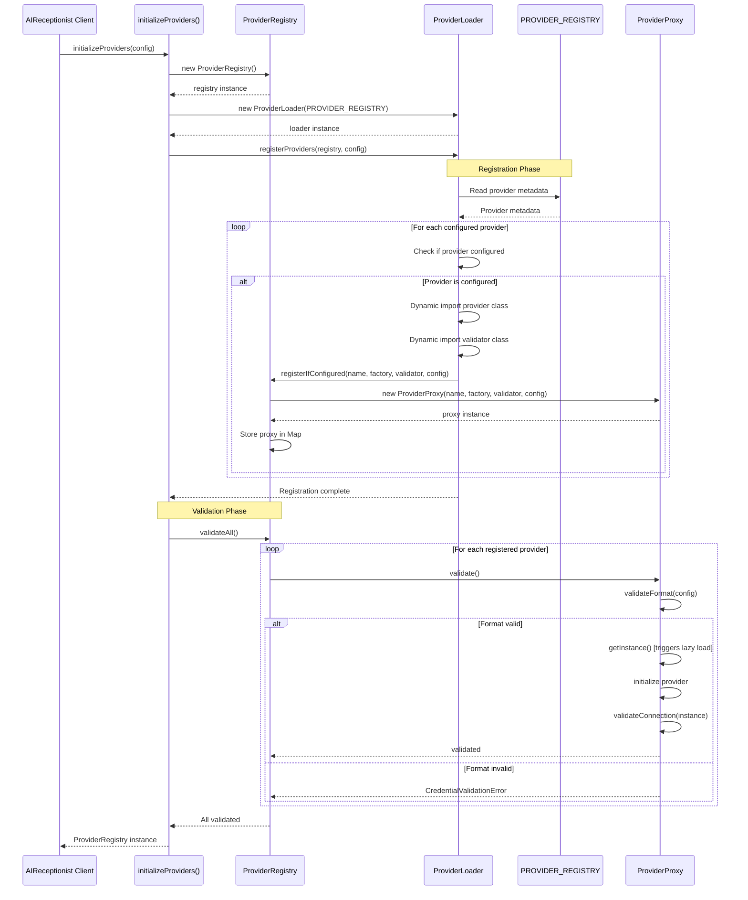
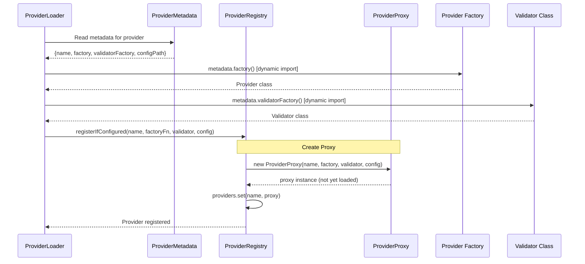
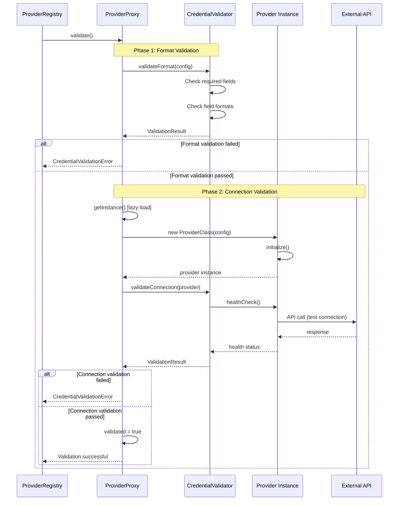
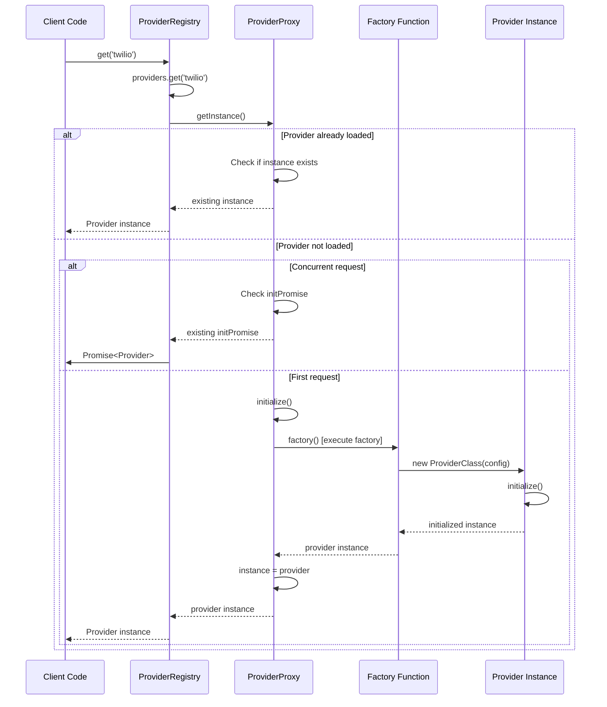
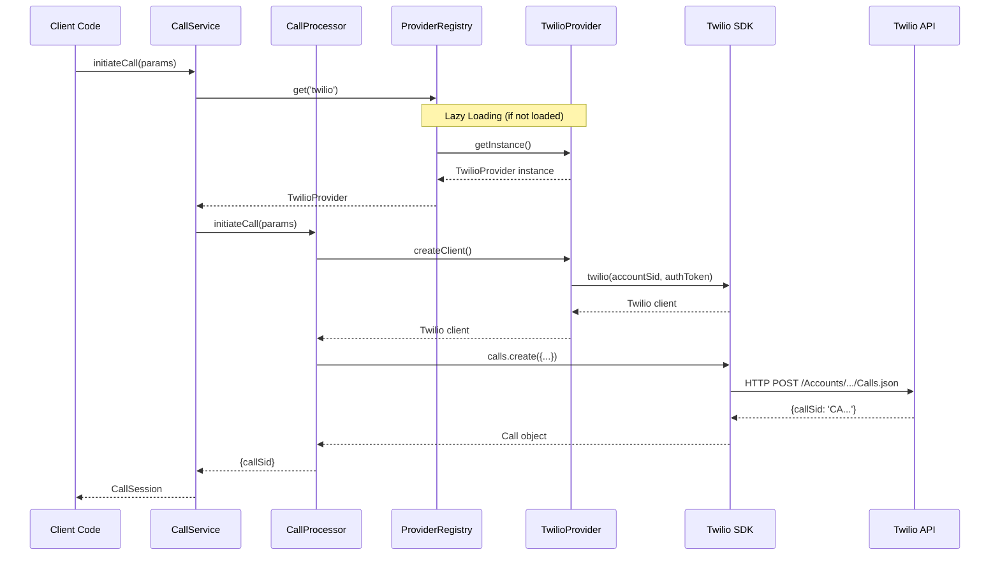
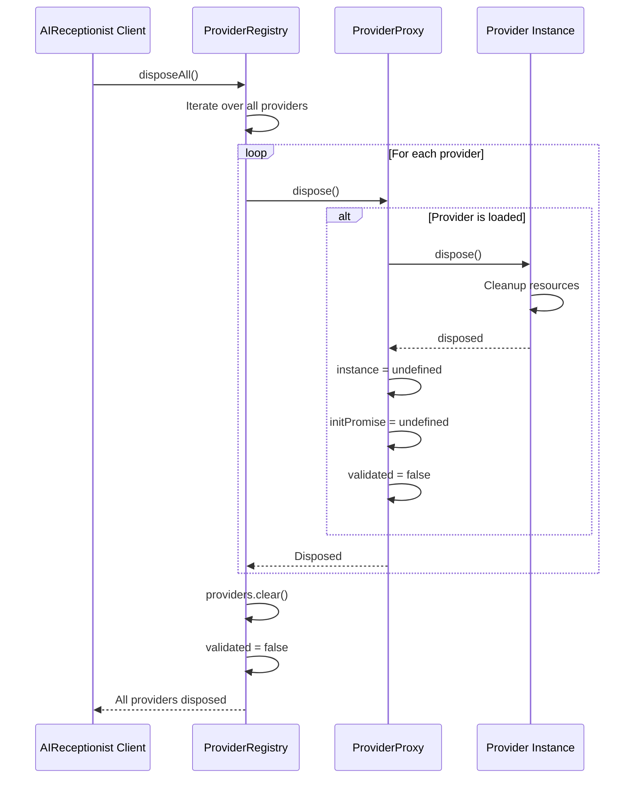
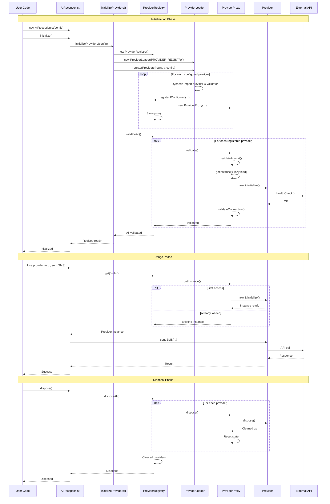
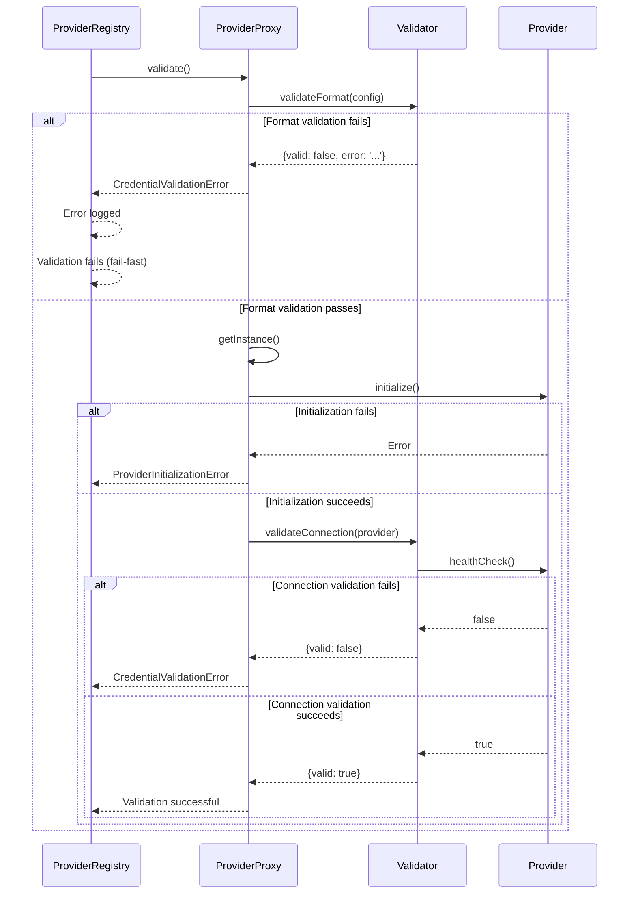
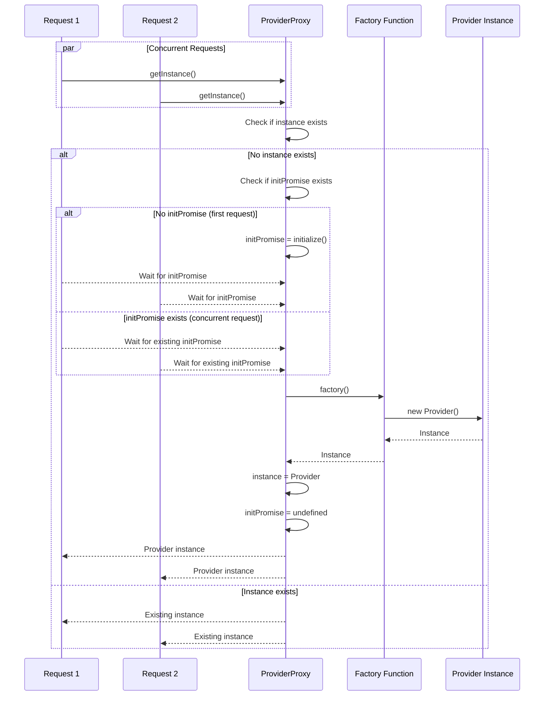

# Provider System Sequence Diagrams

This document provides detailed sequence diagrams showing how the provider system works, from initialization to usage.

## Table of Contents

1. [Provider Initialization Flow](#provider-initialization-flow)
2. [Provider Registration Flow](#provider-registration-flow)
3. [Provider Validation Flow](#provider-validation-flow)
4. [Provider Access Flow (Lazy Loading)](#provider-access-flow-lazy-loading)
5. [Provider Usage Flow](#provider-usage-flow)
6. [Provider Disposal Flow](#provider-disposal-flow)
7. [Complete Lifecycle Flow](#complete-lifecycle-flow)

---

## Provider Initialization Flow

This diagram shows how providers are initialized when the SDK starts up.

---

## Provider Registration Flow

This diagram details how a single provider is registered with the registry.

---

## Provider Validation Flow

This diagram shows the two-phase validation process that occurs during initialization.

---

## Provider Access Flow (Lazy Loading)

This diagram shows how providers are lazily loaded when first accessed.

---

## Provider Usage Flow

This diagram shows how a provider is used after it's been loaded, using Twilio as an example.

---

## Provider Disposal Flow

This diagram shows how providers are cleaned up when the SDK shuts down.

---

## Complete Lifecycle Flow

This comprehensive diagram shows the complete lifecycle from initialization to disposal.

---

## Key Design Patterns Used

### 1. Service Locator Pattern
- **ProviderRegistry** acts as a service locator, managing all provider instances
- Centralized access point for providers

### 2. Proxy Pattern
- **ProviderProxy** implements lazy loading
- Transparent access to provider instances
- Defers initialization until first use

### 3. Factory Pattern
- Factory functions create provider instances
- Dynamic imports enable code splitting

### 4. Strategy Pattern
- **ICredentialValidator** interface with multiple implementations
- Each provider type has its own validator strategy

### 5. Metadata Pattern
- **PROVIDER_REGISTRY** contains metadata for auto-discovery
- Enables automatic registration based on configuration

---

## Error Handling Flow

---

## Thread Safety in Lazy Loading

The ProviderProxy ensures thread-safe lazy loading:

---

## Summary

The provider system uses a sophisticated architecture that:

1. **Auto-discovers** providers using metadata
2. **Lazy loads** providers only when needed
3. **Validates** credentials early to fail fast
4. **Thread-safe** concurrent access handling
5. **Clean disposal** of resources

All of these patterns work together to provide a robust, scalable provider management system that integrates seamlessly with external services while maintaining excellent performance and developer experience.

