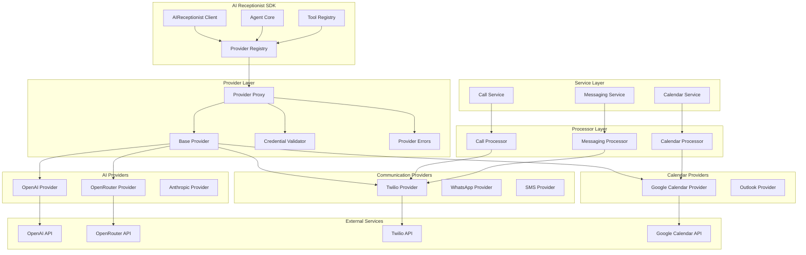
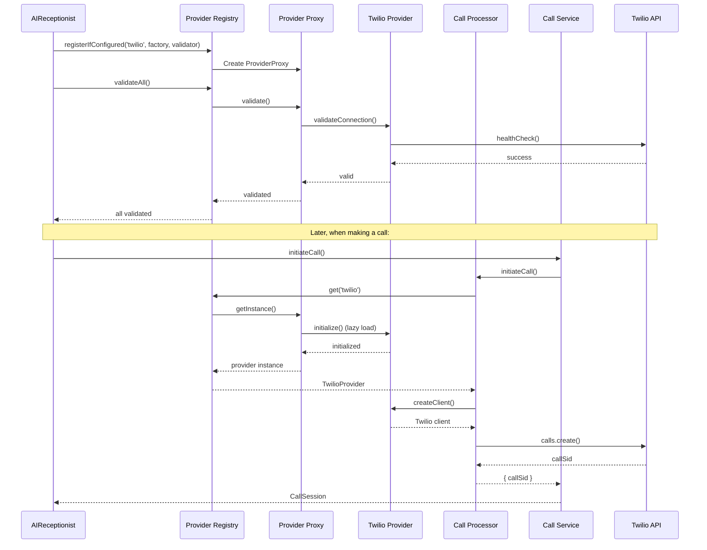

# Provider Architecture

The AI Receptionist SDK uses a sophisticated provider architecture that enables seamless integration with various external services through a unified interface. This document explains how providers work, their lifecycle, and how to use them.

## Overview

Providers are the bridge between the AI Receptionist SDK and external services. They abstract away the complexity of different APIs and provide a consistent interface for the SDK to interact with services like AI models, communication platforms, and calendar systems.

## Architecture Diagram



## Complete Provider Flow

The provider system follows a layered architecture:

1. **Client Layer**: `AIReceptionist` initializes and manages providers
2. **Registry Layer**: `ProviderRegistry` manages provider lifecycle with lazy loading
3. **Proxy Layer**: `ProviderProxy` handles lazy instantiation and validation
4. **Provider Layer**: Actual provider implementations (OpenAI, Twilio, Google)
5. **Processor Layer**: Administrative wrappers that use providers
6. **Service Layer**: High-level business logic using processors

### Data Flow Example



## Core Components

### 1. Base Provider Interface

All providers implement the `IProvider` interface, which defines the standard lifecycle methods:

```typescript
interface IProvider {
  readonly name: string;
  readonly type: 'communication' | 'ai' | 'api' | 'calendar' | 'crm' | 'storage' | 'custom';
  initialize(): Promise<void>;
  dispose(): Promise<void>;
  healthCheck(): Promise<boolean>;
}
```

### 2. Provider Registry

The `ProviderRegistry` is the central service locator that manages all provider instances. It implements:

- **Lazy Loading**: Providers are only instantiated when first accessed
- **Credential Validation**: Early validation of provider credentials
- **Lifecycle Management**: Centralized initialization and disposal
- **Type Safety**: Generic retrieval with compile-time type checking

### 3. Provider Proxy

The `ProviderProxy` implements the Proxy Pattern for transparent lazy loading:

- **Deferred Instantiation**: Providers are created only when needed
- **Thread Safety**: Prevents concurrent initialization
- **Credential Validation**: Validates credentials before first use
- **Error Handling**: Graceful handling of initialization failures

### 4. Provider Error System

The system includes a comprehensive error hierarchy for provider-related failures:

```typescript
// Base error for all provider-related errors
export class ProviderError extends Error {
  constructor(
    message: string,
    public readonly code: string,
    public readonly statusCode?: number,
    public readonly context?: Record<string, unknown>
  );
}

// Thrown when provider credentials fail validation
export class CredentialValidationError extends ProviderError {
  constructor(providerName: string, details: string, context?: Record<string, unknown>);
}

// Thrown when trying to access a provider that wasn't configured
export class ProviderNotConfiguredError extends ProviderError {
  constructor(providerName: string);
}

// Thrown when provider initialization fails
export class ProviderInitializationError extends ProviderError {
  constructor(providerName: string, details: string, context?: Record<string, unknown>);
}
```

### 5. Processor Layer

Processors are thin administrative wrappers that use providers for specific operations:

- **CallProcessor**: Uses TwilioProvider for call operations
- **MessagingProcessor**: Uses TwilioProvider for SMS operations  
- **CalendarProcessor**: Uses GoogleProvider for calendar operations

```typescript
// Example: CallProcessor using TwilioProvider
export class CallProcessor {
  constructor(private twilioProvider: TwilioProvider) {}

  async initiateCall(params: InitiateCallParams): Promise<{ callSid: string }> {
    const client = this.twilioProvider.createClient();
    const config = this.twilioProvider.getConfig();
    
    const call = await client.calls.create({
      to: params.to,
      from: config.phoneNumber,
      url: `http://localhost:3000/webhooks/calls/${params.conversationId}`
    });
    
    return { callSid: call.sid };
  }
}
```

### 6. Service Layer Integration

Services use processors (which use providers) for high-level operations:

- **CallService**: Uses CallProcessor for voice operations
- **MessagingService**: Uses MessagingProcessor for SMS operations
- **CalendarService**: Uses CalendarProcessor for scheduling operations

## Provider Types

### AI Providers

AI providers handle language model interactions:

#### OpenAI Provider
```typescript
const openaiProvider = new OpenAIProvider({
  apiKey: 'sk-...',
  model: 'gpt-4',
  temperature: 0.7,
  maxTokens: 2000
});
```

**Features:**
- Full OpenAI SDK integration
- Function calling support
- Streaming support (future)
- Automatic retry with exponential backoff

#### OpenRouter Provider
```typescript
const openrouterProvider = new OpenRouterProvider({
  apiKey: 'sk-or-...',
  model: 'anthropic/claude-3-opus',
  temperature: 0.7,
  maxTokens: 2000
});
```

**Features:**
- Access to 100+ AI models
- OpenAI-compatible interface
- Automatic fallback and load balancing
- Cost optimization

### Communication Providers

Communication providers handle messaging and voice interactions:

#### Twilio Provider
```typescript
const twilioProvider = new TwilioProvider({
  accountSid: 'AC...',
  authToken: '...',
  phoneNumber: '+1234567890'
});
```

**Features:**
- SMS and voice capabilities
- Webhook handling
- Call recording
- Message status tracking

### Calendar Providers

Calendar providers manage scheduling and appointments:

#### Google Calendar Provider
```typescript
const googleProvider = new GoogleProvider({
  credentials: {
    client_id: '...',
    client_secret: '...',
    refresh_token: '...'
  },
  calendarId: 'primary'
});
```

**Features:**
- Event creation and management
- Availability checking
- Time zone handling
- Recurring events

## Provider Lifecycle

### 1. Registration in Client.ts

Providers are registered during SDK initialization in the `AIReceptionist.initialize()` method:

```typescript
// 6. Initialize Provider Registry (Service Locator Pattern)
this.providerRegistry = new ProviderRegistry();

// 7. Register AI provider (always required, lazy loaded)
this.providerRegistry.registerIfConfigured(
  'ai',
  async () => {
    switch (this.config.model.provider) {
      case 'openai': {
        const { OpenAIProvider } = await import('./providers/ai/openai.provider');
        return new OpenAIProvider(this.config.model);
      }
      case 'openrouter': {
        const { OpenRouterProvider } = await import('./providers/ai/openrouter.provider');
        return new OpenRouterProvider(this.config.model);
      }
      case 'anthropic':
      case 'google':
        throw new Error(`${this.config.model.provider} provider not yet implemented`);
      default:
        throw new Error(`Unknown AI provider: ${this.config.model.provider}`);
    }
  },
  new OpenAIValidator(),
  this.config.model
);

// 8. Register Twilio provider ONLY if credentials configured (lazy loaded)
if (this.config.providers.communication?.twilio) {
  this.providerRegistry.registerIfConfigured(
    'twilio',
    async () => {
      const { TwilioProvider } = await import('./providers');
      return new TwilioProvider(this.config.providers.communication!.twilio!);
    },
    new TwilioValidator(),
    this.config.providers.communication.twilio
  );
}

// 9. Register Google Calendar provider ONLY if credentials configured (lazy loaded)
if (this.config.providers.calendar?.google) {
  this.providerRegistry.registerIfConfigured(
    'google',
    async () => {
      const { GoogleProvider } = await import('./providers');
      return new GoogleProvider(this.config.providers.calendar!.google!);
    },
    new GoogleValidator(),
    this.config.providers.calendar.google
  );
}
```

### 2. Early Validation System

The validation system uses a **Strategy Pattern** with two-phase validation:

```typescript
// 10. Validate ALL registered providers early (fail fast on bad credentials)
logger.info('[AIReceptionist] Validating provider credentials...');
await this.providerRegistry.validateAll();
logger.info('[AIReceptionist] All credentials validated successfully');
```

**Two-Phase Validation Process:**

1. **Format Validation** (Lightweight, no API calls):
   - Checks credential structure and format
   - Validates required fields are present
   - Validates format patterns (e.g., API keys start with 'sk-')

2. **Connection Validation** (Makes API calls):
   - Tests actual connectivity to external services
   - Verifies credentials work with real APIs
   - Performs health checks

### 3. Lazy Loading with Provider Proxy

Providers are instantiated only when first accessed through the ProviderProxy:

```typescript
// Provider loads on first access via proxy
const aiProvider = await this.providerRegistry.get<OpenAIProvider | OpenRouterProvider>('ai');
```

The ProviderProxy implements:
- **Thread-safe lazy loading**
- **Credential validation before instantiation**
- **Error handling for failed initialization**

### 4. Usage in Agent and Services

Providers are used throughout the SDK:

```typescript
// AI provider for chat completions in Agent
const response = await this.aiProvider.chat({
  conversationId: request.context.conversationId,
  userMessage: request.input,
  conversationHistory: memoryContext.shortTerm || [],
  availableTools: availableTools,
  systemPrompt: systemPrompt
});

// Twilio provider for communication services
if (this.providerRegistry.has('twilio')) {
  const twilioProvider = await this.providerRegistry.get<TwilioProvider>('twilio');
  
  // Create processors for administrative operations
  const { CallProcessor } = await import('./processors/call.processor');
  const { MessagingProcessor } = await import('./processors/messaging.processor');
  
  this.callProcessor = new CallProcessor(twilioProvider);
  this.messagingProcessor = new MessagingProcessor(twilioProvider);
}
```

### 5. Disposal

Providers are properly disposed when the SDK is shut down:

```typescript
async dispose(): Promise<void> {
  logger.info('[AIReceptionist] Disposing');

  if (this.agent) {
    await this.agent.dispose();
  }

  // Dispose all providers via registry
  if (this.providerRegistry) {
    await this.providerRegistry.disposeAll();
  }

  this.initialized = false;
}
```

## Configuration Management

### Initial Configuration

Users can configure providers during SDK initialization:

```typescript
import { AIReceptionist } from '@ai-receptionist/sdk';

const sdk = new AIReceptionist({
  model: {
    provider: 'openai',
    apiKey: process.env.OPENAI_API_KEY,
    model: 'gpt-4'
  },
  providers: {
    communication: {
      twilio: {
        accountSid: process.env.TWILIO_ACCOUNT_SID,
        authToken: process.env.TWILIO_AUTH_TOKEN,
        phoneNumber: process.env.TWILIO_PHONE_NUMBER
      }
    },
    calendar: {
      google: {
        credentials: {
          client_id: process.env.GOOGLE_CLIENT_ID,
          client_secret: process.env.GOOGLE_CLIENT_SECRET,
          refresh_token: process.env.GOOGLE_REFRESH_TOKEN
        },
        calendarId: 'primary'
      }
    }
  }
});

await sdk.initialize();
```

### Runtime Model Switching

Users can now change provider configurations at runtime through the provider registry:

```typescript
// Get the provider registry
const registry = sdk.getProviderRegistry();

// Get the AI provider (works for both OpenAI and OpenRouter)
const aiProvider = await registry.get<OpenAIProvider | OpenRouterProvider>('ai');

// Switch models at runtime
if (aiProvider instanceof OpenRouterProvider) {
  // OpenRouter supports switching between different models
  aiProvider.setModel('anthropic/claude-3-opus');
  const reasoningResponse = await aiProvider.chat({
    conversationId: 'conv-123',
    userMessage: 'Analyze this complex problem...',
    systemPrompt: 'You are a reasoning expert...'
  });

  // Switch to GPT-4 for creative tasks
  aiProvider.setModel('openai/gpt-4-turbo');
  const creativeResponse = await aiProvider.chat({
    conversationId: 'conv-124',
    userMessage: 'Write a creative story...',
    systemPrompt: 'You are a creative writer...'
  });

  // Switch to a cost-effective model for simple tasks
  aiProvider.setModel('meta-llama/llama-3-8b-instruct');
  const simpleResponse = await aiProvider.chat({
    conversationId: 'conv-125',
    userMessage: 'What is the weather?',
    systemPrompt: 'You are a helpful assistant...'
  });
} else if (aiProvider instanceof OpenAIProvider) {
  // OpenAI supports switching between different OpenAI models
  aiProvider.setModel('gpt-4');
  const response = await aiProvider.chat({
    conversationId: 'conv-126',
    userMessage: 'Hello!',
    systemPrompt: 'You are a helpful assistant...'
  });
}
```

### Configuration Management Interface

All AI providers now implement the `IConfigurableProvider` interface:

```typescript
interface IConfigurableProvider extends IProvider {
  updateConfig(newConfig: any): Promise<void>;
  getConfig(): any;
  validateConfig(config: any): Promise<{ valid: boolean; error?: string }>;
  resetConfig(): Promise<void>;
}
```

### Provider-Specific Configuration Methods

#### OpenAI Provider

```typescript
const openai = await registry.get<OpenAIProvider>('ai');

// Change model
await openai.setModel('gpt-4');

// Change API key
await openai.setApiKey('sk-new-api-key');

// Update full configuration
await openai.updateConfig({
  provider: 'openai',
  apiKey: 'sk-new-key',
  model: 'gpt-4-turbo',
  temperature: 0.8,
  maxTokens: 4000
});

// Validate configuration before applying
const validation = await openai.validateConfig(newConfig);
if (validation.valid) {
  await openai.updateConfig(newConfig);
} else {
  console.error('Invalid config:', validation.error);
}

// Reset to defaults
await openai.resetConfig();
```

#### OpenRouter Provider

```typescript
const openrouter = await registry.get<OpenRouterProvider>('ai');

// Change model (supports 100+ models)
await openrouter.setModel('anthropic/claude-3-opus');

// Change API key
await openrouter.setApiKey('sk-or-new-api-key');

// Update full configuration
await openrouter.updateConfig({
  provider: 'openrouter',
  apiKey: 'sk-or-new-key',
  model: 'google/gemini-pro',
  temperature: 0.9,
  maxTokens: 8000
});

// Validate model availability
const isAvailable = await openrouter.validateModel('anthropic/claude-3-opus');
if (isAvailable) {
  await openrouter.setModel('anthropic/claude-3-opus');
}

// List available models
const models = await openrouter.listAvailableModels();
console.log('Available models:', models);
```

### Available Models

OpenRouter provides access to 100+ models from different providers:

```typescript
import { OPENROUTER_MODELS } from '@ai-receptionist/sdk';

// Popular model options
const models = {
  // OpenAI models
  gpt4: OPENROUTER_MODELS.openai.gpt4,
  gpt4Turbo: OPENROUTER_MODELS.openai.gpt4Turbo,
  gpt35Turbo: OPENROUTER_MODELS.openai.gpt35Turbo,
  
  // Anthropic models
  claude3Opus: OPENROUTER_MODELS.anthropic.claude3Opus,
  claude3Sonnet: OPENROUTER_MODELS.anthropic.claude3Sonnet,
  claude3Haiku: OPENROUTER_MODELS.anthropic.claude3Haiku,
  
  // Google models
  geminiPro: OPENROUTER_MODELS.google.geminiPro,
  geminiPro15: OPENROUTER_MODELS.google.geminiPro15,
  
  // Meta models
  llama3_70b: OPENROUTER_MODELS.meta.llama3_70b,
  llama3_8b: OPENROUTER_MODELS.meta.llama3_8b,
  
  // Mistral models
  mistralLarge: OPENROUTER_MODELS.mistral.mistralLarge,
  mistralMedium: OPENROUTER_MODELS.mistral.mistralMedium,
  mixtral: OPENROUTER_MODELS.mistral.mixtral
};
```

### Model Validation

Check if a model is available before switching:

```typescript
const openrouter = await sdk.providerRegistry.get<OpenRouterProvider>('ai');

// Validate model availability
const isAvailable = await openrouter.validateModel('anthropic/claude-3-opus');
if (isAvailable) {
  openrouter.setModel('anthropic/claude-3-opus');
} else {
  console.warn('Model not available, falling back to default');
}

// List all available models
const availableModels = await openrouter.listAvailableModels();
console.log('Available models:', availableModels);
```

### Dynamic Provider Registration

Users can register additional providers at runtime:

```typescript
// Register a custom provider
const customProvider = new CustomProvider({
  apiKey: 'custom-api-key',
  endpoint: 'https://custom-api.com'
});

// Register with the registry
sdk.providerRegistry.registerIfConfigured(
  'custom',
  () => customProvider,
  new CustomValidator(),
  { apiKey: 'custom-api-key' }
);

// Use the custom provider
const custom = await sdk.providerRegistry.get<CustomProvider>('custom');
```

### Environment-Based Configuration

Use environment variables for different deployment environments:

```typescript
// Development configuration
const devConfig = {
  model: {
    provider: 'openrouter',
    apiKey: process.env.OPENROUTER_API_KEY,
    model: 'meta-llama/llama-3-8b-instruct' // Cost-effective for dev
  },
  providers: {
    communication: {
      twilio: {
        accountSid: process.env.TWILIO_DEV_ACCOUNT_SID,
        authToken: process.env.TWILIO_DEV_AUTH_TOKEN,
        phoneNumber: process.env.TWILIO_DEV_PHONE_NUMBER
      }
    }
  }
};

// Production configuration
const prodConfig = {
  model: {
    provider: 'openai',
    apiKey: process.env.OPENAI_API_KEY,
    model: 'gpt-4' // High-quality for production
  },
  providers: {
    communication: {
      twilio: {
        accountSid: process.env.TWILIO_PROD_ACCOUNT_SID,
        authToken: process.env.TWILIO_PROD_AUTH_TOKEN,
        phoneNumber: process.env.TWILIO_PROD_PHONE_NUMBER
      }
    }
  }
};

const sdk = new AIReceptionist(process.env.NODE_ENV === 'production' ? prodConfig : devConfig);
```

### Configuration Validation

Validate configurations before initialization:

```typescript
import { OpenAIValidator, TwilioValidator } from '@ai-receptionist/sdk';

// Validate AI provider config
const aiValidator = new OpenAIValidator();
const aiResult = aiValidator.validateFormat({
  provider: 'openai',
  apiKey: process.env.OPENAI_API_KEY,
  model: 'gpt-4'
});

if (!aiResult.valid) {
  throw new Error(`AI configuration invalid: ${aiResult.error}`);
}

// Validate Twilio config
const twilioValidator = new TwilioValidator();
const twilioResult = twilioValidator.validateFormat({
  accountSid: process.env.TWILIO_ACCOUNT_SID,
  authToken: process.env.TWILIO_AUTH_TOKEN,
  phoneNumber: process.env.TWILIO_PHONE_NUMBER
});

if (!twilioResult.valid) {
  throw new Error(`Twilio configuration invalid: ${twilioResult.error}`);
}
```

## Usage Examples

### Basic Configuration

```typescript
import { AIReceptionist } from '@ai-receptionist/sdk';

const sdk = new AIReceptionist({
  model: {
    provider: 'openai',
    apiKey: process.env.OPENAI_API_KEY,
    model: 'gpt-4'
  },
  providers: {
    communication: {
      twilio: {
        accountSid: process.env.TWILIO_ACCOUNT_SID,
        authToken: process.env.TWILIO_AUTH_TOKEN,
        phoneNumber: process.env.TWILIO_PHONE_NUMBER
      }
    },
    calendar: {
      google: {
        credentials: {
          client_id: process.env.GOOGLE_CLIENT_ID,
          client_secret: process.env.GOOGLE_CLIENT_SECRET,
          refresh_token: process.env.GOOGLE_REFRESH_TOKEN
        },
        calendarId: 'primary'
      }
    }
  }
});

await sdk.initialize();
```

### Using Multiple AI Models

```typescript
// Switch between models at runtime
const openrouter = await sdk.providerRegistry.get<OpenRouterProvider>('ai');

// Use Claude for complex reasoning
openrouter.setModel('anthropic/claude-3-opus');
const reasoningResponse = await openrouter.chat(options);

// Use GPT-4 for creative tasks
openrouter.setModel('openai/gpt-4-turbo');
const creativeResponse = await openrouter.chat(options);
```

### Custom Provider Implementation

```typescript
import { BaseProvider } from '@ai-receptionist/sdk';

class CustomProvider extends BaseProvider {
  readonly name = 'custom';
  readonly type = 'custom' as const;

  async initialize(): Promise<void> {
    // Initialize your custom service
    this.initialized = true;
  }

  async dispose(): Promise<void> {
    // Clean up resources
    this.initialized = false;
  }

  async healthCheck(): Promise<boolean> {
    // Check if your service is healthy
    return this.initialized;
  }

  // Add your custom methods
  async customMethod(): Promise<any> {
    this.ensureInitialized();
    // Your custom logic
  }
}
```

## Validation System Implementation

The validation system uses the **Strategy Pattern** with specific validators for each provider type:

### Validator Interface

```typescript
interface ICredentialValidator {
  validateFormat(config: any): ValidationResult;
  validateConnection(provider: IProvider): Promise<ValidationResult>;
}

interface ValidationResult {
  valid: boolean;
  error?: string;
  details?: any;
}
```

### OpenAI Validator

Validates AI provider credentials (OpenAI and OpenRouter):

```typescript
export class OpenAIValidator implements ICredentialValidator {
  validateFormat(config: AIModelConfig): ValidationResult {
    // Check required fields
    if (!config.apiKey) {
      return {
        valid: false,
        error: 'Missing API key for AI provider',
        details: { provider: config.provider }
      };
    }

    // Validate API key format based on provider
    if (config.provider === 'openai' && !config.apiKey.startsWith('sk-')) {
      return {
        valid: false,
        error: 'Invalid OpenAI API key format (should start with "sk-")',
        details: { provider: config.provider }
      };
    }

    if (config.provider === 'openrouter' && !config.apiKey.startsWith('sk-or-')) {
      return {
        valid: false,
        error: 'Invalid OpenRouter API key format (should start with "sk-or-")',
        details: { provider: config.provider }
      };
    }

    return { valid: true };
  }

  async validateConnection(provider: IProvider): Promise<ValidationResult> {
    const healthy = await provider.healthCheck();
    return healthy
      ? { valid: true }
      : { valid: false, error: 'Failed to connect to AI provider API' };
  }
}
```

### Twilio Validator

Validates Twilio communication provider credentials:

```typescript
export class TwilioValidator implements ICredentialValidator {
  validateFormat(config: TwilioConfig): ValidationResult {
    // Check required fields
    if (!config.accountSid || !config.authToken || !config.phoneNumber) {
      return {
        valid: false,
        error: 'Missing required Twilio credentials (accountSid, authToken, phoneNumber)',
        details: {
          hasAccountSid: !!config.accountSid,
          hasAuthToken: !!config.authToken,
          hasPhoneNumber: !!config.phoneNumber
        }
      };
    }

    // Validate Account SID format
    if (!config.accountSid.startsWith('AC')) {
      return {
        valid: false,
        error: 'Invalid Twilio Account SID format (should start with "AC")',
        details: { accountSid: config.accountSid.substring(0, 5) + '...' }
      };
    }

    // Validate phone number format (E.164)
    const e164Regex = /^\+?[1-9]\d{1,14}$/;
    if (!e164Regex.test(config.phoneNumber)) {
      return {
        valid: false,
        error: 'Invalid phone number format (use E.164 format: +1234567890)',
        details: { phoneNumber: config.phoneNumber }
      };
    }

    return { valid: true };
  }

  async validateConnection(provider: IProvider): Promise<ValidationResult> {
    const healthy = await provider.healthCheck();
    return healthy
      ? { valid: true }
      : { valid: false, error: 'Failed to connect to Twilio API' };
  }
}
```

### Google Validator

Validates Google Calendar provider credentials:

```typescript
export class GoogleValidator implements ICredentialValidator {
  validateFormat(config: GoogleConfig): ValidationResult {
    // Check that at least one authentication method is provided
    if (!config.apiKey && !config.credentials) {
      return {
        valid: false,
        error: 'Missing Google credentials (apiKey or credentials required)',
        details: {
          hasApiKey: !!config.apiKey,
          hasCredentials: !!config.credentials
        }
      };
    }

    // Validate calendar ID format
    if (config.calendarId !== 'primary' && !this.isValidCalendarId(config.calendarId)) {
      return {
        valid: false,
        error: 'Invalid Google Calendar ID format (should be email-like format or "primary")',
        details: { calendarId: config.calendarId }
      };
    }

    return { valid: true };
  }

  async validateConnection(provider: IProvider): Promise<ValidationResult> {
    const healthy = await provider.healthCheck();
    return healthy
      ? { valid: true }
      : { valid: false, error: 'Failed to connect to Google Calendar API' };
  }
}
```

## Best Practices

### 1. Error Handling

Always handle provider errors gracefully:

```typescript
try {
  const provider = await registry.get<OpenAIProvider>('ai');
  const response = await provider.chat(options);
} catch (error) {
  if (error instanceof CredentialValidationError) {
    // Handle credential issues
    console.error('Credential validation failed:', error.message);
  } else if (error instanceof ProviderInitializationError) {
    // Handle initialization issues
    console.error('Provider initialization failed:', error.message);
  } else {
    // Handle other errors
    console.error('Unexpected error:', error.message);
  }
}
```

### 2. Health Checks

Regularly check provider health:

```typescript
const isHealthy = await provider.healthCheck();
if (!isHealthy) {
  // Handle unhealthy provider
  console.warn('Provider health check failed');
}
```

### 3. Resource Management

Always dispose providers when done:

```typescript
try {
  // Use provider
} finally {
  await provider.dispose();
}
```

### 4. Configuration Validation

Validate provider configurations early:

```typescript
// Validate before registration
const validator = new OpenAIValidator();
const result = validator.validateFormat(config);
if (!result.valid) {
  throw new Error(`Invalid OpenAI configuration: ${result.error}`);
}
```

## Troubleshooting

### Common Issues

1. **Provider Not Found**
   - Ensure provider is registered before use
   - Check provider name spelling
   - Verify provider is configured

2. **Credential Validation Failed**
   - Check API keys and credentials
   - Verify service permissions
   - Test credentials manually

3. **Initialization Failed**
   - Check network connectivity
   - Verify service availability
   - Review error logs

4. **Health Check Failed**
   - Check service status
   - Verify API quotas
   - Review rate limits

### Debug Mode

Enable debug logging to troubleshoot provider issues:

```typescript
import { logger } from '@ai-receptionist/sdk';

// Enable debug logging
logger.setLevel('debug');

// Check provider status
const provider = await registry.get<OpenAIProvider>('ai');
console.log('Provider loaded:', provider.isLoaded());
console.log('Provider validated:', provider.isValidated());
```

## Conclusion

The provider architecture provides a flexible, scalable way to integrate with external services while maintaining a consistent interface. The lazy loading pattern ensures optimal performance, while the validation system prevents runtime errors from misconfiguration.

For more information, see the [API Reference](../api-reference.md) and [Configuration Guide](../configuration.md).
