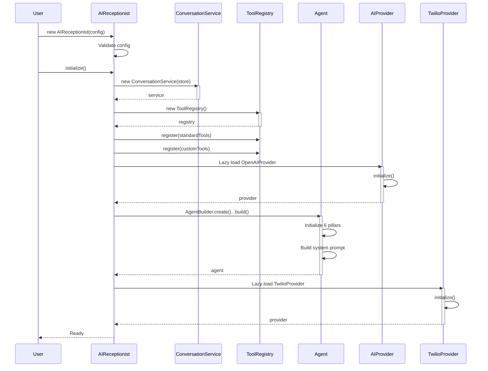
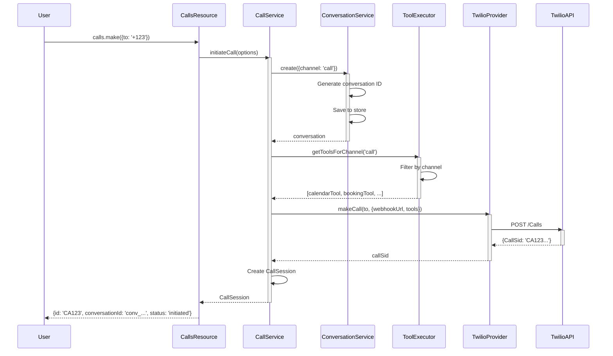
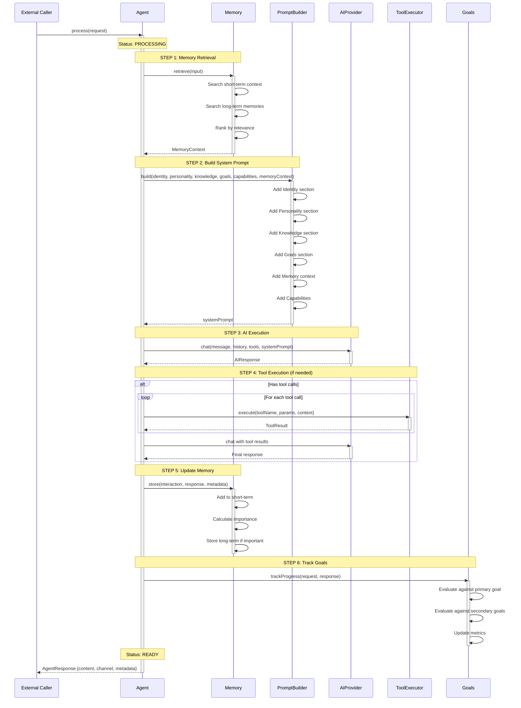

# AI Receptionist SDK - Complete Architecture Documentation

> **Agent-Centric AI Communication SDK with Six-Pillar Architecture**
>
> Version: 0.1.0
> Last Updated: October 2025

---

## Table of Contents

1. [Executive Summary](#executive-summary)
2. [Architectural Overview](#architectural-overview)
3. [Core Design Principles](#core-design-principles)
4. [System Architecture](#system-architecture)
5. [Six-Pillar Agent System](#six-pillar-agent-system)
6. [Layer-by-Layer Breakdown](#layer-by-layer-breakdown)
7. [Key Workflows & Sequence Diagrams](#key-workflows--sequence-diagrams)
8. [Data Flow Diagrams](#data-flow-diagrams)
9. [Component Interactions](#component-interactions)
10. [Extension Points](#extension-points)
11. [Performance Characteristics](#performance-characteristics)
12. [Security & Compliance](#security--compliance)

---

## Executive Summary

The **AI Receptionist SDK** is a production-ready, enterprise-grade TypeScript SDK for building intelligent AI agents that can communicate across multiple channels (voice calls, SMS, email). The SDK is built on a **six-pillar agent architecture** and follows clean code principles with a layered architecture pattern.

### Key Capabilities

- **Multi-Channel Communication**: Seamlessly handle voice calls, SMS, and email
- **Intelligent AI Agents**: Six-pillar architecture (Identity, Personality, Knowledge, Capabilities, Memory, Goals)
- **Extensible Tool System**: Channel-specific tool handlers with runtime registration
- **Provider Pattern**: Clean abstractions for external APIs (Twilio, OpenAI, Google Calendar)
- **Type-Safe**: Full TypeScript support with strict mode enabled
- **Production-Ready**: Built-in observability, error handling, and retry mechanisms

### Technology Stack

- **Runtime**: Node.js 18+
- **Language**: TypeScript 5.3+ (Strict Mode)
- **AI Providers**: OpenAI, OpenRouter, Anthropic (planned), Google (planned)
- **Communication**: Twilio (voice + SMS), SendGrid (email)
- **Testing**: Jest with 80%+ coverage target
- **Build**: tsup (ESM + CJS with tree-shaking)

---

## Architectural Overview

### High-Level Architecture

```
┌─────────────────────────────────────────────────────────────────────┐
│                          USER APPLICATION                            │
└─────────────────────────────────────────────────────────────────────┘
                                    │
                                    ▼
┌─────────────────────────────────────────────────────────────────────┐
│                     RESOURCE LAYER (Public API)                      │
│  ┌─────────────┐  ┌─────────────┐  ┌─────────────┐  ┌────────────┐ │
│  │   Calls     │  │    SMS      │  │   Email     │  │    Text    │ │
│  │  Resource   │  │  Resource   │  │  Resource   │  │  Resource  │ │
│  └─────────────┘  └─────────────┘  └─────────────┘  └────────────┘ │
└─────────────────────────────────────────────────────────────────────┘
                                    │
                                    ▼
┌─────────────────────────────────────────────────────────────────────┐
│                      SERVICE LAYER (Business Logic)                  │
│  ┌─────────────────────┐  ┌──────────────────┐  ┌────────────────┐ │
│  │   CallService       │  │ ToolExecution    │  │  Conversation  │ │
│  │  (Orchestration)    │  │    Service       │  │    Service     │ │
│  └─────────────────────┘  └──────────────────┘  └────────────────┘ │
└─────────────────────────────────────────────────────────────────────┘
                                    │
                                    ▼
┌─────────────────────────────────────────────────────────────────────┐
│                    AGENT LAYER (Intelligence)                        │
│                       ┌──────────────────┐                           │
│                       │  Agent (6 Pillars)│                          │
│                       └──────────────────┘                           │
│  ┌──────────┐ ┌──────────┐ ┌──────────┐ ┌──────────┐ ┌──────────┐ │
│  │ Identity │ │Personality│ │Knowledge │ │Capability│ │  Memory  │ │
│  └──────────┘ └──────────┘ └──────────┘ └──────────┘ └──────────┘ │
│                        ┌──────────┐                                  │
│                        │  Goals   │                                  │
│                        └──────────┘                                  │
│                                                                       │
│  ┌───────────────────┐  ┌──────────────┐  ┌─────────────────────┐  │
│  │ SystemPrompt      │  │ AgentLogger  │  │ InteractionTracer   │  │
│  │    Builder        │  │              │  │                     │  │
│  └───────────────────┘  └──────────────┘  └─────────────────────┘  │
└─────────────────────────────────────────────────────────────────────┘
                                    │
                                    ▼
┌─────────────────────────────────────────────────────────────────────┐
│               PROVIDER LAYER (External Integration)                  │
│  ┌─────────────────────────────────────────────────────────────────┐│
│  │ Communication Providers                                          ││
│  │  ┌──────────────┐  ┌─────────────┐                              ││
│  │  │   Twilio     │  │  SendGrid   │                              ││
│  │  │  (Voice+SMS) │  │   (Email)   │                              ││
│  │  └──────────────┘  └─────────────┘                              ││
│  └─────────────────────────────────────────────────────────────────┘│
│  ┌─────────────────────────────────────────────────────────────────┐│
│  │ AI Providers                                                     ││
│  │  ┌──────────────┐  ┌─────────────┐  ┌─────────────────────┐    ││
│  │  │   OpenAI     │  │ OpenRouter  │  │ Anthropic (planned) │    ││
│  │  └──────────────┘  └─────────────┘  └─────────────────────┘    ││
│  └─────────────────────────────────────────────────────────────────┘│
│  ┌─────────────────────────────────────────────────────────────────┐│
│  │ Calendar Providers                                               ││
│  │  ┌──────────────┐                                                ││
│  │  │ Google Cal   │                                                ││
│  │  └──────────────┘                                                ││
│  └─────────────────────────────────────────────────────────────────┘│
└─────────────────────────────────────────────────────────────────────┘
                                    │
                                    ▼
┌─────────────────────────────────────────────────────────────────────┐
│                     STORAGE LAYER (Persistence)                      │
│  ┌─────────────────────┐  ┌──────────────────┐                      │
│  │ ConversationStore   │  │   Tool Registry  │                      │
│  │  (In-Memory/Custom) │  │   (In-Memory)    │                      │
│  └─────────────────────┘  └──────────────────┘                      │
└─────────────────────────────────────────────────────────────────────┘
```


### Architectural Patterns

The SDK employs several proven design patterns:

1. **Layered Architecture**: Clear separation between resources, services, agents, and providers
2. **Provider Pattern (Adapter)**: External APIs wrapped in clean interfaces
3. **Builder Pattern**: Fluent API for constructing agents and tools
4. **Registry Pattern**: Centralized tool management with runtime registration
5. **Strategy Pattern**: Channel-specific tool handlers
6. **Service Layer Pattern**: Business logic separated from presentation and infrastructure
7. **Repository Pattern**: Abstracted data persistence (conversation store)
8. **Observer Pattern**: Event-driven callbacks for monitoring

---

## Core Design Principles

### 1. Agent-Centric Design

**Philosophy**: The AI agent is the primary entity, channels are just communication methods.

```typescript
// Sarah is ONE agent that can communicate through multiple channels
const sarah = new AIReceptionist({
  agent: {
    identity: { name: 'Sarah', role: 'Sales Rep' },
    personality: { traits: ['friendly', 'enthusiastic'] }
  }
});

// Same agent, different channels
await sarah.calls.make({ to: '+123' });  // Voice
await sarah.sms.send({ to: '+123' });    // Text
await sarah.email.send({ to: 'user@example.com' }); // Email
```

### 2. Single Responsibility Principle

Each component has **one reason to change**:

- **Resources**: User-facing API surface
- **Services**: Business logic and orchestration
- **Agent**: Intelligence and decision-making
- **Providers**: External API communication
- **Tools**: Specific capabilities and actions

### 3. Dependency Inversion

High-level modules don't depend on low-level modules. Both depend on abstractions.

```typescript
// Service depends on interface, not concrete implementation
class CallService {
  constructor(
    private twilioProvider: TwilioProvider,  // Could be any provider
    private aiProvider: IAIProvider,          // Interface
    private conversationService: ConversationService
  ) {}
}
```

### 4. Open/Closed Principle

**Open for extension, closed for modification**:

- Add new tools without modifying existing code
- Add new providers by implementing interfaces
- Extend agent capabilities without changing core

### 5. Type Safety First

- Strict TypeScript mode enabled
- No `any` in public APIs
- Comprehensive type definitions
- Compile-time safety guarantees

---

## System Architecture

### Component Diagram

```
┌──────────────────────────────────────────────────────────────────────────────────┐
│                           AIReceptionist (Main Client)                            │
│                                                                                    │
│  Entry Point: new AIReceptionist(config)                                          │
│  Lifecycle: initialize() → use resources → dispose()                              │
└──────────────────────────────────────────────────────────────────────────────────┘
              │
              │ Creates & Manages
              │
    ┌─────────┴────────┬─────────────────┬───────────────────┬────────────────┐
    │                  │                 │                   │                │
    ▼                  ▼                 ▼                   ▼                ▼
┌──────────┐    ┌──────────┐     ┌──────────┐       ┌──────────┐     ┌──────────┐
│  Calls   │    │   SMS    │     │  Email   │       │   Text   │     │  Agent   │
│ Resource │    │ Resource │     │ Resource │       │ Resource │     │  (Core)  │
└──────────┘    └──────────┘     └──────────┘       └──────────┘     └──────────┘
      │                │                                   │                │
      │ delegates      │ delegates                         │ uses           │
      ▼                ▼                                   ▼                ▼
┌────────────────────────────────────────────────────────────────────────────────┐
│                            SERVICE LAYER                                        │
│                                                                                  │
│  ┌──────────────────────┐  ┌────────────────────┐  ┌─────────────────────────┐ │
│  │   CallService        │  │  ToolExecution     │  │  ConversationService    │ │
│  │                      │  │     Service        │  │                         │ │
│  │ - initiateCall()     │  │ - execute()        │  │ - create()              │ │
│  │ - endCall()          │  │ - executeAll()     │  │ - get()                 │ │
│  │ - handleWebhook()    │  │ - getToolsFor      │  │ - update()              │ │
│  │                      │  │   Channel()        │  │ - appendMessage()       │ │
│  └──────────────────────┘  └────────────────────┘  └─────────────────────────┘ │
│           │                          │                         │                 │
│           │                          │                         │                 │
│           └──────────────┬───────────┴─────────────────────────┘                │
└──────────────────────────┼───────────────────────────────────────────────────────┘
                           │
                           │ Uses
                           ▼
┌─────────────────────────────────────────────────────────────────────────────────┐
│                         AGENT (Six-Pillar Architecture)                          │
│                                                                                   │
│  Core Intelligence: Agent.ts                                                     │
│                                                                                   │
│  ┌────────────────┐  ┌───────────────┐  ┌──────────────┐  ┌─────────────────┐  │
│  │   1. Identity  │  │ 2. Personality│  │ 3. Knowledge │  │ 4. Capability   │  │
│  │                │  │               │  │              │  │                 │  │
│  │ - name         │  │ - traits      │  │ - domain     │  │ - tools         │  │
│  │ - role         │  │ - commStyle   │  │ - expertise  │  │ - skills        │  │
│  │ - title        │  │ - tone        │  │ - context    │  │ - registry      │  │
│  │ - summary()    │  │ - errorMsg()  │  │ - load()     │  │ - getTools()    │  │
│  └────────────────┘  └───────────────┘  └──────────────┘  └─────────────────┘  │
│                                                                                   │
│  ┌────────────────┐  ┌───────────────┐                                          │
│  │   5. Memory    │  │   6. Goals    │                                          │
│  │                │  │               │                                          │
│  │ - shortTerm    │  │ - primary     │                                          │
│  │ - longTerm     │  │ - secondary   │                                          │
│  │ - retrieve()   │  │ - metrics     │                                          │
│  │ - store()      │  │ - track()     │                                          │
│  └────────────────┘  └───────────────┘                                          │
│                                                                                   │
│  Supporting Systems:                                                             │
│  ┌─────────────────────┐  ┌──────────────┐  ┌─────────────────────┐            │
│  │ SystemPromptBuilder │  │ AgentLogger  │  │ InteractionTracer   │            │
│  │                     │  │              │  │                     │            │
│  │ - build()           │  │ - info()     │  │ - startInteraction()│            │
│  │ - getSections()     │  │ - error()    │  │ - log()             │            │
│  │ - buildError        │  │ - debug()    │  │ - endInteraction()  │            │
│  │   RecoveryPrompt()  │  │              │  │                     │            │
│  └─────────────────────┘  └──────────────┘  └─────────────────────┘            │
│                                                                                   │
│  Main Process: process(request) → AgentResponse                                 │
│    1. Retrieve memory context                                                    │
│    2. Build system prompt                                                        │
│    3. Execute with AI provider                                                   │
│    4. Execute tools if needed                                                    │
│    5. Store in memory                                                            │
│    6. Track goal progress                                                        │
└───────────────────────────────────────────────────────────────────────────────────┘
                           │
                           │ Uses
                           ▼
┌──────────────────────────────────────────────────────────────────────────────────┐
│                        PROVIDER LAYER (Adapters)                                  │
│                                                                                    │
│  All providers implement: IProvider                                               │
│    - name, type                                                                   │
│    - initialize(), dispose(), healthCheck()                                       │
│                                                                                    │
│  ┌──────────────────────────────────────────────────────────────────────────┐    │
│  │  Communication Providers                                                  │    │
│  │                                                                            │    │
│  │  ┌───────────────────────┐    ┌────────────────────────┐                │    │
│  │  │   TwilioProvider      │    │   SendGridProvider     │                │    │
│  │  │                       │    │      (planned)         │                │    │
│  │  │ - makeCall()          │    │ - sendEmail()          │                │    │
│  │  │ - sendSMS()           │    │ - templates()          │                │    │
│  │  │ - endCall()           │    │                        │                │    │
│  │  └───────────────────────┘    └────────────────────────┘                │    │
│  └──────────────────────────────────────────────────────────────────────────┘    │
│                                                                                    │
│  ┌──────────────────────────────────────────────────────────────────────────┐    │
│  │  AI Providers                                                             │    │
│  │                                                                            │    │
│  │  ┌───────────────────────┐    ┌────────────────────────┐                │    │
│  │  │   OpenAIProvider      │    │  OpenRouterProvider    │                │    │
│  │  │                       │    │                        │                │    │
│  │  │ - chat()              │    │ - chat()               │                │    │
│  │  │ - streamChat()        │    │ - streamChat()         │                │    │
│  │  │ - embeddings()        │    │ - supports multiple    │                │    │
│  │  │                       │    │   models               │                │    │
│  │  └───────────────────────┘    └────────────────────────┘                │    │
│  └──────────────────────────────────────────────────────────────────────────┘    │
│                                                                                    │
│  ┌──────────────────────────────────────────────────────────────────────────┐    │
│  │  Calendar Providers                                                       │    │
│  │                                                                            │    │
│  │  ┌────────────────────────────┐                                          │    │
│  │  │  GoogleCalendarProvider    │                                          │    │
│  │  │                            │                                          │    │
│  │  │ - listEvents()             │                                          │    │
│  │  │ - createEvent()            │                                          │    │
│  │  │ - updateEvent()            │                                          │    │
│  │  │ - deleteEvent()            │                                          │    │
│  │  └────────────────────────────┘                                          │    │
│  └──────────────────────────────────────────────────────────────────────────┘    │
└────────────────────────────────────────────────────────────────────────────────────┘
                           │
                           │ Stores data in
                           ▼
┌──────────────────────────────────────────────────────────────────────────────────┐
│                          STORAGE & REGISTRY LAYER                                 │
│                                                                                    │
│  ┌─────────────────────────────┐    ┌──────────────────────────────────┐        │
│  │   ConversationStore         │    │      ToolRegistry                │        │
│  │   (IConversationStore)      │    │                                  │        │
│  │                             │    │  - tools: Map<string, ITool>     │        │
│  │ Default: InMemory           │    │  - register(tool)                │        │
│  │ Custom: Postgres, Redis,    │    │  - unregister(name)              │        │
│  │         MongoDB, etc.       │    │  - get(name)                     │        │
│  │                             │    │  - listAvailable(channel)        │        │
│  │ - save(conversation)        │    │  - execute(name, params, ctx)    │        │
│  │ - get(id)                   │    │  - count()                       │        │
│  │ - update(id, data)          │    │                                  │        │
│  │ - delete(id)                │    │  Standard Tools:                 │        │
│  │ - list(filter)              │    │  - calendar_check_availability   │        │
│  │                             │    │  - calendar_book_appointment     │        │
│  └─────────────────────────────┘    │  - crm_lookup_customer           │        │
│                                      │  - crm_create_lead               │        │
│                                      │  + custom tools...               │        │
│                                      └──────────────────────────────────┘        │
└──────────────────────────────────────────────────────────────────────────────────┘

Key Relationships:
  → Creates/Manages   ─── Uses   ┄┄┄ Implements Interface
```


### Initialization Sequence

The SDK follows a specific initialization order to ensure dependencies are available:

1. **Conversation Store** - State management foundation
2. **Tool Registry** - Tool management system
3. **Standard Tools** - Built-in capabilities (calendar, booking, CRM)
4. **Custom Tools** - User-provided tools
5. **Tool Executor** - Tool execution service with monitoring
6. **AI Provider** - Lazy-loaded based on configuration (OpenAI, OpenRouter, etc.)
7. **Agent** - Six-pillar agent with all dependencies
8. **Communication Providers** - Lazy-loaded (Twilio, SendGrid)
9. **Services** - Business logic services (CallService, etc.)
10. **Resources** - User-facing APIs

---

## Six-Pillar Agent System

The core intelligence of the SDK is the **Agent**, built on six foundational pillars. See [src/agent/core/Agent.ts](../../src/agent/core/Agent.ts) for implementation.

```
┌──────────────────────────────────────────────────────────────────────────────┐
│                       SIX-PILLAR AGENT ARCHITECTURE                           │
│                                                                                │
│                            ┌────────────────┐                                 │
│                            │     AGENT      │                                 │
│                            │   (Core Class) │                                 │
│                            └────────────────┘                                 │
│                                     │                                          │
│                                     │ Orchestrates                             │
│           ┌─────────────────────────┼─────────────────────────┐               │
│           │                         │                         │               │
│           ▼                         ▼                         ▼               │
│   ┌──────────────┐          ┌──────────────┐        ┌──────────────┐         │
│   │  1. IDENTITY │          │2. PERSONALITY│        │ 3. KNOWLEDGE │         │
│   └──────────────┘          └──────────────┘        └──────────────┘         │
│   Who am I?                 How do I behave?        What do I know?           │
│                                                                                │
│   - name: string            - traits: Trait[]       - domain: string          │
│   - role: string            - communicationStyle:   - expertise: string[]     │
│   - title?: string            { primary, adaptive } - facts: Fact[]           │
│   - organization?: string   - tone: object          - documentation: string   │
│   - backstory?: string      - errorMessages: map   - contextWindow: string    │
│                                                                                │
│   Methods:                  Methods:                Methods:                  │
│   - summary()               - applyToPrompt()       - load()                  │
│   - toJSON()                - getErrorMessage()     - search()                │
│                             - adjustTone()          - addFact()               │
│                                                     - dispose()               │
│           │                         │                         │               │
│           └─────────────────────────┼─────────────────────────┘               │
│                                     │                                          │
│           ┌─────────────────────────┼─────────────────────────┐               │
│           │                         │                         │               │
│           ▼                         ▼                         ▼               │
│   ┌──────────────┐          ┌──────────────┐        ┌──────────────┐         │
│   │4.CAPABILITIES│          │  5. MEMORY   │        │   6. GOALS   │         │
│   └──────────────┘          └──────────────┘        └──────────────┘         │
│   What can I do?            What do I remember?     What am I trying          │
│                                                     to achieve?               │
│                                                                                │
│   - tools: ITool[]          - shortTerm:            - primary: Goal           │
│   - skills: Skill[]           ShortTermMemory      - secondary: Goal[]        │
│   - registry: ref           - longTerm:             - metrics: Map            │
│                               LongTermMemory       - successCriteria: {}      │
│   Methods:                  - vector?: Vector       - evaluationRules: {}     │
│   - register(tool)            Memory                                          │
│   - getTools(channel)                               Methods:                  │
│   - execute(tool)           Methods:                - getCurrent()            │
│   - list()                  - retrieve(input)       - trackProgress()         │
│   - count()                 - store(memory)         - evaluate()              │
│                             - getStats()            - updateMetrics()         │
│                             - dispose()                                       │
│                                                                                │
└────────────────────────────────────────────────────────────────────────────────┘

┌──────────────────────────────────────────────────────────────────────────────┐
│                         SUPPORTING SYSTEMS                                    │
│                                                                                │
│  ┌────────────────────────┐  ┌───────────────────┐  ┌─────────────────────┐ │
│  │ SystemPromptBuilder    │  │   AgentLogger     │  │ InteractionTracer   │ │
│  │                        │  │                   │  │                     │ │
│  │ Assembles prompts from │  │ Structured logging│  │ Traces interactions │ │
│  │ all 6 pillars:         │  │ for observability │  │ for debugging       │ │
│  │                        │  │                   │  │                     │ │
│  │ build({               │  │ - info()          │  │ - start()           │ │
│  │   identity,           │  │ - error()         │  │ - log(event)        │ │
│  │   personality,        │  │ - debug()         │  │ - end()             │ │
│  │   knowledge,          │  │ - warn()          │  │ - getTrace()        │ │
│  │   goals,              │  │                   │  │                     │ │
│  │   capabilities,       │  │                   │  │                     │ │
│  │   memoryContext       │  │                   │  │                     │ │
│  │ })                    │  │                   │  │                     │ │
│  └────────────────────────┘  └───────────────────┘  └─────────────────────┘ │
└──────────────────────────────────────────────────────────────────────────────┘

┌──────────────────────────────────────────────────────────────────────────────┐
│                      AGENT PROCESSING WORKFLOW                                │
│                                                                                │
│  Input: AgentRequest { input, context, channel, metadata }                   │
│                                                                                │
│  1. MEMORY RETRIEVAL                                                          │
│     Memory.retrieve(input) → MemoryContext                                    │
│     - Pull relevant short-term context                                        │
│     - Search long-term memories for relevant facts                            │
│     - Rank and return top N most relevant items                               │
│                                                                                │
│  2. SYSTEM PROMPT GENERATION                                                  │
│     SystemPromptBuilder.build({...all pillars}) → string                      │
│     - Identity section (who you are)                                          │
│     - Personality section (how to behave)                                     │
│     - Knowledge section (what you know)                                       │
│     - Goals section (what you're trying to achieve)                           │
│     - Memory context (relevant conversation history)                          │
│     - Capabilities (tools available on this channel)                          │
│                                                                                │
│  3. AI PROVIDER EXECUTION                                                     │
│     AIProvider.chat({message, history, tools, systemPrompt}) → AIResponse     │
│     - Send to OpenAI/OpenRouter/etc.                                          │
│     - Get response (text + optional tool calls)                               │
│                                                                                │
│  4. TOOL EXECUTION (if needed)                                                │
│     For each toolCall in response.toolCalls:                                  │
│       Capabilities.execute(toolName, params, context) → ToolResult            │
│     Then: Call AI again with tool results → Final response                    │
│                                                                                │
│  5. MEMORY UPDATE                                                             │
│     Memory.store({                                                            │
│       content: "User: X, Assistant: Y",                                       │
│       metadata: {request, response},                                          │
│       importance: calculated                                                  │
│     })                                                                         │
│     - Store in short-term                                                     │
│     - Store in long-term if important                                         │
│                                                                                │
│  6. GOAL TRACKING                                                             │
│     Goals.trackProgress(request, response)                                    │
│     - Evaluate if response aligns with goals                                  │
│     - Update success metrics                                                  │
│     - Log progress                                                            │
│                                                                                │
│  Output: AgentResponse { content, channel, metadata }                        │
└──────────────────────────────────────────────────────────────────────────────┘

┌──────────────────────────────────────────────────────────────────────────────┐
│                        AGENT STATE MACHINE                                    │
│                                                                                │
│     ┌─────────────┐                                                           │
│     │ INITIALIZING│ ◄──────────── new Agent(config)                          │
│     └─────────────┘                                                           │
│            │                                                                   │
│            │ initialize()                                                      │
│            │ - Init memory                                                     │
│            │ - Load knowledge                                                  │
│            │ - Init capabilities                                               │
│            │ - Build initial prompt                                            │
│            ▼                                                                   │
│     ┌─────────────┐                                                           │
│  ┌─►│    READY    │◄──┐                                                       │
│  │  └─────────────┘   │                                                       │
│  │         │           │                                                       │
│  │         │ process(request)                                                 │
│  │         ▼           │                                                       │
│  │  ┌─────────────┐   │                                                       │
│  │  │ PROCESSING  │   │                                                       │
│  │  └─────────────┘   │                                                       │
│  │         │           │                                                       │
│  │         │ (success) │                                                       │
│  │         └───────────┘                                                       │
│  │         │                                                                   │
│  │         │ (error)                                                           │
│  │         ▼                                                                   │
│  │  ┌─────────────┐                                                           │
│  └──│    ERROR    │ (attempts recovery, then returns to READY)                │
│     └─────────────┘                                                           │
│            │                                                                   │
│            │ dispose()                                                         │
│            ▼                                                                   │
│     ┌─────────────┐                                                           │
│     │  DISPOSED   │ (final state)                                             │
│     └─────────────┘                                                           │
└──────────────────────────────────────────────────────────────────────────────┘
```

For complete details on each pillar, see [../AGENT_SYSTEM.md](../AGENT_SYSTEM.md)

---

## Layer-by-Layer Breakdown

### Layer 1: Resource Layer

**Purpose**: User-facing API surface - high-level, intuitive methods

**Location**: [src/resources/](../../src/resources/)

**Components**:
- `CallsResource` - Voice call operations
- `SMSResource` - SMS operations
- `EmailResource` - Email operations
- `TextResource` - Direct text interaction (for testing/chatbots)

**Responsibilities**:
- Provide clean, intuitive API to users
- Validate input parameters
- Delegate to service layer
- Return user-friendly response objects

**Example**:
```typescript
// CallsResource
export class CallsResource {
  constructor(private callService: CallService) {}

  async make(options: MakeCallOptions): Promise<CallSession> {
    // Delegate to service layer
    return this.callService.initiateCall(options);
  }
}
```

### Layer 2: Service Layer

**Purpose**: Business logic and orchestration

**Location**: [src/services/](../../src/services/)

**Components**:
- `CallService` - Call orchestration and management
- `ConversationService` - Conversation state management
- `ToolExecutionService` - Tool execution with monitoring

**Responsibilities**:
- Implement business rules
- Orchestrate between providers, agents, and storage
- Handle complex workflows
- Manage state transitions
- Error handling and retry logic

### Layer 3: Agent Layer

**Purpose**: Intelligence and decision-making

**Location**: [src/agent/](../../src/agent/)

**Components**:
- `Agent` - Main agent class ([Agent.ts:44-379](../../src/agent/core/Agent.ts))
- `AgentBuilder` - Fluent builder for creating agents
- Six-pillar subsystems (Identity, Personality, Knowledge, Capabilities, Memory, Goals)
- `SystemPromptBuilder` - Dynamic prompt generation
- `AgentLogger` & `InteractionTracer` - Observability

### Layer 4: Provider Layer

**Purpose**: External API adapters (infrastructure)

**Location**: [src/providers/](../../src/providers/)

**Components**:
- Communication: `TwilioProvider`
- AI: `OpenAIProvider`, `OpenRouterProvider`
- Calendar: `GoogleCalendarProvider`

**Interface**:
```typescript
export interface IProvider {
  readonly name: string;
  readonly type: 'communication' | 'ai' | 'calendar' | 'crm' | 'storage';
  initialize(): Promise<void>;
  dispose(): Promise<void>;
  healthCheck(): Promise<boolean>;
}
```

---

## Key Workflows & Sequence Diagrams

### Workflow 1: SDK Initialization



### Workflow 2: Making an Outbound Call



### Workflow 3: Agent Processing Request (Six-Pillar Flow)



---

## Data Flow Diagrams

### Complete Request-Response Flow

```
┌────────────────────────────────────────────────────────────────────────────────┐
│                        INBOUND CALL DATA FLOW                                   │
└────────────────────────────────────────────────────────────────────────────────┘

1. Incoming Call
   ┌──────────┐
   │  Caller  │ ──── dials ────> Twilio Network
   └──────────┘
                                      │
                                      │ (webhook POST)
                                      ▼
                        ┌──────────────────────────┐
                        │  TwilioProvider          │
                        │  handleIncomingCall()    │
                        └──────────────────────────┘
                                      │
                                      │ (call metadata)
                                      ▼
                        ┌──────────────────────────┐
                        │   CallService            │
                        │   handleIncomingCall()   │
                        └──────────────────────────┘
                                      │
                                      ├──────────┐
                                      │          │
                                      ▼          ▼
                    ┌─────────────────────┐  ┌─────────────────┐
                    │ ConversationService │  │  ToolExecutor   │
                    │ create()            │  │  getToolsFor    │
                    └─────────────────────┘  │  Channel('call')│
                              │              └─────────────────┘
                              │ (conversation ID)     │
                              │                       │ (available tools)
                              └───────┬───────────────┘
                                      ▼
                        ┌──────────────────────────┐
                        │    Agent                 │
                        │    initialize context    │
                        └──────────────────────────┘

2. Processing User Input
   ┌──────────┐
   │  Caller  │ ──── speaks ───> Twilio (transcription)
   └──────────┘
                                      │
                                      │ (webhook POST with text)
                                      ▼
                        ┌──────────────────────────┐
                        │  TwilioProvider          │
                        │  handleUserInput()       │
                        └──────────────────────────┘
                                      │
                                      │ (transcribed text)
                                      ▼
                        ┌──────────────────────────┐
                        │   CallService            │
                        │   processUserMessage()   │
                        └──────────────────────────┘
                                      │
                                      │ (prepare AgentRequest)
                                      ▼
┌─────────────────────────────────────────────────────────────────────────────────┐
│                    AGENT PROCESSING (Six-Pillar Flow)                            │
│                                                                                   │
│    ┌──────────────────────────────────────────────────────────────────────┐     │
│    │  Agent.process(request)                                               │     │
│    └──────────────────────────────────────────────────────────────────────┘     │
│                                                                                   │
│    STEP 1: Memory Retrieval                                                      │
│    ┌─────────────────┐                                                          │
│    │ MemoryManager   │ ─── retrieve(input) ──> returns MemoryContext            │
│    │ - short-term    │                         (recent messages,                │
│    │ - long-term     │                          relevant facts)                 │
│    └─────────────────┘                                                          │
│              │                                                                    │
│              ▼                                                                    │
│    STEP 2: Build System Prompt                                                   │
│    ┌─────────────────────┐                                                      │
│    │ SystemPromptBuilder │ ─── build() ──> Assembles prompt from:               │
│    └─────────────────────┘                  ├─ Identity (name, role)            │
│              │                               ├─ Personality (traits, tone)       │
│              │                               ├─ Knowledge (domain expertise)     │
│              │                               ├─ Goals (objectives)               │
│              │                               ├─ Memory (context)                 │
│              │                               └─ Capabilities (tools)             │
│              ▼                                                                    │
│    STEP 3: AI Execution                                                          │
│    ┌─────────────────┐                                                          │
│    │  AIProvider     │ ─── chat(message, history, tools, systemPrompt)          │
│    │  (OpenAI/       │     ┌────────────────────────────────────────────┐      │
│    │   OpenRouter)   │ ──> │ AI Response:                               │      │
│    └─────────────────┘     │ - content (text response)                  │      │
│              │              │ - toolCalls (if agent wants to use tools) │      │
│              │              │ - confidence                               │      │
│              │              └────────────────────────────────────────────┘      │
│              ▼                                                                    │
│    STEP 4: Tool Execution (if toolCalls present)                                │
│    ┌──────────────────┐                                                         │
│    │  ToolExecutor    │ ── executeAll(toolCalls, context)                       │
│    │                  │     │                                                    │
│    │  For each tool:  │ ────┼─> calendar_check_availability                     │
│    │    - validate    │     ├─> calendar_book_appointment                       │
│    │    - execute     │     ├─> crm_lookup_customer                             │
│    │    - format      │     └─> custom_tools...                                 │
│    │    - return      │                                                          │
│    └──────────────────┘     Returns: ToolResult[]                               │
│              │                                                                    │
│              ├──> If tools executed: Call AI again with tool results             │
│              │                       to get final response                       │
│              ▼                                                                    │
│    STEP 5: Update Memory                                                         │
│    ┌─────────────────┐                                                          │
│    │ MemoryManager   │ ─── store(interaction, response, metadata)               │
│    │  - short-term   │     Saves to both short-term and                         │
│    │  - long-term    │     long-term if important                               │
│    └─────────────────┘                                                          │
│              │                                                                    │
│              ▼                                                                    │
│    STEP 6: Track Goals                                                           │
│    ┌─────────────────┐                                                          │
│    │  GoalSystem     │ ─── trackProgress(request, response)                     │
│    │                 │     Updates metrics for goal achievement                 │
│    └─────────────────┘                                                          │
│              │                                                                    │
│              ▼                                                                    │
│    ┌──────────────────────────────────────────────────────────────────────┐     │
│    │  AgentResponse { content, channel, metadata }                        │     │
│    └──────────────────────────────────────────────────────────────────────┘     │
└───────────────────────────────────────────────────────────────────────────────────┘
                                      │
                                      │ (AgentResponse)
                                      ▼
                        ┌──────────────────────────┐
                        │   CallService            │
                        │   formatResponse()       │
                        └──────────────────────────┘
                                      │
                                      │ (formatted for channel)
                                      ▼
                        ┌──────────────────────────┐
                        │   TwilioProvider         │
                        │   sendResponse()         │
                        └──────────────────────────┘
                                      │
                                      │ (TwiML/Voice command)
                                      ▼
                               Twilio Network
                                      │
                                      │ (speaks response)
                                      ▼
                                 ┌──────────┐
                                 │  Caller  │ hears response
                                 └──────────┘

┌────────────────────────────────────────────────────────────────────────────────┐
│                       OUTBOUND CALL DATA FLOW                                   │
└────────────────────────────────────────────────────────────────────────────────┘

   ┌──────────────────┐
   │  User Code       │ ── client.calls.make({ to: '+123' })
   └──────────────────┘
            │
            ▼
   ┌──────────────────┐
   │  CallsResource   │ ── make(options)
   └──────────────────┘
            │
            ▼
   ┌──────────────────────┐
   │  CallService         │ ── initiateCall(options)
   └──────────────────────┘
            │
            ├────────────────┐
            │                │
            ▼                ▼
   ┌─────────────────┐  ┌────────────────┐
   │ Conversation    │  │ ToolExecutor   │
   │ Service         │  │ getToolsFor    │
   │ create()        │  │ Channel('call')│
   └─────────────────┘  └────────────────┘
            │                │
            │ (conv ID)      │ (tools)
            └────────┬───────┘
                     ▼
   ┌──────────────────────────────────┐
   │  TwilioProvider                  │
   │  makeCall(to, {webhookUrl, ...}) │
   └──────────────────────────────────┘
                     │
                     │ (API request)
                     ▼
             Twilio API (initiates call)
                     │
                     │ (connects)
                     ▼
              ┌──────────┐
              │  Callee  │ (receives call)
              └──────────┘
                     │
                     │ (answers, speaks)
                     │
         (Flow continues same as inbound call processing)

┌────────────────────────────────────────────────────────────────────────────────┐
│                    PERSISTENCE & STATE MANAGEMENT                               │
└────────────────────────────────────────────────────────────────────────────────┘

   Throughout the conversation:

   ┌────────────────────────┐
   │  ConversationService   │ ← ─ ─ ─ ─ ─ ─ ─ ┐
   └────────────────────────┘                  │
              │                                 │
              │ save/update                     │ read
              ▼                                 │
   ┌────────────────────────┐                  │
   │  ConversationStore     │ ─ ─ ─ ─ ─ ─ ─ ─ ┘
   │  (IConversationStore)  │
   │                        │   Stores:
   │  - InMemory (default)  │   - Conversation metadata
   │  - Postgres            │   - Message history
   │  - Redis               │   - Channel info
   │  - MongoDB             │   - Custom metadata
   └────────────────────────┘   - Timestamps

   ┌────────────────────────┐
   │  ToolRegistry          │
   │                        │   Manages:
   │  Map<string, ITool>    │   - Tool definitions
   │                        │   - Channel handlers
   │  - Standard tools      │   - Tool schemas
   │  - Custom tools        │   - Execution logic
   └────────────────────────┘

┌────────────────────────────────────────────────────────────────────────────────┐
│                       OBSERVABILITY & MONITORING                                │
└────────────────────────────────────────────────────────────────────────────────┘

   During all operations:

   ┌──────────────────┐         ┌─────────────────────┐
   │  AgentLogger     │         │ InteractionTracer   │
   │                  │         │                     │
   │  - info()        │         │ - startInteraction()│
   │  - error()       │         │ - log(event)        │
   │  - debug()       │         │ - endInteraction()  │
   └──────────────────┘         └─────────────────────┘
            │                             │
            │                             │
            ▼                             ▼
   ┌─────────────────────────────────────────────┐
   │  Event Callbacks (User-defined)             │
   │                                              │
   │  - onToolExecute(event)                     │
   │  - onToolError(event)                       │
   │  - onConversationStart(conversation)        │
   │  - onConversationEnd(conversation, metrics) │
   └─────────────────────────────────────────────┘
            │
            ▼
   ┌─────────────────────────────────────────────┐
   │  External Monitoring (User Integration)     │
   │                                              │
   │  - Analytics (Mixpanel, Segment, etc.)      │
   │  - Error tracking (Sentry, Rollbar, etc.)   │
   │  - Logging (Datadog, Splunk, etc.)          │
   │  - Custom dashboards                        │
   └─────────────────────────────────────────────┘
```

---

## Component Interactions

### Client � Services

The main SDK client creates and holds references to all services, injecting dependencies:

```typescript
// See client.ts:83-368
class AIReceptionist {
  private conversationService: ConversationService;
  private toolExecutor: ToolExecutionService;
  private callService: CallService;

  async initialize() {
    this.conversationService = new ConversationService(store);
    this.toolExecutor = new ToolExecutionService(registry, callbacks);
    this.callService = new CallService(
      twilioProvider,
      aiProvider,
      this.conversationService,  // Inject
      this.toolExecutor           // Inject
    );
  }
}
```

---

## Extension Points

The SDK is designed to be extended at multiple levels:

### 1. Custom Tools

Add domain-specific capabilities:

```typescript
import { ToolBuilder } from '@loctelli/ai-receptionist';

const checkInventoryTool = new ToolBuilder()
  .withName('check_inventory')
  .withDescription('Check product inventory')
  .withParameters({
    type: 'object',
    properties: {
      productId: { type: 'string' }
    }
  })
  .onCall(async (params, context) => {
    const inventory = await yourDB.query('inventory', params.productId);
    return {
      success: true,
      response: {
        speak: `We have ${inventory.quantity} units in stock`
      }
    };
  })
  .build();
```

### 2. Custom Conversation Store

Persist conversations to your database:

```typescript
import { IConversationStore } from '@loctelli/ai-receptionist';

class PostgresConversationStore implements IConversationStore {
  async save(conversation: Conversation) {
    await this.db.query('INSERT INTO conversations ...', conversation);
  }
  // ... implement other methods
}
```

### 3. Event Hooks

Monitor and track activity:

```typescript
const client = new AIReceptionist({
  onToolExecute: (event) => {
    analytics.track('tool_executed', {
      tool: event.toolName,
      duration: event.duration
    });
  },

  onToolError: (event) => {
    Sentry.captureException(event.error);
  }
});
```

---

## Performance Characteristics

### Initialization Time

| Component | Time (ms) | Notes |
|-----------|-----------|-------|
| Conversation Service | <1 | In-memory |
| Tool Registry | <1 | Simple map |
| Agent (6 pillars) | 1-5 | Minimal setup |
| OpenAI Provider | 5-10 | Network validation |
| Twilio Provider | 5-10 | Network validation |
| **TOTAL (Full SDK)** | **20-50** | With all providers |
| **TOTAL (Minimal)** | **5-15** | Core + OpenAI only |

### Request Latency

| Operation | Latency | Breakdown |
|-----------|---------|-----------|
| calls.make() | 100-300ms | API call to Twilio |
| sms.send() | 50-150ms | API call to Twilio |
| Agent.process() | 500-2000ms | See agent workflow |
| - Memory retrieval | 10-50ms | In-memory or vector |
| - Prompt building | 5-10ms | String concatenation |
| - AI API call | 400-1500ms | Network + AI processing |
| - Tool execution | 50-500ms | Depends on tool |

---

## Security & Compliance

### Security Features

1. **Secret Management**
   - Never log API keys
   - Support environment variables
   - Validate credentials at initialization

2. **Input Validation**
   - Type-safe inputs via TypeScript
   - Runtime validation for user data
   - Sanitize before external API calls

3. **Error Handling**
   - Graceful degradation
   - Never expose internal errors to users
   - Secure error logging (no PII)

### Compliance Considerations

1. **Data Privacy**
   - Conversation data can be encrypted at rest
   - Support for GDPR deletion (via custom store)
   - Opt-in logging and analytics

2. **Audit Trail**
   - Conversation history persisted
   - Tool executions logged
   - Agent decisions traceable

---

## Conclusion

The **AI Receptionist SDK** provides a robust, scalable foundation for building intelligent AI agents. The architecture emphasizes:

- **Clean separation of concerns** through layered architecture
- **Flexibility** via provider pattern and extension points
- **Type safety** with comprehensive TypeScript support
- **Observability** through built-in logging and tracing
- **Maintainability** following SOLID principles

The **six-pillar agent system** ensures agents have clear identity, personality, domain expertise, actionable capabilities, contextual memory, and goal-driven behavior.

---

**For more details, see:**
- [Agent System Guide](../AGENT_SYSTEM.md)
- [Design Improvements](../Design_Improvements.md)
- [Tree Shaking Guide](../TREE_SHAKING.md)
- [OpenRouter Integration](../OPENROUTER.md)
