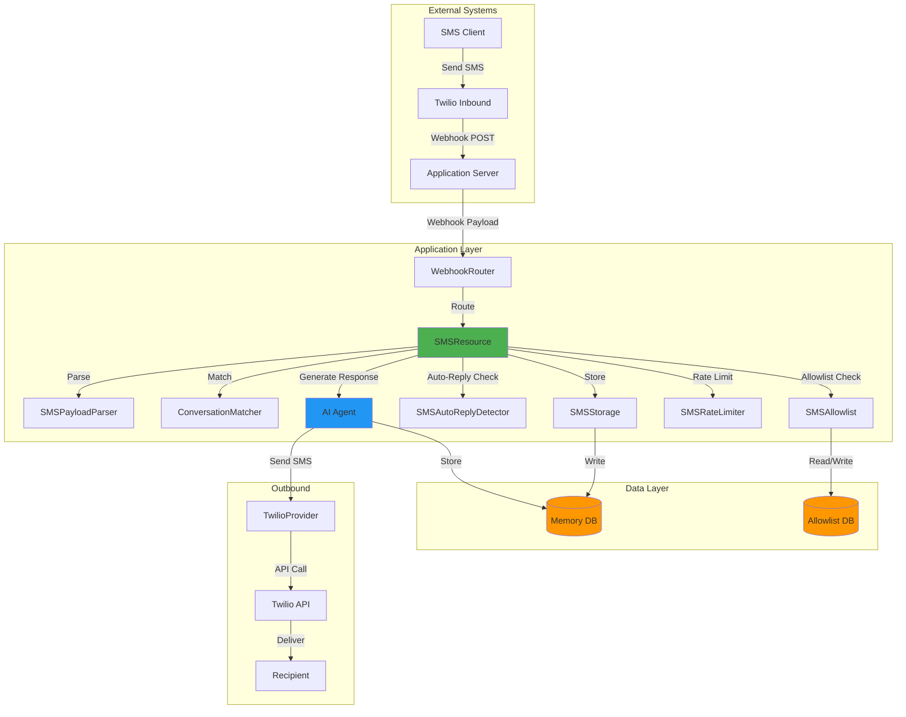

# SMS System Architecture - Implementation Plan

## Executive Summary

This document outlines the complete implementation plan for integrating Twilio SMS into the AI Receptionist SDK, following the same architectural patterns established by the email system.

**Current Status:**
- ✅ Basic SMSResource stub exists ([sms.resource.ts](../src/resources/core/sms.resource.ts))
- ✅ TwilioProvider exists ([twilio.provider.ts](../src/providers/api/twilio.provider.ts))
- ✅ Basic send_sms tool exists ([messaging-tools.ts](../src/tools/standard/messaging-tools.ts))
- ✅ Webhook routing infrastructure exists ([webhook-router.ts](../src/webhooks/webhook-router.ts))
- ❌ Missing comprehensive SMS architecture (similar to email system)

**Implementation Goals:**
- Webhook-driven inbound SMS processing (Twilio)
- Conversation matching and threading
- Auto-reply system with spam protection
- Database-backed storage with metadata
- Rate limiting and allowlist management
- AI-powered contextual responses
- Multi-layer protection against SMS loops

---

## Table of Contents

1. [System Architecture Overview](#system-architecture-overview)
2. [Implementation Phases](#implementation-phases)
3. [Phase 1: Core Infrastructure](#phase-1-core-infrastructure)
4. [Phase 2: Conversation Matching](#phase-2-conversation-matching)
5. [Phase 3: Auto-Reply System](#phase-3-auto-reply-system)
6. [Phase 4: Storage & Threading](#phase-4-storage--threading)
7. [Phase 5: Advanced Features](#phase-5-advanced-features)
8. [Phase 6: Testing & Documentation](#phase-6-testing--documentation)
9. [File Structure](#file-structure)
10. [Database Schema](#database-schema)
11. [Configuration](#configuration)
12. [Security Considerations](#security-considerations)

---

## System Architecture Overview



---

## Implementation Phases

### Phase 1: Core Infrastructure (4-6 hours)
**Goal:** Set up foundational utilities and types

**Files to Create:**
1. `src/utils/sms/SMSPayloadParser.ts` - Parse Twilio webhooks
2. `src/utils/sms/SMSStorage.ts` - Database storage utilities
3. `src/utils/sms/SMSAllowlist.ts` - Phone number allowlist
4. `src/utils/sms/SMSRateLimiter.ts` - Rate limiting
5. `src/utils/sms/SMSAutoReplyDetector.ts` - Loop prevention
6. `src/utils/sms/index.ts` - Exports
7. `src/types/sms.types.ts` - TypeScript types

**Files to Update:**
1. `src/types/index.ts` - Export SMS types
2. `src/utils/RateLimiter.ts` - Generic rate limiter (if needed)

### Phase 2: Conversation Matching (3-4 hours)
**Goal:** Match SMS conversations by phone numbers

**Files to Create:**
1. `src/utils/sms/ConversationMatcher.ts` - Phone number matching logic

**Strategy:**
- Match by phone number pairs (from/to)
- Handle different phone formats (+1234567890, 1234567890, etc.)
- Create new conversation if no match found
- Auto-add to allowlist on first contact

### Phase 3: Auto-Reply System (4-5 hours)
**Goal:** Implement 4-layer protection system

**Layers:**
1. **Layer 0:** Auto-reply detection (STOP, vacation messages)
2. **Layer 1:** First-message check (new contacts)
3. **Layer 2:** Allowlist check (approved numbers only)
4. **Layer 3:** Rate limiting (prevent spam loops)

**Files to Update:**
1. `src/resources/core/sms.resource.ts` - Complete implementation

### Phase 4: Storage & Threading (2-3 hours)
**Goal:** Store SMS messages with metadata

**Database Schema:**
- Use existing `ai_receptionist_memory` table
- Store as `role: 'user'` (inbound) or `role: 'assistant'` (outbound)
- Add SMS-specific sessionMetadata

**Files to Complete:**
1. `src/utils/sms/SMSStorage.ts` - Implementation

### Phase 5: Advanced Features (3-4 hours)
**Goal:** Enhanced functionality

**Features:**
1. Media message support (MMS)
2. Opt-out handling (STOP, UNSTOP)
3. Message status tracking
4. Delivery receipts
5. Phone number normalization

**Files to Create:**
1. `src/utils/sms/SMSMediaHandler.ts` - MMS support
2. `src/utils/sms/SMSOptOutManager.ts` - STOP/START handling
3. `src/utils/sms/PhoneNumberUtils.ts` - Normalization

### Phase 6: Testing & Documentation (2-3 hours)
**Goal:** Comprehensive testing and docs

**Deliverables:**
1. Unit tests for all utilities
2. Integration tests for webhooks
3. Architecture documentation (this file, expanded)
4. API documentation
5. Example usage

---

## Phase 1: Core Infrastructure

### 1.1 SMS Types

**File:** `src/types/sms.types.ts`

```typescript
/**
 * SMS Type Definitions
 */

export interface InboundSMSPayload {
  // Core fields
  messageSid: string;           // Twilio message SID
  from: string;                 // Sender phone (+1234567890)
  to: string;                   // Recipient phone (+1234567890)
  body: string;                 // Message body

  // Media (MMS)
  numMedia?: number;
  media?: SMSMedia[];

  // Metadata
  accountSid?: string;
  fromCity?: string;
  fromState?: string;
  fromZip?: string;
  fromCountry?: string;
  toCity?: string;
  toState?: string;
  toZip?: string;
  toCountry?: string;

  // Status
  smsStatus?: string;
  timestamp?: Date;
}

export interface SMSMedia {
  contentType: string;
  url: string;
  size?: number;
}

export interface OutboundSMSOptions {
  to: string;
  body: string;
  from?: string;              // Override default
  mediaUrl?: string[];        // MMS support
  statusCallback?: string;    // Delivery tracking
}

export interface SMSSessionMetadata {
  // Threading
  messageSid: string;
  conversationId: string;

  // Direction
  direction: 'inbound' | 'outbound';

  // Participants
  from: string;
  to: string;

  // Content
  body: string;
  numMedia?: number;
  media?: SMSMedia[];

  // Location
  fromCity?: string;
  fromState?: string;
  fromCountry?: string;

  // Provider
  provider: 'twilio';
  accountSid?: string;
  status?: string;
}

export interface SMSAutoReplyReport {
  isAutoReply: boolean;
  detectedKeywords?: string[];
  keywordMatches?: string[];
}
```

### 1.2 SMS Payload Parser

**File:** `src/utils/sms/SMSPayloadParser.ts`

```typescript
/**
 * SMS Payload Parser
 * Parses Twilio webhook payloads into standardized format
 */

import { logger } from '../logger';
import type { InboundSMSPayload, SMSMedia } from '../../types/sms.types';

export class SMSPayloadParser {
  /**
   * Parse Twilio inbound SMS webhook
   */
  static parse(payload: any): InboundSMSPayload {
    logger.info('[SMSPayloadParser] Parsing payload', {
      MessageSid: payload.MessageSid,
      From: payload.From
    });

    const parsed: InboundSMSPayload = {
      messageSid: payload.MessageSid,
      from: payload.From,
      to: payload.To,
      body: payload.Body || '',
      numMedia: parseInt(payload.NumMedia || '0', 10),
      accountSid: payload.AccountSid,
      smsStatus: payload.SmsStatus,
      timestamp: new Date()
    };

    // Parse location data
    if (payload.FromCity) {
      parsed.fromCity = payload.FromCity;
      parsed.fromState = payload.FromState;
      parsed.fromZip = payload.FromZip;
      parsed.fromCountry = payload.FromCountry;
    }

    if (payload.ToCity) {
      parsed.toCity = payload.ToCity;
      parsed.toState = payload.ToState;
      parsed.toZip = payload.ToZip;
      parsed.toCountry = payload.ToCountry;
    }

    // Parse media (MMS)
    if (parsed.numMedia && parsed.numMedia > 0) {
      parsed.media = this.parseMedia(payload);
    }

    return parsed;
  }

  /**
   * Parse MMS media attachments
   */
  private static parseMedia(payload: any): SMSMedia[] {
    const numMedia = parseInt(payload.NumMedia || '0', 10);
    const media: SMSMedia[] = [];

    for (let i = 0; i < numMedia; i++) {
      const contentType = payload[`MediaContentType${i}`];
      const url = payload[`MediaUrl${i}`];

      if (contentType && url) {
        media.push({
          contentType,
          url,
          size: undefined // Twilio doesn't provide size in webhook
        });
      }
    }

    return media;
  }

  /**
   * Validate required fields
   */
  static validate(payload: any): boolean {
    const required = ['MessageSid', 'From', 'To'];
    return required.every(field => payload[field]);
  }
}
```

### 1.3 SMS Storage

**File:** `src/utils/sms/SMSStorage.ts`

```typescript
/**
 * SMS Storage
 * Stores SMS messages in memory database with metadata
 */

import { logger } from '../logger';
import type { IMemory } from '../../types';
import type { InboundSMSPayload, OutboundSMSOptions, SMSSessionMetadata } from '../../types/sms.types';
import { PhoneNumberUtils } from './PhoneNumberUtils';

export class SMSStorage {
  /**
   * Store inbound SMS
   */
  static async storeInboundSMS(
    sms: InboundSMSPayload,
    conversationId: string,
    memory: IMemory
  ): Promise<void> {
    // Build content with media info
    let content = sms.body || '';

    if (sms.media && sms.media.length > 0) {
      const mediaInfo = sms.media
        .map(m => `[Media: ${m.contentType} - ${m.url}]`)
        .join('\n');

      content = content ? `${content}\n\n${mediaInfo}` : mediaInfo;
    }

    // Build session metadata
    const sessionMetadata: SMSSessionMetadata = {
      messageSid: sms.messageSid,
      conversationId,
      direction: 'inbound',
      from: sms.from,
      to: sms.to,
      body: sms.body,
      numMedia: sms.numMedia,
      media: sms.media,
      fromCity: sms.fromCity,
      fromState: sms.fromState,
      fromCountry: sms.fromCountry,
      provider: 'twilio',
      accountSid: sms.accountSid,
      status: sms.smsStatus
    };

    // Store as user message
    await memory.addMessage({
      role: 'user',
      content,
      channel: 'sms',
      sessionMetadata,
      conversationId
    });

    logger.info('[SMSStorage] Stored inbound SMS', {
      conversationId,
      messageSid: sms.messageSid,
      from: sms.from
    });
  }

  /**
   * Store outbound SMS
   */
  static async storeOutboundSMS(
    messageSid: string,
    conversationId: string,
    options: OutboundSMSOptions,
    memory: IMemory
  ): Promise<void> {
    // Build session metadata
    const sessionMetadata: SMSSessionMetadata = {
      messageSid,
      conversationId,
      direction: 'outbound',
      from: options.from || '', // Will be filled by provider
      to: options.to,
      body: options.body,
      numMedia: options.mediaUrl ? options.mediaUrl.length : 0,
      provider: 'twilio'
    };

    // Store as assistant message
    await memory.addMessage({
      role: 'assistant',
      content: options.body,
      channel: 'sms',
      sessionMetadata,
      conversationId
    });

    logger.info('[SMSStorage] Stored outbound SMS', {
      conversationId,
      messageSid,
      to: options.to
    });
  }
}
```

### 1.4 SMS Allowlist

**File:** `src/utils/sms/SMSAllowlist.ts`

```typescript
/**
 * SMS Allowlist
 * Database-backed phone number allowlist with in-memory cache
 */

import { logger } from '../logger';
import type { DrizzleStorage } from '../../agent/storage/drizzle';
import { PhoneNumberUtils } from './PhoneNumberUtils';

export class SMSAllowlist {
  private phoneNumbers: Set<string> = new Set();

  constructor(private db: DrizzleStorage) {}

  /**
   * Initialize allowlist from database
   */
  async initialize(): Promise<void> {
    try {
      const rows = await this.db.getAllAllowlistedPhoneNumbers();
      this.phoneNumbers = new Set(
        rows.map(row => PhoneNumberUtils.normalize(row.phoneNumber))
      );

      logger.info(`[SMSAllowlist] Loaded ${this.phoneNumbers.size} phone numbers`);
    } catch (error) {
      logger.error('[SMSAllowlist] Failed to initialize', error as Error);
      throw error;
    }
  }

  /**
   * Add phone number to allowlist
   */
  async add(phoneNumber: string, addedBy: string = 'manual'): Promise<void> {
    const normalized = PhoneNumberUtils.normalize(phoneNumber);

    // Add to cache
    this.phoneNumbers.add(normalized);

    // Persist to database
    await this.db.addToPhoneAllowlist(normalized, addedBy);

    logger.info(`[SMSAllowlist] Added: ${normalized} (by: ${addedBy})`);
  }

  /**
   * Check if phone number is allowlisted
   */
  has(phoneNumber: string): boolean {
    const normalized = PhoneNumberUtils.normalize(phoneNumber);
    return this.phoneNumbers.has(normalized);
  }

  /**
   * Remove phone number from allowlist
   */
  async remove(phoneNumber: string): Promise<void> {
    const normalized = PhoneNumberUtils.normalize(phoneNumber);

    // Remove from cache
    this.phoneNumbers.delete(normalized);

    // Remove from database
    await this.db.removeFromPhoneAllowlist(normalized);

    logger.info(`[SMSAllowlist] Removed: ${normalized}`);
  }

  /**
   * Get all allowlisted phone numbers
   */
  getAll(): string[] {
    return Array.from(this.phoneNumbers);
  }

  /**
   * Get count
   */
  count(): number {
    return this.phoneNumbers.size;
  }

  /**
   * Clear all
   */
  async clear(): Promise<void> {
    this.phoneNumbers.clear();
    await this.db.clearPhoneAllowlist();
    logger.info('[SMSAllowlist] Cleared all phone numbers');
  }
}
```

### 1.5 SMS Rate Limiter

**File:** `src/utils/sms/SMSRateLimiter.ts`

```typescript
/**
 * SMS Rate Limiter
 * Prevents spam loops by limiting SMS sends per conversation
 */

import { logger } from '../logger';

export interface SMSRateLimiterConfig {
  maxRequests: number;  // Max SMS per window
  windowMs: number;     // Time window in ms
}

interface RateLimitEntry {
  count: number;
  resetAt: number;
}

export class SMSRateLimiter {
  private limits: Map<string, RateLimitEntry> = new Map();
  private config: SMSRateLimiterConfig;

  constructor(config?: Partial<SMSRateLimiterConfig>) {
    this.config = {
      maxRequests: config?.maxRequests || 10,
      windowMs: config?.windowMs || 3600000 // 1 hour
    };

    // Cleanup old entries every 5 minutes
    setInterval(() => this.cleanup(), 5 * 60 * 1000);
  }

  /**
   * Check if conversation is under rate limit
   */
  async checkLimit(conversationId: string): Promise<boolean> {
    const now = Date.now();
    const entry = this.limits.get(conversationId);

    // No entry = under limit
    if (!entry) {
      this.limits.set(conversationId, {
        count: 1,
        resetAt: now + this.config.windowMs
      });
      return true;
    }

    // Entry expired = reset
    if (now >= entry.resetAt) {
      this.limits.set(conversationId, {
        count: 1,
        resetAt: now + this.config.windowMs
      });
      return true;
    }

    // Under limit = increment
    if (entry.count < this.config.maxRequests) {
      entry.count++;
      return true;
    }

    // Over limit
    logger.warn('[SMSRateLimiter] Rate limit exceeded', {
      conversationId,
      count: entry.count,
      limit: this.config.maxRequests
    });
    return false;
  }

  /**
   * Get remaining requests
   */
  getRemaining(conversationId: string): number {
    const entry = this.limits.get(conversationId);
    if (!entry || Date.now() >= entry.resetAt) {
      return this.config.maxRequests;
    }
    return Math.max(0, this.config.maxRequests - entry.count);
  }

  /**
   * Cleanup expired entries
   */
  private cleanup(): void {
    const now = Date.now();
    let cleaned = 0;

    for (const [conversationId, entry] of this.limits.entries()) {
      if (now >= entry.resetAt) {
        this.limits.delete(conversationId);
        cleaned++;
      }
    }

    if (cleaned > 0) {
      logger.info(`[SMSRateLimiter] Cleaned ${cleaned} expired entries`);
    }
  }
}
```

### 1.6 Phone Number Utils

**File:** `src/utils/sms/PhoneNumberUtils.ts`

```typescript
/**
 * Phone Number Utilities
 * Normalize and format phone numbers for matching
 */

import { logger } from '../logger';

export class PhoneNumberUtils {
  /**
   * Normalize phone number for matching
   * Examples:
   *   +1 (234) 567-8900 → +12345678900
   *   1234567890 → +11234567890
   *   +1234567890 → +1234567890
   */
  static normalize(phoneNumber: string): string {
    // Remove all non-digit characters except leading +
    const cleaned = phoneNumber.replace(/[^\d+]/g, '');

    // Ensure E.164 format (+1234567890)
    if (cleaned.startsWith('+')) {
      return cleaned;
    }

    // Add +1 for US numbers (default)
    if (cleaned.length === 10) {
      return `+1${cleaned}`;
    }

    if (cleaned.length === 11 && cleaned.startsWith('1')) {
      return `+${cleaned}`;
    }

    // Return as-is with + prefix
    return `+${cleaned}`;
  }

  /**
   * Format phone number for display
   * +12345678900 → +1 (234) 567-8900
   */
  static format(phoneNumber: string): string {
    const normalized = this.normalize(phoneNumber);

    // US number formatting
    if (normalized.startsWith('+1') && normalized.length === 12) {
      const digits = normalized.slice(2);
      return `+1 (${digits.slice(0, 3)}) ${digits.slice(3, 6)}-${digits.slice(6)}`;
    }

    // International format
    return normalized;
  }

  /**
   * Validate E.164 format
   */
  static isValid(phoneNumber: string): boolean {
    const e164Regex = /^\+[1-9]\d{1,14}$/;
    return e164Regex.test(phoneNumber);
  }

  /**
   * Extract country code
   */
  static getCountryCode(phoneNumber: string): string | null {
    const normalized = this.normalize(phoneNumber);

    // US/Canada
    if (normalized.startsWith('+1')) return '+1';

    // UK
    if (normalized.startsWith('+44')) return '+44';

    // Add more as needed

    return null;
  }
}
```

### 1.7 SMS Auto-Reply Detector

**File:** `src/utils/sms/SMSAutoReplyDetector.ts`

```typescript
/**
 * SMS Auto-Reply Detector
 * Detects auto-reply messages and opt-out keywords to prevent loops
 */

import { logger } from '../logger';
import type { SMSAutoReplyReport } from '../../types/sms.types';

export class SMSAutoReplyDetector {
  /**
   * Keywords that indicate auto-reply or opt-out
   */
  private static AUTO_REPLY_KEYWORDS = [
    'stop', 'stopall', 'unsubscribe', 'cancel', 'end', 'quit',
    'out of office', 'ooo', 'automatic reply', 'auto-reply',
    'vacation', 'away message'
  ];

  /**
   * Opt-in keywords
   */
  private static OPT_IN_KEYWORDS = [
    'start', 'unstop', 'subscribe', 'yes'
  ];

  /**
   * Check if message is auto-reply or contains opt-out keyword
   */
  static isAutoReply(body: string): SMSAutoReplyReport {
    const lowerBody = body.toLowerCase().trim();
    const detectedKeywords: string[] = [];

    // Check for auto-reply keywords
    for (const keyword of this.AUTO_REPLY_KEYWORDS) {
      if (lowerBody.includes(keyword) || lowerBody === keyword) {
        detectedKeywords.push(keyword);
      }
    }

    const isAutoReply = detectedKeywords.length > 0;

    if (isAutoReply) {
      logger.info('[SMSAutoReplyDetector] Auto-reply detected', {
        keywords: detectedKeywords,
        body: body.substring(0, 50)
      });
    }

    return {
      isAutoReply,
      detectedKeywords: isAutoReply ? detectedKeywords : undefined,
      keywordMatches: isAutoReply ? detectedKeywords : undefined
    };
  }

  /**
   * Check if message is opt-in request
   */
  static isOptIn(body: string): boolean {
    const lowerBody = body.toLowerCase().trim();

    for (const keyword of this.OPT_IN_KEYWORDS) {
      if (lowerBody === keyword) {
        logger.info('[SMSAutoReplyDetector] Opt-in detected', { keyword });
        return true;
      }
    }

    return false;
  }

  /**
   * Check if message is STOP command
   */
  static isStop(body: string): boolean {
    const lowerBody = body.toLowerCase().trim();
    return ['stop', 'stopall', 'unsubscribe', 'cancel', 'end', 'quit'].includes(lowerBody);
  }

  /**
   * Check if message is START command
   */
  static isStart(body: string): boolean {
    const lowerBody = body.toLowerCase().trim();
    return ['start', 'unstop', 'yes'].includes(lowerBody);
  }
}
```

---

## Phase 2: Conversation Matching

**File:** `src/utils/sms/ConversationMatcher.ts`

```typescript
/**
 * SMS Conversation Matcher
 * Matches SMS conversations by phone number pairs
 */

import { logger } from '../logger';
import type { IMemory } from '../../types';
import type { InboundSMSPayload } from '../../types/sms.types';
import { PhoneNumberUtils } from './PhoneNumberUtils';

export class ConversationMatcher {
  /**
   * Find existing conversation by participants
   * Strategy: Match by normalized phone number pair (from/to)
   */
  static async findConversation(
    sms: InboundSMSPayload,
    memory: IMemory
  ): Promise<string | null> {
    const normalizedFrom = PhoneNumberUtils.normalize(sms.from);
    const normalizedTo = PhoneNumberUtils.normalize(sms.to);

    logger.info('[ConversationMatcher] Searching for conversation', {
      from: normalizedFrom,
      to: normalizedTo
    });

    // Get recent SMS messages
    const messages = await memory.getRecentMessages({
      channel: 'sms',
      limit: 100
    });

    // Find matching conversation (bi-directional)
    for (const msg of messages) {
      const metadata = msg.sessionMetadata;
      if (!metadata) continue;

      const msgFrom = PhoneNumberUtils.normalize(metadata.from);
      const msgTo = PhoneNumberUtils.normalize(metadata.to);

      // Match: (from, to) or (to, from)
      const matchesForward = msgFrom === normalizedFrom && msgTo === normalizedTo;
      const matchesReverse = msgFrom === normalizedTo && msgTo === normalizedFrom;

      if (matchesForward || matchesReverse) {
        logger.info('[ConversationMatcher] Found existing conversation', {
          conversationId: metadata.conversationId
        });
        return metadata.conversationId;
      }
    }

    logger.info('[ConversationMatcher] No existing conversation found');
    return null;
  }

  /**
   * Check if phone number has conversation history
   */
  static async hasConversationHistory(
    phoneNumber: string,
    memory: IMemory
  ): Promise<boolean> {
    const normalized = PhoneNumberUtils.normalize(phoneNumber);
    const messages = await memory.getRecentMessages({
      channel: 'sms',
      limit: 50
    });

    for (const msg of messages) {
      const metadata = msg.sessionMetadata;
      if (!metadata) continue;

      const msgFrom = PhoneNumberUtils.normalize(metadata.from);
      const msgTo = PhoneNumberUtils.normalize(metadata.to);

      if (msgFrom === normalized || msgTo === normalized) {
        return true;
      }
    }

    return false;
  }
}
```

---

## File Structure

After implementation, the SMS system will have the following structure:

```
src/
├── resources/core/
│   └── sms.resource.ts              # Main SMS controller (ENHANCED)
├── utils/sms/
│   ├── SMSAllowlist.ts              # Phone number allowlist (NEW)
│   ├── SMSAutoReplyDetector.ts      # Loop prevention (NEW)
│   ├── SMSPayloadParser.ts          # Webhook parsing (NEW)
│   ├── SMSStorage.ts                # Memory persistence (NEW)
│   ├── SMSRateLimiter.ts            # Rate limiting (NEW)
│   ├── ConversationMatcher.ts       # Phone matching (NEW)
│   ├── PhoneNumberUtils.ts          # Phone normalization (NEW)
│   └── index.ts                     # Exports (NEW)
├── providers/api/
│   └── twilio.provider.ts           # Twilio provider (EXISTS)
├── tools/standard/
│   └── messaging-tools.ts           # send_sms tool (EXISTS)
├── types/
│   └── sms.types.ts                 # TypeScript types (NEW)
└── webhooks/
    └── webhook-router.ts            # Webhook routing (EXISTS)
```

**Total:** ~1,500 lines of new code across 8 new files

---

## Database Schema

### SMS Allowlist Table

```sql
CREATE TABLE ai_receptionist_sms_allowlist (
  id UUID PRIMARY KEY DEFAULT gen_random_uuid(),
  phone_number TEXT NOT NULL UNIQUE,
  added_at TIMESTAMP DEFAULT NOW() NOT NULL,
  added_by TEXT  -- 'system' | 'manual' | 'conversation_init'
);

CREATE INDEX sms_allowlist_phone_idx ON ai_receptionist_sms_allowlist (phone_number);
CREATE INDEX sms_allowlist_added_at_idx ON ai_receptionist_sms_allowlist (added_at);
```

### Memory Table (Existing - No Changes)

SMS messages are stored in the existing `ai_receptionist_memory` table with:
- `channel: 'sms'`
- `role: 'user'` (inbound) or `'assistant'` (outbound)
- `sessionMetadata` containing SMS-specific fields

---

## Configuration

### Environment Variables

```bash
# Twilio Configuration
TWILIO_ACCOUNT_SID=ACxxxxxxxxxxxxxxxxxxxxx
TWILIO_AUTH_TOKEN=your_auth_token
TWILIO_PHONE_NUMBER=+12345678900

# SMS Settings
SMS_RATE_LIMIT_MAX=10           # Max SMS per conversation per hour
SMS_RATE_LIMIT_WINDOW_MS=3600000 # 1 hour
SMS_AUTO_REPLY_ENABLED=true     # Enable auto-replies
```

### SDK Configuration

```typescript
const client = new AIReceptionist({
  providers: {
    twilio: {
      accountSid: process.env.TWILIO_ACCOUNT_SID,
      authToken: process.env.TWILIO_AUTH_TOKEN,
      phoneNumber: process.env.TWILIO_PHONE_NUMBER
    }
  },
  sms: {
    rateLimitConfig: {
      maxRequests: 10,
      windowMs: 3600000
    },
    autoReplyEnabled: true
  }
});
```

---

## Security Considerations

### 1. Webhook Validation

Twilio provides request signature validation:

```typescript
import { validateTwilioWebhook } from './providers/validation/twilio-validator';

app.post('/webhook/sms', (req, res) => {
  // Validate Twilio signature
  const signature = req.headers['x-twilio-signature'];
  const url = `https://yourdomain.com${req.originalUrl}`;
  const params = req.body;

  if (!validateTwilioWebhook(signature, url, params, authToken)) {
    return res.status(403).send('Invalid signature');
  }

  // Process webhook
});
```

### 2. Rate Limiting

- **Per-conversation limit:** 10 SMS/hour (configurable)
- **Global limit:** Consider implementing
- **Allowlist-based:** Only auto-reply to approved numbers

### 3. Allowlist Management

- **Auto-add:** First message from new number
- **Manual add:** API method for pre-approval
- **Opt-out handling:** STOP keyword removes from allowlist

### 4. Data Privacy

- **Phone number storage:** Encrypted in database
- **Message content:** Encrypted at rest
- **Retention policy:** Auto-delete old messages

### 5. Compliance

- **TCPA:** Obtain consent before sending SMS
- **STOP handling:** Immediate opt-out processing
- **Message limits:** Respect carrier guidelines

---

## Next Steps

1. **Phase 1:** Implement core infrastructure (this document serves as the guide)
2. **Phase 2:** Implement conversation matching
3. **Phase 3:** Implement auto-reply system
4. **Phase 4:** Implement storage & threading
5. **Phase 5:** Add advanced features (MMS, opt-out)
6. **Phase 6:** Testing & documentation

**Estimated Total Time:** 18-25 hours for complete SMS system

---

## Differences from Email System

| Feature | Email | SMS |
|---------|-------|-----|
| Threading | Message-ID, References headers | Phone number pairs |
| Matching | 4-strategy algorithm | Single strategy (phone pairs) |
| Normalization | Message ID cleanup | Phone number formatting |
| Media | Attachments (base64) | MMS (URLs) |
| Auto-reply detection | RFC headers + patterns | Keyword matching (STOP) |
| Provider | Postmark | Twilio |
| Webhook validation | None (IP whitelist) | Signature verification |
| Opt-out | Manual removal | STOP keyword |

---

## API Examples

### Send SMS

```typescript
const result = await client.sms.send({
  to: '+12345678900',
  body: 'Hello from AI Receptionist!'
});
```

### Handle Inbound Webhook

```typescript
app.post('/webhook/sms', async (req, res) => {
  const result = await client.webhook.handleSMSWebhook(req.body);
  res.set('Content-Type', 'text/xml');
  res.send(result);
});
```

### Manage Allowlist

```typescript
// Add number
await client.sms.allowlist.add('+12345678900', 'manual');

// Check if allowed
if (client.sms.allowlist.has('+12345678900')) {
  console.log('Number is allowlisted');
}

// Remove number
await client.sms.allowlist.remove('+12345678900');

// Get all
const numbers = client.sms.allowlist.getAll();
```

---

This architecture document will serve as your implementation guide. Follow it phase by phase to build a robust, production-ready SMS system that mirrors the quality of your email implementation.
