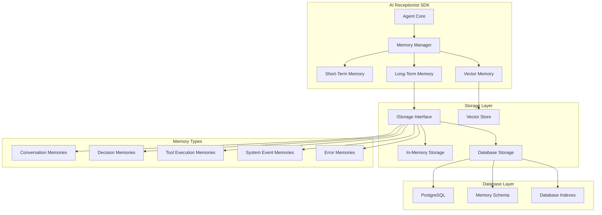
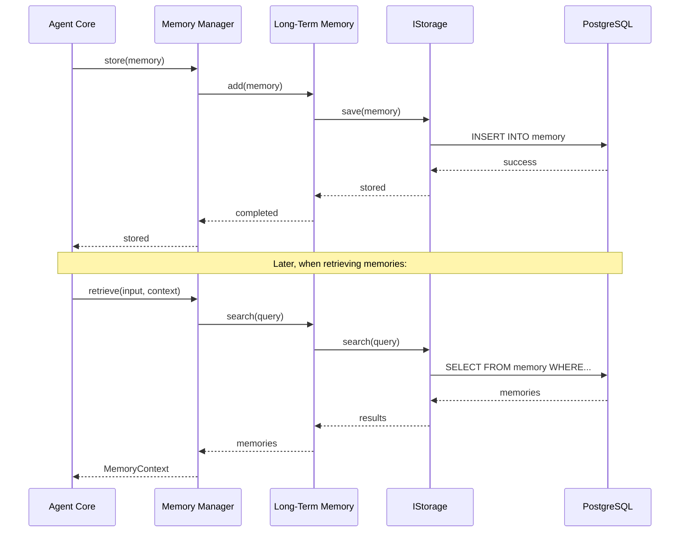

# Storage Architecture

The AI Receptionist SDK uses a sophisticated storage architecture that enables persistent memory across conversations through a unified interface. This document explains how storage works, its lifecycle, and how to use it.

## Overview

Storage is the foundation of the agent's memory system, providing persistent storage for conversations, decisions, tool executions, and system events. It abstracts away the complexity of different storage backends and provides a consistent interface for the SDK to store and retrieve memories.

## Architecture Diagram



## Complete Storage Flow

The storage system follows a layered architecture:

1. **Agent Layer**: `Agent` uses `MemoryManager` for memory operations
2. **Memory Layer**: `MemoryManager` coordinates between different memory types
3. **Storage Layer**: `IStorage` interface provides unified storage operations
4. **Implementation Layer**: `InMemoryStorage` and `DatabaseStorage` implementations
5. **Database Layer**: PostgreSQL with optimized schema and indexes

### Data Flow Example



## Core Components

### 1. Storage Interface

All storage implementations implement the `IStorage` interface, which defines the standard operations:

```typescript
interface IStorage {
  /**
   * Save a memory to persistent storage
   */
  save(memory: Memory): Promise<void>;

  /**
   * Save multiple memories in batch
   */
  saveBatch(memories: Memory[]): Promise<void>;

  /**
   * Get a specific memory by ID
   */
  get(id: string): Promise<Memory | null>;

  /**
   * Search memories with flexible query
   */
  search(query: MemorySearchQuery): Promise<Memory[]>;

  /**
   * Delete a memory
   */
  delete(id: string): Promise<void>;

  /**
   * Health check
   */
  healthCheck(): Promise<boolean>;
}
```

### 2. Memory Schema

The database schema is designed for optimal performance and flexibility:

```typescript
export const memory = pgTable('ai_receptionist_memory', {
  // Core fields
  id: uuid('id').primaryKey(),
  content: text('content').notNull(),
  timestamp: timestamp('timestamp').notNull(),
  type: text('type').notNull(), // 'conversation' | 'decision' | 'error' | 'tool_execution' | 'system'
  importance: integer('importance'),

  // Channel tracking
  channel: text('channel'), // 'call' | 'sms' | 'email' | 'text'

  // Session metadata (stored as JSONB)
  sessionMetadata: jsonb('session_metadata').$type<{
    conversationId?: string;
    callSid?: string;
    messageSid?: string;
    emailId?: string;
    status?: 'active' | 'completed' | 'failed';
    duration?: number;
    participants?: string[];
  }>(),

  // Role tracking
  role: text('role'), // 'system' | 'user' | 'assistant' | 'tool'

  // Tool execution tracking (stored as JSONB)
  toolCall: jsonb('tool_call').$type<{
    id: string;
    name: string;
    parameters: any;
  }>(),

  toolResult: jsonb('tool_result').$type<{
    success: boolean;
    data?: any;
    error?: string;
  }>(),

  // Additional metadata
  metadata: jsonb('metadata'),
  goalAchieved: boolean('goal_achieved'),

  // Timestamps
  createdAt: timestamp('created_at').defaultNow().notNull(),
});
```

### 3. Search Query Interface

The `MemorySearchQuery` interface provides flexible search capabilities:

```typescript
interface MemorySearchQuery {
  // Filtering
  conversationId?: string;
  channel?: Channel;
  type?: string | string[];
  role?: string;
  startDate?: Date;
  endDate?: Date;
  minImportance?: number;
  keywords?: string[];

  // Pagination
  limit?: number;
  offset?: number;

  // Sorting
  orderBy?: 'timestamp' | 'importance';
  orderDirection?: 'asc' | 'desc';
}
```

### 4. Storage Implementations

#### In-Memory Storage

For development and testing:

```typescript
export class InMemoryStorage implements IStorage {
  private memories = new Map<string, Memory>();
  private conversationIndex = new Map<string, Set<string>>();
  private channelIndex = new Map<string, Set<string>>();

  async save(memory: Memory): Promise<void> {
    this.memories.set(memory.id, memory);
    // Update indexes for fast retrieval
    this.updateIndexes(memory);
  }

  async search(query: MemorySearchQuery): Promise<Memory[]> {
    // Filter and sort memories based on query
    return this.filterMemories(query);
  }
}
```

**Features:**
- Fast in-memory operations
- Automatic indexing for conversations and channels
- Perfect for development and testing
- Data lost on restart

#### Database Storage

For production persistence:

```typescript
export class DatabaseStorage implements IStorage {
  private db: SupportedDatabase;
  private table: typeof memory;

  async save(memory: Memory): Promise<void> {
    await this.db.insert(this.table).values({
      id: memory.id,
      content: memory.content,
      timestamp: memory.timestamp,
      type: memory.type,
      importance: memory.importance,
      channel: memory.channel,
      sessionMetadata: memory.sessionMetadata,
      role: memory.role,
      toolCall: memory.toolCall,
      toolResult: memory.toolResult,
      metadata: memory.metadata,
      goalAchieved: memory.goalAchieved,
    });
  }

  async search(query: MemorySearchQuery): Promise<Memory[]> {
    // Build complex SQL query with filters, sorting, and pagination
    return this.buildSearchQuery(query);
  }
}
```

**Features:**
- Persistent storage with PostgreSQL
- Optimized indexes for fast queries
- Complex filtering and sorting
- Batch operations for performance
- Automatic migrations

### 5. Memory Manager Integration

The `MemoryManager` coordinates between different memory types:

```typescript
export class MemoryManagerImpl implements IMemoryManager {
  private readonly shortTerm: ShortTermMemory;
  private readonly longTerm?: LongTermMemory;
  private readonly vector?: VectorMemory;

  async store(memory: Memory): Promise<void> {
    // Always store in short-term memory
    await this.shortTerm.add(memory);

    // Decide if important enough for long-term storage
    if (this.shouldPersist(memory) && this.longTerm) {
      await this.longTerm.add(memory);
    }
  }

  async retrieve(input: string, context?: {
    conversationId?: string;
    channel?: Channel;
  }): Promise<MemoryContext> {
    const memoryContext: MemoryContext = {
      shortTerm: [],
      longTerm: [],
      semantic: []
    };

    // Get recent conversation context
    if (context?.conversationId) {
      const conversationMemories = this.shortTerm.getAll().filter(
        m => m.sessionMetadata?.conversationId === context.conversationId
      );
      memoryContext.shortTerm = this.convertMemoriesToMessages(conversationMemories);
    }

    // Get relevant long-term memories
    if (this.longTerm) {
      const keywords = this.extractKeywords(input);
      const searchQuery: MemorySearchQuery = {
        keywords,
        limit: 5,
        minImportance: 5
      };
      const longTermMemories = await this.longTerm.search(searchQuery);
      memoryContext.longTerm = longTermMemories;
    }

    return memoryContext;
  }
}
```

## Storage Types

### Memory Types

The system stores different types of memories:

#### Conversation Memories
```typescript
{
  id: "conv-123-msg-1",
  content: "Hello, I'd like to schedule an appointment",
  timestamp: new Date(),
  type: "conversation",
  role: "user",
  channel: "call",
  sessionMetadata: {
    conversationId: "conv-123",
    callSid: "CA1234567890",
    status: "active"
  }
}
```

#### Decision Memories
```typescript
{
  id: "decision-123",
  content: "Decided to schedule appointment for next Tuesday",
  timestamp: new Date(),
  type: "decision",
  importance: 8,
  channel: "call",
  sessionMetadata: {
    conversationId: "conv-123"
  },
  goalAchieved: true
}
```

#### Tool Execution Memories
```typescript
{
  id: "tool-123",
  content: "Executed calendar tool to check availability",
  timestamp: new Date(),
  type: "tool_execution",
  channel: "call",
  toolCall: {
    id: "call_123",
    name: "check_calendar",
    parameters: { date: "2024-01-15" }
  },
  toolResult: {
    success: true,
    data: { available: true, slots: ["10:00", "14:00"] }
  }
}
```

#### System Event Memories
```typescript
{
  id: "system-123",
  content: "Conversation started",
  timestamp: new Date(),
  type: "system",
  importance: 5,
  channel: "call",
  sessionMetadata: {
    conversationId: "conv-123",
    status: "active"
  }
}
```

### Database Tables

#### Memory Table
The primary table storing all agent memories:

```sql
CREATE TABLE ai_receptionist_memory (
  id UUID PRIMARY KEY,
  content TEXT NOT NULL,
  timestamp TIMESTAMP NOT NULL,
  type TEXT NOT NULL,
  importance INTEGER,
  channel TEXT,
  session_metadata JSONB,
  role TEXT,
  tool_call JSONB,
  tool_result JSONB,
  metadata JSONB,
  goal_achieved BOOLEAN,
  created_at TIMESTAMP DEFAULT NOW() NOT NULL
);
```

#### Leads Table
Optional table for business logic:

```sql
CREATE TABLE ai_receptionist_leads (
  id UUID PRIMARY KEY DEFAULT gen_random_uuid(),
  name TEXT,
  email TEXT,
  phone TEXT,
  source TEXT,
  metadata JSONB,
  created_at TIMESTAMP DEFAULT NOW() NOT NULL
);
```

#### Call Logs Table
Optional table for analytics:

```sql
CREATE TABLE ai_receptionist_call_logs (
  id UUID PRIMARY KEY DEFAULT gen_random_uuid(),
  conversation_id UUID,
  phone_number TEXT,
  duration INTEGER,
  outcome TEXT,
  summary TEXT,
  metadata JSONB,
  created_at TIMESTAMP DEFAULT NOW() NOT NULL
);
```

## Storage Lifecycle

### 1. Initialization in Agent

Storage is initialized during agent creation:

```typescript
// In Agent constructor
const memoryConfig: MemoryConfig = {
  contextWindow: 20,
  longTermEnabled: true,
  longTermStorage: new DatabaseStorage({
    db: this.database,
    autoMigrate: true
  }),
  vectorEnabled: false, // Optional
  autoPersist: {
    minImportance: 7,
    types: ['decision', 'tool_execution', 'system']
  }
};

this.memoryManager = new MemoryManagerImpl(memoryConfig);
```

### 2. Memory Storage Process

Memories are stored through the memory manager:

```typescript
// Store a new memory
const memory: Memory = {
  id: generateId(),
  content: "User requested appointment",
  timestamp: new Date(),
  type: "conversation",
  role: "user",
  channel: "call",
  sessionMetadata: {
    conversationId: "conv-123",
    callSid: "CA1234567890"
  },
  importance: 5
};

await this.memoryManager.store(memory);
```

### 3. Memory Retrieval Process

Memories are retrieved for context:

```typescript
// Retrieve context for current interaction
const context = await this.memoryManager.retrieve(
  "I need to schedule an appointment",
  {
    conversationId: "conv-123",
    channel: "call"
  }
);

// context.shortTerm contains recent conversation
// context.longTerm contains relevant historical memories
// context.semantic contains semantically similar memories
```

### 4. Search and Filtering

Advanced search capabilities:

```typescript
// Search for specific memories
const memories = await this.memoryManager.search({
  conversationId: "conv-123",
  type: ["conversation", "decision"],
  minImportance: 5,
  keywords: ["appointment", "schedule"],
  limit: 10,
  orderBy: "timestamp",
  orderDirection: "desc"
});
```

## Configuration Management

### Basic Configuration

```typescript
import { AIReceptionist } from '@ai-receptionist/sdk';
import { DatabaseStorage } from '@ai-receptionist/sdk';

const sdk = new AIReceptionist({
  model: {
    provider: 'openai',
    apiKey: process.env.OPENAI_API_KEY,
    model: 'gpt-4'
  },
  memory: {
    contextWindow: 20,
    longTermEnabled: true,
    longTermStorage: new DatabaseStorage({
      db: database, // Your database connection
      autoMigrate: true
    }),
    autoPersist: {
      minImportance: 7,
      types: ['decision', 'tool_execution', 'system']
    }
  }
});

await sdk.initialize();
```

### Advanced Configuration

```typescript
const memoryConfig: MemoryConfig = {
  // Short-term memory settings
  contextWindow: 30, // Keep 30 recent messages

  // Long-term memory settings
  longTermEnabled: true,
  longTermStorage: new DatabaseStorage({
    db: database,
    autoMigrate: true
  }),

  // Auto-persistence rules
  autoPersist: {
    minImportance: 6, // Persist memories with importance >= 6
    types: ['decision', 'tool_execution', 'system', 'error']
  },

  // Vector memory (optional)
  vectorEnabled: true,
  vectorStore: new VectorStore({
    provider: 'pinecone',
    apiKey: process.env.PINECONE_API_KEY,
    environment: process.env.PINECONE_ENVIRONMENT
  })
};
```

### Environment-Based Configuration

```typescript
// Development configuration
const devConfig = {
  memory: {
    contextWindow: 10,
    longTermEnabled: false, // Use in-memory for dev
    longTermStorage: new InMemoryStorage()
  }
};

// Production configuration
const prodConfig = {
  memory: {
    contextWindow: 50,
    longTermEnabled: true,
    longTermStorage: new DatabaseStorage({
      db: productionDatabase,
      autoMigrate: true
    }),
    autoPersist: {
      minImportance: 7,
      types: ['decision', 'tool_execution', 'system']
    }
  }
};

const sdk = new AIReceptionist(
  process.env.NODE_ENV === 'production' ? prodConfig : devConfig
);
```

## Database Optimization

### Indexes

The system creates optimized indexes for fast queries:

```sql
-- Conversation-based queries
CREATE INDEX memory_conversation_id_idx ON ai_receptionist_memory 
USING GIN (session_metadata);

-- Channel-based queries
CREATE INDEX memory_channel_idx ON ai_receptionist_memory (channel);

-- Type-based queries
CREATE INDEX memory_type_idx ON ai_receptionist_memory (type);

-- Time-based queries
CREATE INDEX memory_timestamp_idx ON ai_receptionist_memory (timestamp);

-- Importance-based queries
CREATE INDEX memory_importance_idx ON ai_receptionist_memory (importance);
```

### Query Optimization

The storage system uses several optimization techniques:

1. **Batch Operations**: Multiple memories saved in single transaction
2. **Indexed Queries**: All common query patterns are indexed
3. **Pagination**: Large result sets are paginated
4. **Caching**: Long-term memory uses in-memory cache
5. **Connection Pooling**: Database connections are pooled

## Migration System

### Automatic Migrations

The system can automatically create tables and indexes:

```typescript
const storage = new DatabaseStorage({
  db: database,
  autoMigrate: true // Automatically create tables and indexes
});
```

### Manual Migrations

For complex migrations, use the migration utilities:

```typescript
import { migrateConversationsToMemory } from '@ai-receptionist/sdk';

// Migrate from old conversation store
const result = await migrateConversationsToMemory({
  sourceDb: oldDatabase,
  targetStorage: newStorage,
  batchSize: 100,
  onProgress: (current, total) => {
    console.log(`Migrated ${current}/${total} conversations`);
  }
});

console.log(`Migration complete: ${result.migrated} memories migrated, ${result.errors} errors`);
```

### Migration Verification

Verify migration integrity:

```typescript
import { verifyMigration } from '@ai-receptionist/sdk';

const verification = await verifyMigration(oldDatabase, newStorage);
if (verification.isValid) {
  console.log('Migration successful');
} else {
  console.error(`Migration failed: ${verification.details}`);
}
```

## Usage Examples

### Basic Memory Operations

```typescript
// Store a conversation memory
await memoryManager.store({
  id: 'msg-123',
  content: 'Hello, I need help with scheduling',
  timestamp: new Date(),
  type: 'conversation',
  role: 'user',
  channel: 'call',
  sessionMetadata: {
    conversationId: 'conv-123',
    callSid: 'CA1234567890'
  }
});

// Store a decision memory
await memoryManager.store({
  id: 'decision-123',
  content: 'Decided to schedule appointment for Tuesday',
  timestamp: new Date(),
  type: 'decision',
  importance: 8,
  channel: 'call',
  sessionMetadata: {
    conversationId: 'conv-123'
  },
  goalAchieved: true
});
```

### Advanced Search

```typescript
// Search for all decisions in a conversation
const decisions = await memoryManager.search({
  conversationId: 'conv-123',
  type: 'decision',
  orderBy: 'timestamp',
  orderDirection: 'asc'
});

// Search for high-importance memories across all channels
const importantMemories = await memoryManager.search({
  minImportance: 8,
  limit: 20,
  orderBy: 'importance',
  orderDirection: 'desc'
});

// Search for memories containing specific keywords
const appointmentMemories = await memoryManager.search({
  keywords: ['appointment', 'schedule', 'booking'],
  type: ['conversation', 'decision'],
  limit: 10
});
```

### Conversation Management

```typescript
// Start a new conversation session
await memoryManager.startSession({
  conversationId: 'conv-123',
  channel: 'call',
  metadata: {
    phoneNumber: '+1234567890',
    callerName: 'John Doe'
  }
});

// End a conversation session
await memoryManager.endSession('conv-123', 'Successfully scheduled appointment for Tuesday at 2 PM');
```

## Best Practices

### 1. Memory Importance

Set appropriate importance levels:

```typescript
// High importance for decisions and goals
const decisionMemory: Memory = {
  // ... other fields
  importance: 8,
  type: 'decision',
  goalAchieved: true
};

// Medium importance for conversations
const conversationMemory: Memory = {
  // ... other fields
  importance: 5,
  type: 'conversation'
};

// Low importance for routine interactions
const routineMemory: Memory = {
  // ... other fields
  importance: 3,
  type: 'conversation'
};
```

### 2. Batch Operations

Use batch operations for performance:

```typescript
// Instead of multiple individual saves
for (const memory of memories) {
  await storage.save(memory);
}

// Use batch save
await storage.saveBatch(memories);
```

### 3. Error Handling

Handle storage errors gracefully:

```typescript
try {
  await memoryManager.store(memory);
} catch (error) {
  if (error instanceof StorageError) {
    console.error('Storage error:', error.message);
    // Handle storage-specific errors
  } else {
    console.error('Unexpected error:', error);
    // Handle other errors
  }
}
```

### 4. Health Monitoring

Monitor storage health:

```typescript
const isHealthy = await storage.healthCheck();
if (!isHealthy) {
  console.warn('Storage health check failed');
  // Handle unhealthy storage
}
```

## Troubleshooting

### Common Issues

1. **Storage Not Available**
   - Check database connection
   - Verify storage configuration
   - Ensure proper initialization

2. **Migration Failed**
   - Check database permissions
   - Verify schema compatibility
   - Review migration logs

3. **Performance Issues**
   - Check database indexes
   - Monitor query performance
   - Consider connection pooling

4. **Memory Leaks**
   - Clear caches regularly
   - Monitor memory usage
   - Dispose resources properly

### Debug Mode

Enable debug logging for storage operations:

```typescript
import { logger } from '@ai-receptionist/sdk';

// Enable debug logging
logger.setLevel('debug');

// Check storage statistics
const stats = memoryManager.getStats();
console.log('Memory stats:', stats);
```

## Conclusion

The storage architecture provides a flexible, scalable way to persist agent memories while maintaining high performance. The unified interface allows for easy switching between storage backends, while the migration system ensures smooth upgrades.

For more information, see the [API Reference](../api-reference.md) and [Configuration Guide](../configuration.md).
