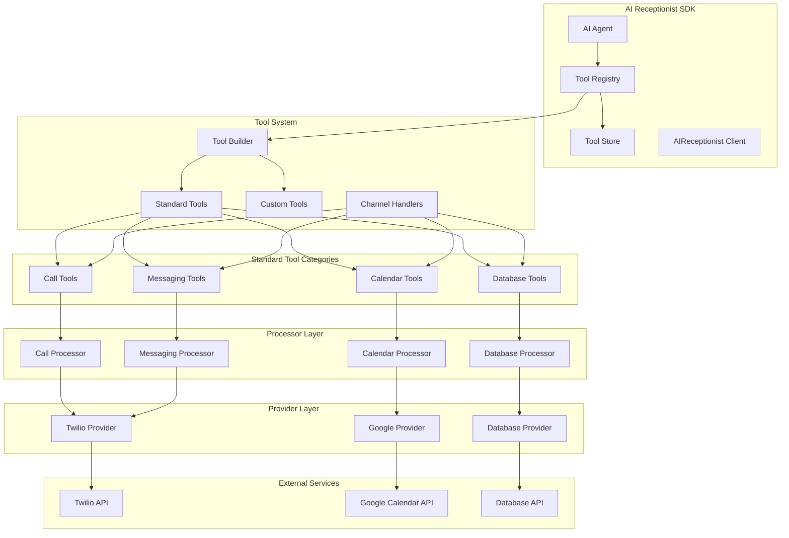
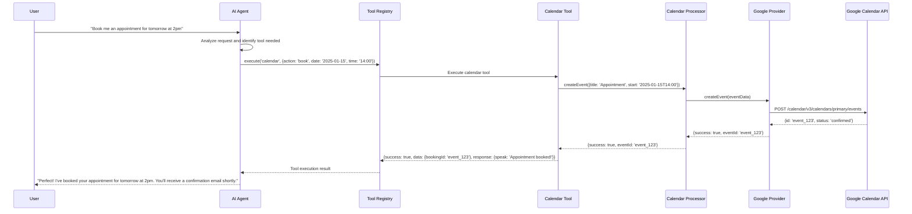

# Tool Architecture

The AI Receptionist SDK uses a sophisticated tool system that enables the AI agent to perform actions and interact with external services through a unified interface. This document explains how tools work, their lifecycle, and how to use them effectively.

## Overview

Tools are the bridge between the AI agent and external capabilities. They abstract away the complexity of different APIs and provide a consistent interface for the agent to perform actions like making calls, sending messages, managing calendars, and accessing databases. Tools are channel-aware, meaning they can provide different responses optimized for voice calls, SMS, email, or text interactions.

## Architecture Diagram



## Complete Tool Flow

The tool system follows a layered architecture:

1. **Agent Layer**: AI agent decides when to use tools based on user input
2. **Registry Layer**: `ToolRegistry` manages tool lifecycle and execution
3. **Builder Layer**: `ToolBuilder` provides fluent API for creating tools
4. **Handler Layer**: Channel-specific handlers (voice, SMS, email, text)
5. **Processor Layer**: Administrative wrappers that use providers
6. **Provider Layer**: Actual service integrations (Twilio, Google, etc.)

### Data Flow Example



## Core Components

### 1. Tool Interface

All tools implement the `ITool` interface, which defines the standard structure:

```typescript
interface ITool {
  name: string;
  description: string;
  parameters: JSONSchema;
  handlers: ToolHandlers;
}

interface ToolHandlers {
  onCall?: ToolHandler;      // Voice call handler
  onSMS?: ToolHandler;       // SMS handler
  onEmail?: ToolHandler;     // Email handler
  onText?: ToolHandler;      // Text handler
  default: ToolHandler;      // Fallback handler
}

type ToolHandler = (params: any, context: ExecutionContext) => Promise<ToolResult>;
```

### 2. Tool Registry

The `ToolRegistry` is the central service locator that manages all tool instances. It implements:

- **Tool Registration**: Register and unregister tools dynamically
- **Channel-Aware Execution**: Execute tools with channel-specific handlers
- **Tool Discovery**: List available tools for specific channels
- **Execution Logging**: Automatic logging of tool executions via ToolStore
- **Error Handling**: Graceful handling of tool execution failures

### 3. Tool Builder

The `ToolBuilder` provides a fluent API for creating tools with channel-specific handlers:

```typescript
const calendarTool = new ToolBuilder()
  .withName('calendar')
  .withDescription('Check availability and book calendar events')
  .withParameters({
    type: 'object',
    properties: {
      action: { type: 'string', enum: ['check_availability', 'book', 'cancel'] },
      date: { type: 'string', format: 'date' },
      time: { type: 'string', format: 'time' }
    },
    required: ['action']
  })
  .onCall(async (params, ctx) => {
    // Voice-optimized response
    return {
      success: true,
      data: { slots: ['9:00 AM', '2:00 PM'] },
      response: { speak: 'I have availability at 9 AM and 2 PM. Which works for you?' }
    };
  })
  .onSMS(async (params, ctx) => {
    // SMS-optimized response
    return {
      success: true,
      data: { slots: ['9:00 AM', '2:00 PM'] },
      response: { message: 'Available: 9:00 AM, 2:00 PM. Reply with choice.' }
    };
  })
  .onEmail(async (params, ctx) => {
    // Email-optimized response with HTML
    return {
      success: true,
      data: { slots: ['9:00 AM', '2:00 PM'] },
      response: {
        html: '<h3>Available Times</h3><ul><li>9:00 AM</li><li>2:00 PM</li></ul>',
        text: 'Available: 9:00 AM, 2:00 PM'
      }
    };
  })
  .default(async (params, ctx) => {
    // Fallback handler
    return {
      success: true,
      data: {},
      response: { text: 'Calendar action processed' }
    };
  })
  .build();
```

### 4. Tool Store

The `ToolStore` provides centralized persistence and querying for tool executions:

- **Execution Logging**: Automatic logging of all tool executions
- **Error Tracking**: Logging of failed tool executions
- **Query Interface**: Search and retrieve tool execution history
- **Memory Integration**: Stores tool data in agent memory for context

### 5. Execution Context

Tools receive an `ExecutionContext` that provides:

```typescript
interface ExecutionContext {
  channel: Channel;           // 'call' | 'sms' | 'email' | 'text'
  conversationId: string;     // Unique conversation identifier
  callSid?: string;          // Twilio call SID (for voice calls)
  messageSid?: string;       // Twilio message SID (for SMS)
  metadata?: Record<string, any>; // Additional context data
  agentId?: string;          // Agent identifier
}
```

### 6. Tool Result

All tools return a standardized `ToolResult`:

```typescript
interface ToolResult {
  success: boolean;           // Whether the operation succeeded
  data?: any;                // Structured data returned by the tool
  error?: string;            // Error message if failed
  response: ChannelResponse; // Channel-optimized response
}

interface ChannelResponse {
  speak?: string;      // For voice calls (TTS)
  message?: string;    // For SMS (plain text)
  html?: string;       // For email (HTML content)
  text?: string;       // Plain text fallback
  attachments?: any[]; // For email attachments
}
```

## Standard Tool Categories

### Call Tools

Tools for voice call operations using the CallProcessor:

#### Initiate Call Tool
```typescript
const initiateCallTool = buildInitiateCallTool({
  callProcessor: callProcessor
});

// Usage in agent
await toolRegistry.execute('initiate_call', {
  to: '+1234567890',
  greeting: 'Hello! This is your AI assistant.'
}, context);
```

**Features:**
- Outbound call initiation
- Custom greeting messages
- Call status tracking
- Error handling and fallbacks

#### End Call Tool
```typescript
const endCallTool = buildEndCallTool({
  callProcessor: callProcessor
});

// Usage in agent
await toolRegistry.execute('end_call', {
  callSid: 'CA1234567890abcdef'
}, context);
```

**Features:**
- Graceful call termination
- Call cleanup
- Status confirmation

### Calendar Tools

Tools for calendar operations using the CalendarProcessor:

#### Calendar Tool
```typescript
const calendarTool = buildCalendarTool({
  calendarProcessor: calendarProcessor
});

// Check availability
await toolRegistry.execute('calendar', {
  action: 'check_availability',
  date: '2025-01-15',
  calendarId: 'primary'
}, context);

// Book appointment
await toolRegistry.execute('calendar', {
  action: 'book',
  date: '2025-01-15',
  time: '14:00',
  title: 'Client Meeting',
  attendees: ['client@example.com']
}, context);
```

**Features:**
- Availability checking
- Event creation and management
- Attendee management
- Time zone handling
- Recurring events support

### Messaging Tools

Tools for SMS and email operations using the MessagingProcessor:

#### Send SMS Tool
```typescript
const sendSMSTool = buildSendSMSTool({
  messagingProcessor: messagingProcessor
});

// Send SMS
await toolRegistry.execute('send_sms', {
  to: '+1234567890',
  message: 'Your appointment is confirmed for tomorrow at 2pm.'
}, context);
```

#### Send Email Tool
```typescript
const sendEmailTool = buildSendEmailTool({
  messagingProcessor: messagingProcessor
});

// Send email
await toolRegistry.execute('send_email', {
  to: 'client@example.com',
  subject: 'Appointment Confirmation',
  body: 'Your appointment is confirmed for tomorrow at 2pm.',
  html: '<h2>Appointment Confirmed</h2><p>Your appointment is confirmed for tomorrow at 2pm.</p>'
}, context);
```

**Features:**
- Multi-channel messaging (SMS, Email)
- Rich content support (HTML emails)
- Delivery status tracking
- Template support

### Database Tools

Tools for database operations using the DatabaseProcessor:

```typescript
const databaseTools = await setupDatabaseTools(registry, {
  databaseProcessor: databaseProcessor
});

// Query database
await toolRegistry.execute('query_database', {
  table: 'customers',
  filters: { status: 'active' },
  limit: 10
}, context);

// Update record
await toolRegistry.execute('update_record', {
  table: 'customers',
  id: '123',
  data: { status: 'contacted', lastContact: new Date() }
}, context);
```

**Features:**
- SQL query execution
- Record CRUD operations
- Data validation
- Transaction support
- Connection pooling

## Tool Lifecycle

### 1. Registration in Client.ts

Tools are registered during SDK initialization in the `AIReceptionist.initialize()` method:

```typescript
// 2. Initialize tool registry + tool store (for automatic logging)
this.toolRegistry = new ToolRegistry();
this.toolStore = new ToolStore();
this.toolRegistry.setToolStore(this.toolStore);

// 3. Setup standard tools if requested
if (this.config.tools?.defaults) {
  await setupStandardTools(
    this.toolRegistry,
    this.config.tools,
    this.config.providers
  );
}

// 4. Register custom tools
if (this.config.tools?.custom) {
  for (const tool of this.config.tools.custom) {
    this.toolRegistry.register(tool);
  }
}
```

### 2. Tool Discovery

The agent discovers available tools through the registry:

```typescript
// Get tools available for specific channel
const availableTools = this.toolRegistry.listAvailable(request.channel);

// Pass to AI provider for function calling
const aiResponse = await this.aiProvider.chat({
  conversationId: request.context.conversationId,
  userMessage: request.input,
  conversationHistory: memoryContext.shortTerm || [],
  availableTools: availableTools,
  systemPrompt: systemPrompt
});
```

### 3. Tool Execution

When the AI decides to use a tool, it's executed through the registry:

```typescript
// If tool calls needed, execute them directly with registry
if (aiResponse.toolCalls && aiResponse.toolCalls.length > 0 && this.toolRegistry) {
  const toolResults = await this.executeTools(aiResponse.toolCalls, request.context);
  
  // Get final response after tool execution
  return this.synthesizeResponse(aiResponse, toolResults, request.channel);
}

private async executeTools(
  toolCalls: Array<{ id: string; name: string; parameters: any }>,
  context: any
): Promise<Array<{ toolName: string; result: any }>> {
  const results: Array<{ toolName: string; result: any }> = [];

  for (const toolCall of toolCalls) {
    this.logger.info(`[Agent] Executing tool '${toolCall.name}'`);
    const result = await this.toolRegistry.execute(toolCall.name, toolCall.parameters, context);
    results.push({ toolName: toolCall.name, result });
  }

  return results;
}
```

### 4. Channel-Specific Handling

Tools automatically select the appropriate handler based on the execution context:

```typescript
async execute(
  toolName: string,
  parameters: any,
  context: ExecutionContext
): Promise<ToolResult> {
  const tool = this.tools.get(toolName);
  
  if (!tool) {
    throw new Error(`Tool '${toolName}' not found in registry`);
  }

  // Get channel-specific handler or fall back to default
  const handlerKey = `on${this.capitalizeFirst(context.channel)}` as keyof typeof tool.handlers;
  const handler = tool.handlers[handlerKey] || tool.handlers.default;

  logger.info(`[ToolRegistry] Executing tool '${toolName}' on channel '${context.channel}'`);
  
  try {
    const result = await handler(parameters, context);
    
    // Persist to ToolStore (if configured)
    if (this.toolStore) {
      await this.toolStore.logExecution(toolName, parameters, result, context, duration);
    }

    return result;
  } catch (error) {
    // Log error to ToolStore (if configured)
    if (this.toolStore) {
      await this.toolStore.logError(toolName, parameters, error as any, context, duration);
    }

    return {
      success: false,
      error: error instanceof Error ? error.message : 'Unknown error',
      response: {
        text: 'Sorry, I encountered an error while performing that action.'
      }
    };
  }
}
```

### 5. Tool Store Integration

All tool executions are automatically logged to the ToolStore:

```typescript
// Successful execution logging
await this.toolStore.logExecution(toolName, parameters, result, context, duration);

// Error logging
await this.toolStore.logError(toolName, parameters, error, context, duration);

// Query tool history
const executions = await this.toolStore.findExecutions({
  conversationId: 'conv-123',
  toolName: 'calendar',
  success: true,
  limit: 10
});
```

## Configuration Management

### Initial Configuration

Users can configure tools during SDK initialization:

```typescript
import { AIReceptionist } from '@ai-receptionist/sdk';

const sdk = new AIReceptionist({
  model: {
    provider: 'openai',
    apiKey: process.env.OPENAI_API_KEY,
    model: 'gpt-4'
  },
  tools: {
    defaults: ['calendar', 'messaging', 'calls'],
    calendar: {
      calendarId: 'primary',
      timezone: 'America/New_York'
    },
    messaging: {
      smsEnabled: true,
      emailEnabled: true
    },
    custom: [
      // Custom tools
    ]
  },
  providers: {
    communication: {
      twilio: {
        accountSid: process.env.TWILIO_ACCOUNT_SID,
        authToken: process.env.TWILIO_AUTH_TOKEN,
        phoneNumber: process.env.TWILIO_PHONE_NUMBER
      }
    },
    calendar: {
      google: {
        credentials: {
          client_id: process.env.GOOGLE_CLIENT_ID,
          client_secret: process.env.GOOGLE_CLIENT_SECRET,
          refresh_token: process.env.GOOGLE_REFRESH_TOKEN
        },
        calendarId: 'primary'
      }
    }
  }
});

await sdk.initialize();
```

### Custom Tool Creation

Create custom tools using the ToolBuilder:

```typescript
import { Tools } from '@ai-receptionist/sdk';

// Simple custom tool
const customTool = Tools.custom({
  name: 'weather_check',
  description: 'Check weather for a specific location',
  parameters: {
    type: 'object',
    properties: {
      location: { type: 'string', description: 'City name' },
      units: { type: 'string', enum: ['celsius', 'fahrenheit'], default: 'celsius' }
    },
    required: ['location']
  },
  handler: async (params, context) => {
    // Your custom logic here
    const weather = await fetchWeather(params.location, params.units);
    
    return {
      success: true,
      data: { temperature: weather.temp, condition: weather.condition },
      response: {
        speak: `The weather in ${params.location} is ${weather.temp} degrees with ${weather.condition}`,
        message: `Weather in ${params.location}: ${weather.temp}°${params.units === 'celsius' ? 'C' : 'F'}, ${weather.condition}`,
        text: `Weather: ${weather.temp}°${params.units === 'celsius' ? 'C' : 'F'}, ${weather.condition}`
      }
    };
  }
});

// Register the tool
sdk.toolRegistry.register(customTool);
```

### Advanced Custom Tool with Channel Handlers

```typescript
import { ToolBuilder } from '@ai-receptionist/sdk';

const advancedTool = new ToolBuilder()
  .withName('customer_lookup')
  .withDescription('Look up customer information by phone or email')
  .withParameters({
    type: 'object',
    properties: {
      identifier: { type: 'string', description: 'Phone number or email address' },
      fields: { type: 'array', items: { type: 'string' }, description: 'Fields to return' }
    },
    required: ['identifier']
  })
  .onCall(async (params, ctx) => {
    // Voice-optimized response
    const customer = await lookupCustomer(params.identifier);
    return {
      success: true,
      data: customer,
      response: {
        speak: `I found ${customer.name}. They're a ${customer.status} customer with ${customer.points} loyalty points.`
      }
    };
  })
  .onSMS(async (params, ctx) => {
    // SMS-optimized response
    const customer = await lookupCustomer(params.identifier);
    return {
      success: true,
      data: customer,
      response: {
        message: `Customer: ${customer.name}\nStatus: ${customer.status}\nPoints: ${customer.points}`
      }
    };
  })
  .onEmail(async (params, ctx) => {
    // Email-optimized response
    const customer = await lookupCustomer(params.identifier);
    return {
      success: true,
      data: customer,
      response: {
        html: `
          <h3>Customer Information</h3>
          <p><strong>Name:</strong> ${customer.name}</p>
          <p><strong>Status:</strong> ${customer.status}</p>
          <p><strong>Loyalty Points:</strong> ${customer.points}</p>
        `,
        text: `Customer: ${customer.name}, Status: ${customer.status}, Points: ${customer.points}`
      }
    };
  })
  .default(async (params, ctx) => {
    // Fallback handler
    const customer = await lookupCustomer(params.identifier);
    return {
      success: true,
      data: customer,
      response: {
        text: `Customer found: ${customer.name} (${customer.status})`
      }
    };
  })
  .build();
```

## Tool Execution Patterns

### 1. Sequential Tool Execution

Execute multiple tools in sequence:

```typescript
// Agent decides to book appointment and send confirmation
const toolCalls = [
  { id: '1', name: 'calendar', parameters: { action: 'book', date: '2025-01-15', time: '14:00' } },
  { id: '2', name: 'send_sms', parameters: { to: '+1234567890', message: 'Appointment confirmed!' } }
];

for (const toolCall of toolCalls) {
  const result = await toolRegistry.execute(toolCall.name, toolCall.parameters, context);
  if (!result.success) {
    // Handle failure
    break;
  }
}
```

### 2. Conditional Tool Execution

Execute tools based on conditions:

```typescript
// Check availability first, then book if slots available
const availabilityResult = await toolRegistry.execute('calendar', {
  action: 'check_availability',
  date: '2025-01-15'
}, context);

if (availabilityResult.success && availabilityResult.data.slots.length > 0) {
  const bookingResult = await toolRegistry.execute('calendar', {
    action: 'book',
    date: '2025-01-15',
    time: availabilityResult.data.slots[0]
  }, context);
}
```

### 3. Error Handling and Fallbacks

Implement robust error handling:

```typescript
try {
  const result = await toolRegistry.execute('calendar', params, context);
  
  if (!result.success) {
    // Try fallback approach
    const fallbackResult = await toolRegistry.execute('send_sms', {
      to: context.phoneNumber,
      message: 'I apologize, but I cannot book the appointment right now. Please call us directly.'
    }, context);
  }
} catch (error) {
  // Log error and provide user feedback
  logger.error('Tool execution failed:', error);
  
  return {
    success: false,
    response: {
      speak: 'I apologize, but I encountered an error. Please try again or contact us directly.',
      message: 'Error occurred. Please try again or call us directly.'
    }
  };
}
```

## Best Practices

### 1. Channel-Specific Responses

Always provide channel-optimized responses:

```typescript
.onCall(async (params, ctx) => {
  // Voice: Conversational, natural language
  return {
    success: true,
    response: {
      speak: "I've booked your appointment for tomorrow at 2 PM. You'll receive a confirmation email shortly."
    }
  };
})
.onSMS(async (params, ctx) => {
  // SMS: Concise, actionable
  return {
    success: true,
    response: {
      message: "✓ Booked! Tomorrow 2 PM. Confirmation: BOOK123"
    }
  };
})
.onEmail(async (params, ctx) => {
  // Email: Formal, detailed with HTML
  return {
    success: true,
    response: {
      html: "<h2>Appointment Confirmed</h2><p>Your appointment is scheduled for tomorrow at 2 PM.</p>",
      text: "Appointment confirmed for tomorrow at 2 PM."
    }
  };
})
```

### 2. Error Handling

Implement comprehensive error handling:

```typescript
.default(async (params, ctx) => {
  try {
    // Tool logic here
    const result = await performAction(params);
    
    return {
      success: true,
      data: result,
      response: { text: 'Action completed successfully.' }
    };
  } catch (error) {
    logger.error(`Tool ${toolName} failed:`, error);
    
    return {
      success: false,
      error: error instanceof Error ? error.message : 'Unknown error',
      response: {
        speak: 'I apologize, but I encountered an error. Please try again.',
        message: 'Error occurred. Please try again.',
        text: 'An error occurred while processing your request.'
      }
    };
  }
})
```

### 3. Parameter Validation

Validate tool parameters before execution:

```typescript
.default(async (params, ctx) => {
  // Validate required parameters
  if (!params.date) {
    return {
      success: false,
      error: 'Date parameter is required',
      response: { text: 'Please provide a date for the appointment.' }
    };
  }
  
  // Validate date format
  const date = new Date(params.date);
  if (isNaN(date.getTime())) {
    return {
      success: false,
      error: 'Invalid date format',
      response: { text: 'Please provide a valid date in YYYY-MM-DD format.' }
    };
  }
  
  // Continue with tool logic
  // ...
})
```

### 4. Logging and Monitoring

Use the ToolStore for comprehensive logging:

```typescript
// Tool executions are automatically logged
// Query tool history for monitoring
const recentExecutions = await toolStore.findExecutions({
  conversationId: 'conv-123',
  limit: 10
});

// Check for failed executions
const failedExecutions = await toolStore.findExecutions({
  conversationId: 'conv-123',
  success: false,
  limit: 5
});
```

### 5. Performance Optimization

Optimize tool performance:

```typescript
// Cache frequently accessed data
const cache = new Map();

.default(async (params, ctx) => {
  const cacheKey = `customer_${params.identifier}`;
  
  if (cache.has(cacheKey)) {
    return cache.get(cacheKey);
  }
  
  const result = await expensiveLookup(params.identifier);
  cache.set(cacheKey, result);
  
  return result;
})
```

## Troubleshooting

### Common Issues

1. **Tool Not Found**
   - Ensure tool is registered before use
   - Check tool name spelling
   - Verify tool is in the correct registry

2. **Channel Handler Missing**
   - Provide a default handler for all tools
   - Check channel-specific handler implementation
   - Verify channel context is correct

3. **Parameter Validation Failed**
   - Check parameter schema definition
   - Validate required parameters
   - Ensure parameter types match schema

4. **Tool Execution Timeout**
   - Implement timeout handling
   - Optimize tool performance
   - Consider async operations

5. **Provider Integration Issues**
   - Verify provider configuration
   - Check provider health status
   - Review provider error logs

### Debug Mode

Enable debug logging to troubleshoot tool issues:

```typescript
import { logger } from '@ai-receptionist/sdk';

// Enable debug logging
logger.setLevel('debug');

// Check tool registry status
console.log('Registered tools:', toolRegistry.listAvailable());
console.log('Tool count:', toolRegistry.count());

// Monitor tool executions
toolRegistry.on('toolExecuted', (toolName, result) => {
  console.log(`Tool ${toolName} executed:`, result);
});
```

## Conclusion

The tool architecture provides a flexible, scalable way to extend the AI agent's capabilities while maintaining a consistent interface. The channel-aware design ensures optimal user experience across different communication channels, while the comprehensive logging and error handling provide robust operation in production environments.

For more information, see the [API Reference](../api-reference.md) and [Configuration Guide](../configuration.md).
