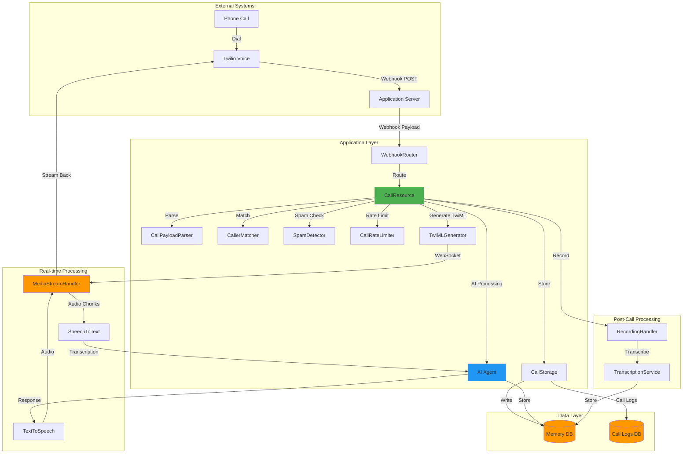

# Voice System Architecture - Implementation Plan

## Executive Summary

This document outlines the complete implementation plan for integrating Twilio Voice into the AI Receptionist SDK, following the same architectural patterns established by the email and SMS systems.

**Current Status:**
- ✅ Basic CallResource stub exists ([call.resource.ts](../src/resources/core/call.resource.ts))
- ✅ TwilioProvider exists ([twilio.provider.ts](../src/providers/api/twilio.provider.ts))
- ✅ Basic call tools exist ([call-tools.ts](../src/tools/standard/call-tools.ts))
- ✅ Webhook routing infrastructure exists ([webhook-router.ts](../src/webhooks/webhook-router.ts))
- ❌ Missing comprehensive voice architecture (similar to email/SMS systems)

**Implementation Goals:**
- Webhook-driven inbound call processing (Twilio Voice)
- Real-time voice streaming with AI responses
- Call recording and transcription
- IVR (Interactive Voice Response) support
- Database-backed storage with call metadata
- Call routing and forwarding
- Voicemail handling
- Call analytics and logging
- Multi-layer protection against spam/robocalls

---

## Table of Contents

1. [System Architecture Overview](#system-architecture-overview)
2. [Implementation Phases](#implementation-phases)
3. [Phase 1: Core Infrastructure](#phase-1-core-infrastructure)
4. [Phase 2: Real-time Voice Streaming](#phase-2-real-time-voice-streaming)
5. [Phase 3: Call Management](#phase-3-call-management)
6. [Phase 4: Recording & Transcription](#phase-4-recording--transcription)
7. [Phase 5: Advanced Features](#phase-5-advanced-features)
8. [Phase 6: Testing & Documentation](#phase-6-testing--documentation)
9. [File Structure](#file-structure)
10. [Database Schema](#database-schema)
11. [Configuration](#configuration)
12. [Security Considerations](#security-considerations)

---

## System Architecture Overview



---

## Implementation Phases

### Phase 1: Core Infrastructure (6-8 hours)
**Goal:** Set up foundational utilities and types

**Files to Create:**
1. `src/utils/voice/CallPayloadParser.ts` - Parse Twilio voice webhooks
2. `src/utils/voice/CallStorage.ts` - Database storage utilities
3. `src/utils/voice/CallRateLimiter.ts` - Rate limiting
4. `src/utils/voice/SpamDetector.ts` - Spam/robocall detection
5. `src/utils/voice/TwiMLGenerator.ts` - TwiML response generation
6. `src/utils/voice/CallerMatcher.ts` - Match calls by phone number
7. `src/utils/voice/index.ts` - Exports
8. `src/types/voice.types.ts` - TypeScript types

**Files to Update:**
1. `src/types/index.ts` - Export voice types

### Phase 2: Real-time Voice Streaming (8-10 hours)
**Goal:** Implement real-time AI voice conversations

**Files to Create:**
1. `src/utils/voice/MediaStreamHandler.ts` - WebSocket media streaming
2. `src/utils/voice/SpeechToText.ts` - Real-time transcription
3. `src/utils/voice/TextToSpeech.ts` - Voice synthesis
4. `src/utils/voice/AudioBuffer.ts` - Audio chunk management

**Strategy:**
- WebSocket connection for bi-directional audio streaming
- Real-time speech-to-text (Deepgram, OpenAI Whisper, etc.)
- Real-time text-to-speech (ElevenLabs, OpenAI TTS, etc.)
- Low-latency audio processing

### Phase 3: Call Management (4-5 hours)
**Goal:** Handle call lifecycle and routing

**Files to Create:**
1. `src/utils/voice/CallRouter.ts` - Call routing logic
2. `src/utils/voice/CallTransfer.ts` - Transfer calls to humans
3. `src/utils/voice/CallQueue.ts` - Queue management
4. `src/utils/voice/VoicemailHandler.ts` - Voicemail processing

**Features:**
- Inbound call handling
- Outbound call placement
- Call forwarding
- Call transfer
- Voicemail detection and handling
- Hold music

### Phase 4: Recording & Transcription (3-4 hours)
**Goal:** Store and transcribe calls

**Files to Create:**
1. `src/utils/voice/RecordingHandler.ts` - Call recording
2. `src/utils/voice/TranscriptionService.ts` - Post-call transcription
3. `src/utils/voice/CallAnalytics.ts` - Call metrics

**Features:**
- Automatic call recording
- Post-call transcription
- Sentiment analysis
- Call summaries
- Duration tracking
- Outcome logging

### Phase 5: Advanced Features (4-6 hours)
**Goal:** Enhanced functionality

**Features:**
1. IVR (Interactive Voice Response) menus
2. DTMF (touch-tone) input handling
3. Conference calling
4. Call screening
5. Business hours handling
6. Emergency call routing
7. Multi-language support

**Files to Create:**
1. `src/utils/voice/IVRBuilder.ts` - IVR menu construction
2. `src/utils/voice/DTMFHandler.ts` - Touch-tone processing
3. `src/utils/voice/ConferenceManager.ts` - Conference calls
4. `src/utils/voice/BusinessHours.ts` - Schedule management

### Phase 6: Testing & Documentation (3-4 hours)
**Goal:** Comprehensive testing and docs

**Deliverables:**
1. Unit tests for all utilities
2. Integration tests for webhooks
3. Load testing for concurrent calls
4. Architecture documentation (this file, expanded)
5. API documentation
6. Example usage

---

## Phase 1: Core Infrastructure

### 1.1 Voice Types

**File:** `src/types/voice.types.ts`

```typescript
/**
 * Voice Type Definitions
 */

export interface InboundCallPayload {
  // Core fields
  callSid: string;              // Twilio call SID
  from: string;                 // Caller phone (+1234567890)
  to: string;                   // Recipient phone (+1234567890)

  // Call status
  callStatus: CallStatus;       // 'ringing' | 'in-progress' | 'completed' | etc.
  direction: 'inbound' | 'outbound';

  // Caller info
  callerName?: string;          // Caller ID name
  fromCity?: string;
  fromState?: string;
  fromZip?: string;
  fromCountry?: string;

  // Recipient info
  toCity?: string;
  toState?: string;
  toZip?: string;
  toCountry?: string;

  // Metadata
  accountSid?: string;
  timestamp?: Date;
  duration?: number;            // Call duration in seconds

  // Additional info
  forwardedFrom?: string;       // If call was forwarded
  callerCountry?: string;
  apiVersion?: string;
}

export type CallStatus =
  | 'queued'
  | 'ringing'
  | 'in-progress'
  | 'completed'
  | 'busy'
  | 'failed'
  | 'no-answer'
  | 'canceled';

export interface OutboundCallOptions {
  to: string;
  from?: string;              // Override default
  url?: string;               // TwiML URL
  statusCallback?: string;    // Status updates
  timeout?: number;           // Ring timeout
  record?: boolean;           // Record call
  machineDetection?: boolean; // Detect voicemail
}

export interface CallSessionMetadata {
  // Threading
  callSid: string;
  conversationId: string;

  // Direction
  direction: 'inbound' | 'outbound';

  // Participants
  from: string;
  to: string;
  callerName?: string;

  // Call info
  callStatus: CallStatus;
  duration?: number;
  recordingUrl?: string;
  recordingSid?: string;
  transcription?: string;

  // Location
  fromCity?: string;
  fromState?: string;
  fromCountry?: string;

  // Provider
  provider: 'twilio';
  accountSid?: string;

  // Analytics
  startTime?: Date;
  endTime?: Date;
  answeredBy?: 'human' | 'machine' | 'unknown';
  outcome?: CallOutcome;
  sentiment?: 'positive' | 'neutral' | 'negative';
}

export type CallOutcome =
  | 'completed'
  | 'voicemail'
  | 'no-answer'
  | 'busy'
  | 'failed'
  | 'transferred'
  | 'spam';

export interface MediaStreamEvent {
  event: 'connected' | 'start' | 'media' | 'stop';
  streamSid?: string;
  callSid?: string;
  media?: {
    payload: string;          // Base64 audio
    timestamp: string;
    track: 'inbound' | 'outbound';
  };
}

export interface TwiMLConfig {
  greeting?: string;
  voice?: VoiceType;
  language?: string;
  recordCall?: boolean;
  transcribeCall?: boolean;
  timeout?: number;
}

export type VoiceType =
  | 'Polly.Joanna'
  | 'Polly.Matthew'
  | 'Google.en-US-Neural2-A'
  | 'Google.en-US-Neural2-C';

export interface SpamDetectionReport {
  isSpam: boolean;
  confidence: number;          // 0-1
  reasons?: string[];
  shouldBlock: boolean;
}

export interface IVRMenu {
  id: string;
  message: string;
  voice?: VoiceType;
  options: IVROption[];
  timeout?: number;
  maxAttempts?: number;
}

export interface IVROption {
  digit: string;               // '1', '2', etc.
  action: IVRAction;
  label?: string;
}

export type IVRAction =
  | { type: 'menu'; menuId: string }
  | { type: 'transfer'; to: string }
  | { type: 'voicemail' }
  | { type: 'agent' }
  | { type: 'hangup' };
```

### 1.2 Call Payload Parser

**File:** `src/utils/voice/CallPayloadParser.ts`

```typescript
/**
 * Call Payload Parser
 * Parses Twilio voice webhook payloads into standardized format
 */

import { logger } from '../logger';
import type { InboundCallPayload, CallStatus } from '../../types/voice.types';

export class CallPayloadParser {
  /**
   * Parse Twilio inbound call webhook
   */
  static parse(payload: any): InboundCallPayload {
    logger.info('[CallPayloadParser] Parsing payload', {
      CallSid: payload.CallSid,
      From: payload.From,
      CallStatus: payload.CallStatus
    });

    const parsed: InboundCallPayload = {
      callSid: payload.CallSid,
      from: payload.From,
      to: payload.To,
      callStatus: this.parseCallStatus(payload.CallStatus),
      direction: payload.Direction === 'inbound' ? 'inbound' : 'outbound',
      accountSid: payload.AccountSid,
      timestamp: new Date(),
      callerName: payload.CallerName,
      apiVersion: payload.ApiVersion
    };

    // Parse location data
    if (payload.FromCity) {
      parsed.fromCity = payload.FromCity;
      parsed.fromState = payload.FromState;
      parsed.fromZip = payload.FromZip;
      parsed.fromCountry = payload.FromCountry;
      parsed.callerCountry = payload.CallerCountry;
    }

    if (payload.ToCity) {
      parsed.toCity = payload.ToCity;
      parsed.toState = payload.ToState;
      parsed.toZip = payload.ToZip;
      parsed.toCountry = payload.ToCountry;
    }

    // Parse call duration (if available)
    if (payload.CallDuration) {
      parsed.duration = parseInt(payload.CallDuration, 10);
    }

    // Parse forwarded from
    if (payload.ForwardedFrom) {
      parsed.forwardedFrom = payload.ForwardedFrom;
    }

    return parsed;
  }

  /**
   * Parse call status
   */
  private static parseCallStatus(status: string): CallStatus {
    const statusMap: Record<string, CallStatus> = {
      'queued': 'queued',
      'ringing': 'ringing',
      'in-progress': 'in-progress',
      'completed': 'completed',
      'busy': 'busy',
      'failed': 'failed',
      'no-answer': 'no-answer',
      'canceled': 'canceled'
    };

    return statusMap[status] || 'queued';
  }

  /**
   * Validate required fields
   */
  static validate(payload: any): boolean {
    const required = ['CallSid', 'From', 'To', 'CallStatus'];
    return required.every(field => payload[field]);
  }

  /**
   * Parse status callback payload
   */
  static parseStatusCallback(payload: any): Partial<InboundCallPayload> {
    return {
      callSid: payload.CallSid,
      callStatus: this.parseCallStatus(payload.CallStatus),
      duration: payload.CallDuration ? parseInt(payload.CallDuration, 10) : undefined,
      timestamp: new Date()
    };
  }
}
```

### 1.3 Call Storage

**File:** `src/utils/voice/CallStorage.ts`

```typescript
/**
 * Call Storage
 * Stores call records in memory database with metadata
 */

import { logger } from '../logger';
import type { MemoryManager } from '../../types';
import type { InboundCallPayload, CallSessionMetadata } from '../../types/voice.types';
import { PhoneNumberUtils } from '../sms/PhoneNumberUtils';

export class CallStorage {
  /**
   * Store inbound call start
   */
  static async storeCallStart(
    call: InboundCallPayload,
    conversationId: string,
    memory: MemoryManager
  ): Promise<void> {
    const content = `Call from ${PhoneNumberUtils.format(call.from)} - ${call.callStatus}`;

    // Build session metadata
    const sessionMetadata: CallSessionMetadata = {
      callSid: call.callSid,
      conversationId,
      direction: call.direction,
      from: call.from,
      to: call.to,
      callerName: call.callerName,
      callStatus: call.callStatus,
      fromCity: call.fromCity,
      fromState: call.fromState,
      fromCountry: call.fromCountry,
      provider: 'twilio',
      accountSid: call.accountSid,
      startTime: call.timestamp || new Date()
    };

    // Store as system message
    await memory.store({
      id: `call-start-${call.callSid}`,
      content,
      timestamp: call.timestamp || new Date(),
      type: 'conversation',
      channel: 'call',
      role: 'system',
      sessionMetadata: sessionMetadata as any
    });

    logger.info('[CallStorage] Stored call start', {
      conversationId,
      callSid: call.callSid,
      from: call.from
    });
  }

  /**
   * Store call completion
   */
  static async storeCallEnd(
    callSid: string,
    conversationId: string,
    duration: number,
    outcome: string,
    memory: MemoryManager
  ): Promise<void> {
    const content = `Call ended - Duration: ${duration}s, Outcome: ${outcome}`;

    const sessionMetadata: Partial<CallSessionMetadata> = {
      callSid,
      conversationId,
      duration,
      callStatus: 'completed',
      outcome: outcome as any,
      endTime: new Date()
    };

    await memory.store({
      id: `call-end-${callSid}`,
      content,
      timestamp: new Date(),
      type: 'conversation',
      channel: 'call',
      role: 'system',
      sessionMetadata: sessionMetadata as any
    });

    logger.info('[CallStorage] Stored call end', {
      conversationId,
      callSid,
      duration,
      outcome
    });
  }

  /**
   * Store call transcription
   */
  static async storeTranscription(
    callSid: string,
    conversationId: string,
    transcription: string,
    memory: MemoryManager
  ): Promise<void> {
    const sessionMetadata: Partial<CallSessionMetadata> = {
      callSid,
      conversationId,
      transcription
    };

    await memory.store({
      id: `call-transcript-${callSid}`,
      content: transcription,
      timestamp: new Date(),
      type: 'conversation',
      channel: 'call',
      role: 'user',
      sessionMetadata: sessionMetadata as any
    });

    logger.info('[CallStorage] Stored transcription', {
      conversationId,
      callSid,
      length: transcription.length
    });
  }
}
```

### 1.4 TwiML Generator

**File:** `src/utils/voice/TwiMLGenerator.ts`

```typescript
/**
 * TwiML Generator
 * Generates Twilio Markup Language (TwiML) responses for voice calls
 */

import { logger } from '../logger';
import type { TwiMLConfig, VoiceType } from '../../types/voice.types';

export class TwiMLGenerator {
  /**
   * Generate basic greeting TwiML
   */
  static generateGreeting(config: TwiMLConfig): string {
    const voice = config.voice || 'Polly.Joanna';
    const language = config.language || 'en-US';
    const greeting = config.greeting || 'Hello, how can I help you today?';

    return `<?xml version="1.0" encoding="UTF-8"?>
<Response>
  <Say voice="${voice}" language="${language}">${greeting}</Say>
  <Pause length="1"/>
</Response>`;
  }

  /**
   * Generate gather (input collection) TwiML
   */
  static generateGather(
    message: string,
    action: string,
    config?: Partial<TwiMLConfig>
  ): string {
    const voice = config?.voice || 'Polly.Joanna';
    const timeout = config?.timeout || 5;

    return `<?xml version="1.0" encoding="UTF-8"?>
<Response>
  <Gather input="speech dtmf" action="${action}" timeout="${timeout}" speechTimeout="auto">
    <Say voice="${voice}">${message}</Say>
  </Gather>
  <Say voice="${voice}">Sorry, I didn't catch that. Goodbye.</Say>
  <Hangup/>
</Response>`;
  }

  /**
   * Generate media stream TwiML (for real-time AI)
   */
  static generateMediaStream(websocketUrl: string, config?: TwiMLConfig): string {
    const voice = config?.voice || 'Polly.Joanna';
    const greeting = config?.greeting || 'Hello, I am connecting you to our AI assistant.';

    return `<?xml version="1.0" encoding="UTF-8"?>
<Response>
  <Say voice="${voice}">${greeting}</Say>
  <Connect>
    <Stream url="${websocketUrl}"/>
  </Connect>
</Response>`;
  }

  /**
   * Generate voicemail TwiML
   */
  static generateVoicemail(beep: boolean = true): string {
    return `<?xml version="1.0" encoding="UTF-8"?>
<Response>
  <Say voice="Polly.Joanna">Please leave a message after the beep.</Say>
  <Record
    maxLength="120"
    playBeep="${beep}"
    transcribe="true"
    transcribeCallback="/webhook/call/transcription"/>
  <Say voice="Polly.Joanna">Thank you for your message. Goodbye.</Say>
  <Hangup/>
</Response>`;
  }

  /**
   * Generate call forward TwiML
   */
  static generateForward(phoneNumber: string, timeout: number = 30): string {
    return `<?xml version="1.0" encoding="UTF-8"?>
<Response>
  <Say voice="Polly.Joanna">Please hold while I transfer your call.</Say>
  <Dial timeout="${timeout}" callerId="+1234567890">
    <Number>${phoneNumber}</Number>
  </Dial>
  <Say voice="Polly.Joanna">Sorry, the line is busy. Goodbye.</Say>
  <Hangup/>
</Response>`;
  }

  /**
   * Generate IVR menu TwiML
   */
  static generateIVRMenu(
    message: string,
    options: Array<{ digit: string; action: string }>,
    voice?: VoiceType
  ): string {
    const voiceType = voice || 'Polly.Joanna';

    const gatherOptions = options.map(opt =>
      `    <Number sendDigits="${opt.digit}">${opt.action}</Number>`
    ).join('\n');

    return `<?xml version="1.0" encoding="UTF-8"?>
<Response>
  <Gather numDigits="1" timeout="10" action="/webhook/call/ivr">
    <Say voice="${voiceType}">${message}</Say>
  </Gather>
  <Say voice="${voiceType}">Sorry, I didn't receive a selection. Goodbye.</Say>
  <Hangup/>
</Response>`;
  }

  /**
   * Generate recording TwiML
   */
  static generateRecording(
    recordingUrl: string,
    transcribe: boolean = true
  ): string {
    return `<?xml version="1.0" encoding="UTF-8"?>
<Response>
  <Record
    action="${recordingUrl}"
    transcribe="${transcribe}"
    transcribeCallback="/webhook/call/transcription"/>
</Response>`;
  }

  /**
   * Generate hangup TwiML
   */
  static generateHangup(message?: string): string {
    if (message) {
      return `<?xml version="1.0" encoding="UTF-8"?>
<Response>
  <Say voice="Polly.Joanna">${message}</Say>
  <Hangup/>
</Response>`;
    }

    return `<?xml version="1.0" encoding="UTF-8"?>
<Response>
  <Hangup/>
</Response>`;
  }

  /**
   * Generate error TwiML
   */
  static generateError(): string {
    return `<?xml version="1.0" encoding="UTF-8"?>
<Response>
  <Say voice="Polly.Joanna">Sorry, there was an error processing your call. Please try again later.</Say>
  <Hangup/>
</Response>`;
  }
}
```

### 1.5 Spam Detector

**File:** `src/utils/voice/SpamDetector.ts`

```typescript
/**
 * Spam Detector
 * Detects spam/robocalls using various heuristics
 */

import { logger } from '../logger';
import type { InboundCallPayload, SpamDetectionReport } from '../../types/voice.types';

export class SpamDetector {
  // Known spam patterns
  private static SPAM_PATTERNS = [
    /warranty.*expir/i,
    /social.*security/i,
    /irs.*tax/i,
    /credit.*card.*rate/i,
    /congratulations.*won/i,
    /final.*notice/i,
    /extended.*warranty/i
  ];

  // Known spam caller IDs
  private static SPAM_CALLER_IDS = new Set<string>([
    'Unknown',
    'Private Number',
    'Unavailable',
    'Anonymous'
  ]);

  /**
   * Detect if call is likely spam
   */
  static async detectSpam(call: InboundCallPayload): Promise<SpamDetectionReport> {
    const reasons: string[] = [];
    let confidence = 0;

    // Check caller ID
    if (this.isSpamCallerID(call.callerName)) {
      reasons.push('Suspicious caller ID');
      confidence += 0.3;
    }

    // Check if from known spam country codes (optional)
    if (this.isSpamCountryCode(call.from)) {
      reasons.push('Suspicious country code');
      confidence += 0.2;
    }

    // Check call frequency (if available)
    // This would require tracking call history

    const isSpam = confidence >= 0.5;
    const shouldBlock = confidence >= 0.7;

    if (isSpam) {
      logger.warn('[SpamDetector] Spam detected', {
        callSid: call.callSid,
        from: call.from,
        confidence,
        reasons
      });
    }

    return {
      isSpam,
      confidence,
      reasons: reasons.length > 0 ? reasons : undefined,
      shouldBlock
    };
  }

  /**
   * Check if caller ID looks like spam
   */
  private static isSpamCallerID(callerName?: string): boolean {
    if (!callerName) return false;
    return this.SPAM_CALLER_IDS.has(callerName);
  }

  /**
   * Check if country code is suspicious
   */
  private static isSpamCountryCode(phoneNumber: string): boolean {
    // Add your spam country code logic here
    // Example: certain international prefixes
    const spamPrefixes = ['+234', '+92', '+91']; // Example only
    return spamPrefixes.some(prefix => phoneNumber.startsWith(prefix));
  }

  /**
   * Mark number as spam
   */
  static async markAsSpam(phoneNumber: string): Promise<void> {
    // Store in database or spam list
    logger.info('[SpamDetector] Marked as spam', { phoneNumber });
  }

  /**
   * Check if number is in spam list
   */
  static async isKnownSpam(phoneNumber: string): Promise<boolean> {
    // Check against spam database
    return false; // Placeholder
  }
}
```

### 1.6 Call Rate Limiter

**File:** `src/utils/voice/CallRateLimiter.ts`

```typescript
/**
 * Call Rate Limiter
 * Prevents spam by limiting calls per phone number
 */

import { logger } from '../logger';

export interface CallRateLimiterConfig {
  maxCalls: number;    // Max calls per window
  windowMs: number;    // Time window in ms
}

interface RateLimitEntry {
  count: number;
  resetAt: number;
}

export class CallRateLimiter {
  private limits: Map<string, RateLimitEntry> = new Map();
  private config: CallRateLimiterConfig;

  constructor(config?: Partial<CallRateLimiterConfig>) {
    this.config = {
      maxCalls: config?.maxCalls || 5,
      windowMs: config?.windowMs || 3600000 // 1 hour
    };

    // Cleanup old entries every 5 minutes
    setInterval(() => this.cleanup(), 5 * 60 * 1000);
  }

  /**
   * Check if phone number is under rate limit
   */
  async checkLimit(phoneNumber: string): Promise<boolean> {
    const now = Date.now();
    const entry = this.limits.get(phoneNumber);

    // No entry = under limit
    if (!entry) {
      this.limits.set(phoneNumber, {
        count: 1,
        resetAt: now + this.config.windowMs
      });
      return true;
    }

    // Entry expired = reset
    if (now >= entry.resetAt) {
      this.limits.set(phoneNumber, {
        count: 1,
        resetAt: now + this.config.windowMs
      });
      return true;
    }

    // Under limit = increment
    if (entry.count < this.config.maxCalls) {
      entry.count++;
      return true;
    }

    // Over limit
    logger.warn('[CallRateLimiter] Rate limit exceeded', {
      phoneNumber,
      count: entry.count,
      limit: this.config.maxCalls
    });
    return false;
  }

  /**
   * Get remaining calls
   */
  getRemaining(phoneNumber: string): number {
    const entry = this.limits.get(phoneNumber);
    if (!entry || Date.now() >= entry.resetAt) {
      return this.config.maxCalls;
    }
    return Math.max(0, this.config.maxCalls - entry.count);
  }

  /**
   * Cleanup expired entries
   */
  private cleanup(): void {
    const now = Date.now();
    let cleaned = 0;

    for (const [phoneNumber, entry] of this.limits.entries()) {
      if (now >= entry.resetAt) {
        this.limits.delete(phoneNumber);
        cleaned++;
      }
    }

    if (cleaned > 0) {
      logger.info(`[CallRateLimiter] Cleaned ${cleaned} expired entries`);
    }
  }

  /**
   * Dispose resources
   */
  dispose(): void {
    this.limits.clear();
  }
}
```

---

## File Structure

After implementation, the voice system will have the following structure:

```
src/
├── resources/core/
│   └── call.resource.ts              # Main call controller (ENHANCED)
├── utils/voice/
│   ├── CallPayloadParser.ts          # Webhook parsing (NEW)
│   ├── CallStorage.ts                # Memory persistence (NEW)
│   ├── CallRateLimiter.ts            # Rate limiting (NEW)
│   ├── SpamDetector.ts               # Spam detection (NEW)
│   ├── TwiMLGenerator.ts             # TwiML generation (NEW)
│   ├── CallerMatcher.ts              # Phone matching (NEW)
│   ├── MediaStreamHandler.ts         # WebSocket streaming (NEW)
│   ├── SpeechToText.ts               # Real-time STT (NEW)
│   ├── TextToSpeech.ts               # Real-time TTS (NEW)
│   ├── RecordingHandler.ts           # Call recording (NEW)
│   ├── TranscriptionService.ts       # Post-call transcription (NEW)
│   ├── IVRBuilder.ts                 # IVR menus (NEW)
│   ├── CallRouter.ts                 # Call routing (NEW)
│   ├── VoicemailHandler.ts           # Voicemail (NEW)
│   └── index.ts                      # Exports (NEW)
├── providers/api/
│   └── twilio.provider.ts            # Twilio provider (EXISTS)
├── tools/standard/
│   └── call-tools.ts                 # Call tools (EXISTS)
├── types/
│   └── voice.types.ts                # TypeScript types (NEW)
└── webhooks/
    └── webhook-router.ts             # Webhook routing (EXISTS)
```

**Total:** ~2,500+ lines of new code across 15+ new files

---

## Database Schema

### Call Logs Table (Expansion of existing)

```sql
-- Extend existing call logs table
ALTER TABLE ai_receptionist_call_logs ADD COLUMN IF NOT EXISTS recording_url TEXT;
ALTER TABLE ai_receptionist_call_logs ADD COLUMN IF NOT EXISTS recording_sid TEXT;
ALTER TABLE ai_receptionist_call_logs ADD COLUMN IF NOT EXISTS transcription TEXT;
ALTER TABLE ai_receptionist_call_logs ADD COLUMN IF NOT EXISTS sentiment TEXT;
ALTER TABLE ai_receptionist_call_logs ADD COLUMN IF NOT EXISTS caller_name TEXT;
ALTER TABLE ai_receptionist_call_logs ADD COLUMN IF NOT EXISTS answered_by TEXT;
ALTER TABLE ai_receptionist_call_logs ADD COLUMN IF NOT EXISTS is_spam BOOLEAN DEFAULT FALSE;

CREATE INDEX IF NOT EXISTS call_logs_phone_idx ON ai_receptionist_call_logs (phone_number);
CREATE INDEX IF NOT EXISTS call_logs_recording_idx ON ai_receptionist_call_logs (recording_sid);
```

### Memory Table (Existing - No Changes)

Call data is stored in the existing `ai_receptionist_memory` table with:
- `channel: 'call'`
- `role: 'user'` (caller) or `'assistant'` (AI) or `'system'` (call events)
- `sessionMetadata` containing call-specific fields

---

## Configuration

### Environment Variables

```bash
# Twilio Configuration
TWILIO_ACCOUNT_SID=ACxxxxxxxxxxxxxxxxxxxxx
TWILIO_AUTH_TOKEN=your_auth_token
TWILIO_PHONE_NUMBER=+12345678900

# Voice Settings
VOICE_RATE_LIMIT_MAX=5              # Max calls per phone per hour
VOICE_RATE_LIMIT_WINDOW_MS=3600000  # 1 hour
VOICE_RECORD_CALLS=true             # Record all calls
VOICE_TRANSCRIBE_CALLS=true         # Transcribe all calls
VOICE_SPAM_DETECTION=true           # Enable spam detection

# Real-time Voice (Optional)
DEEPGRAM_API_KEY=your_deepgram_key  # For STT
ELEVENLABS_API_KEY=your_11labs_key  # For TTS
WEBSOCKET_URL=wss://yourdomain.com/voice
```

### SDK Configuration

```typescript
const client = new AIReceptionist({
  providers: {
    twilio: {
      accountSid: process.env.TWILIO_ACCOUNT_SID,
      authToken: process.env.TWILIO_AUTH_TOKEN,
      phoneNumber: process.env.TWILIO_PHONE_NUMBER
    }
  },
  voice: {
    rateLimitConfig: {
      maxCalls: 5,
      windowMs: 3600000
    },
    recordCalls: true,
    transcribeCalls: true,
    spamDetection: true,
    twimlConfig: {
      voice: 'Polly.Joanna',
      language: 'en-US'
    }
  }
});
```

---

## Security Considerations

### 1. Webhook Validation

```typescript
import { validateTwilioWebhook } from './providers/validation/twilio-validator';

app.post('/webhook/call', (req, res) => {
  const signature = req.headers['x-twilio-signature'];
  const url = `https://yourdomain.com${req.originalUrl}`;

  if (!validateTwilioWebhook(signature, url, req.body, authToken)) {
    return res.status(403).send('Invalid signature');
  }

  // Process webhook
});
```

### 2. Rate Limiting
- Per-phone limit: 5 calls/hour (configurable)
- Global limit: Consider implementing
- Spam detection: Automatic blocking

### 3. Recording & Privacy
- Consent notifications required
- Encrypted storage
- Retention policies
- GDPR/CCPA compliance

### 4. Access Control
- Webhook endpoint authentication
- WebSocket authentication
- Recording access controls

---

## Next Steps

1. **Phase 1:** Implement core infrastructure
2. **Phase 2:** Implement real-time voice streaming
3. **Phase 3:** Implement call management
4. **Phase 4:** Implement recording & transcription
5. **Phase 5:** Add advanced features (IVR, conferencing)
6. **Phase 6:** Testing & documentation

**Estimated Total Time:** 30-40 hours for complete voice system

---

## Differences from SMS/Email Systems

| Feature | Email | SMS | Voice |
|---------|-------|-----|-------|
| Threading | Message-ID headers | Phone pairs | Call SID + phone pairs |
| Real-time | No | No | Yes (WebSocket) |
| Media | Attachments | MMS URLs | Audio streaming |
| Transcription | N/A | N/A | Post-call + Real-time |
| Duration tracking | N/A | N/A | Required |
| Recording | N/A | N/A | Optional |
| IVR | N/A | N/A | Supported |
| Transfer | Forwarding | N/A | Call transfer |
| Provider | Postmark | Twilio | Twilio |

---

This architecture document will serve as your implementation guide for building a robust, production-ready voice system that integrates seamlessly with your existing email and SMS infrastructure.
